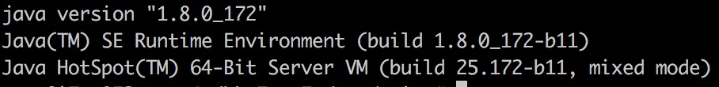
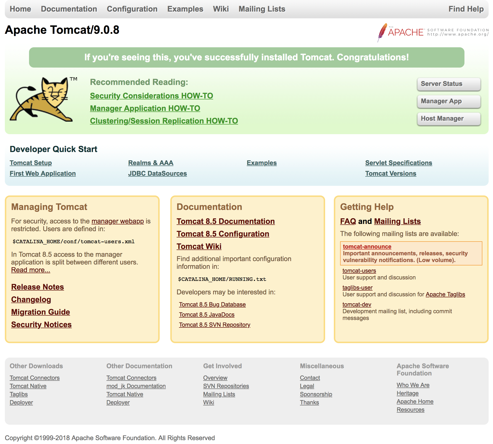
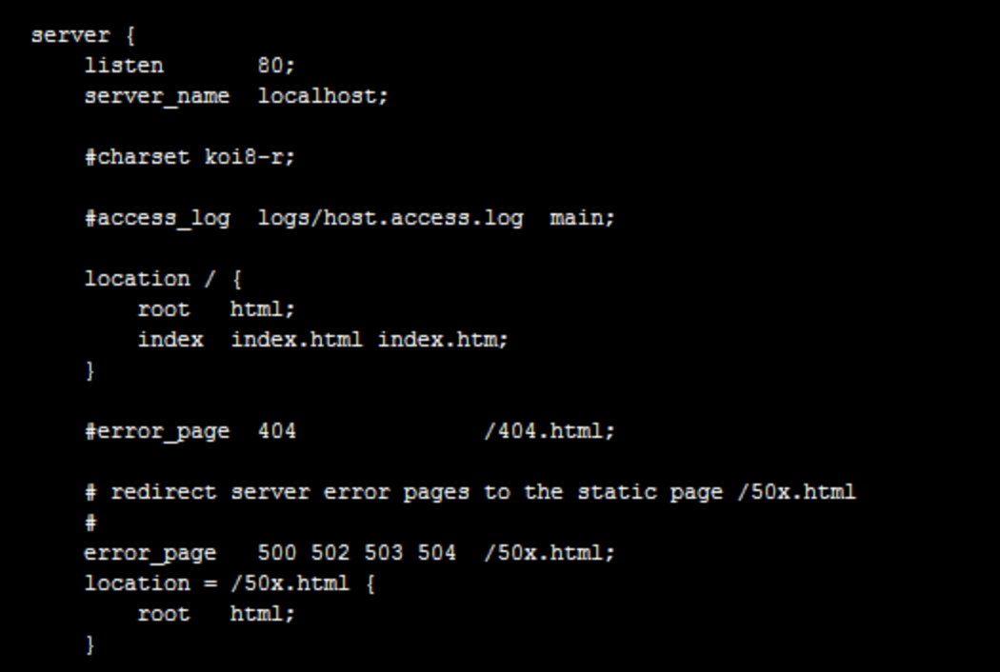

>本文由Scarb发表于[金甲虫的博客](http://47.106.131.90/blog)，转载请注明出处

# 阿里云Ubuntu服务器配置Nginx反向代理到Tomcat并实现动静分离(LNMT)

## 1. 引言

原先的阿里云学生服务器过期之后买了三年新的服务器。配置为1核2G，99元一年。
新的服务器地区是华南1，和旧的服务器不同。然后发现阿里云不能跨地区共享服务器镜像。
新的服务器全部要重新配置。
之前也写过一篇博客: [windows server上 apache + php + MySQL + wordpress 配置](http://47.106.131.90/blog/post/10.html)
新的服务器打算用一下Nginx换换口味。
并且之前的服务器Nginx和Tomcat是分开的，本次在搜索过程中发现反向代理和动静分离的玩法，于是想自己配置实现一下。

## 2. 配置环境

- 阿里云Ubuntu 16.04 64位
- Nginx 1.10
- Tomcat 9.0.8

## 3. Nginx反向代理至Tomcat

安装之前先提一个一键安装环境：[Oneinstack](https://oneinstack.com/)
可以一键安装Linux服务器环境，比较好用。但是本次我想自己折腾一下，最后没有用这个。

百度百科解释：反向代理（Reverse Proxy）方式是指以代理服务器来接受internet上的连接请求，然后将请求转发给内部网络上的服务器，并将从服务器上得到的结果返回给internet上请求连接的客户端，此时代理服务器对外就表现为一个反向代理服务器。

通过上面的解释很容易理解nginx反向代理的意思，也就是说nginx就相当于代理服务器。客户端发出请求，并不是直接被tomcat服务器接收处理，而是要先经过nginx，nginx再转发给tomcat服务器；tomcat处理完成返回结果后，也是先经过nginx，nginx再返回客户端。在整个过程中，nginx貌似充当了真正的服务器，其实并不是，nginx只是起到了转发的作用。

## 4. 动静分离

为了提高网站的响应速度，减轻程序服务器（Tomcat，Jboss等）的负载，对于静态资源比如图片，js，css等文件，我们可以在反向代理服务器中进行缓存，这样浏览器在请求一个静态资源时，代理服务器就可以直接处理，而不用将请求转发给后端服务器。用户请求的动态文件比如servlet,jsp则转发给Tomcat，Jboss服务器处理，这就是动静分离。这也是反向代理服务器的一个重要的作用。

本次动静分离通过Nginx和Tomcat实现，由Nginx处理静态资源，Tomcat处理余下其他的资源。

## 5. Nginx安装

采用`apt-get`安装的Nginx版本号为1.10，而最新版本为`1.15`。
本次图方便直接用`apt-get`安装。如果要装最新版本则要去官网下载压缩包解压进行安装。

```shell
sudo apt-get install nginx
```

安装完之后打开服务`service nginx start`，`localhost:80`验证是否安装成功。
`apt-get`安装的Nginx 的配置文件在

```shell
/etc/nginx/nginx.conf
```

## 6. Tomcat安装

Tomcat需要JDK支持

### 6.1. JDK安装

[jdk下载地址](http://www.oracle.com/technetwork/java/javase/downloads/index.html)

下载完成之后传到服务器，解压，然后移动到相应位置。

```shell
tar -zxvf jdk-8u172-linux-x64.tar.gz
mv jdk-8u172-linux-x64.tar.gz /usr/local/java
```

随后要添加环境变量

```shell
vim ~/.bashrc
```

在后添加

```shell
# java
export JAVA_HOME=/usr/local/java/jdk1.8.0_172
export JAVA_BIN=${JAVA_HOME}/bin
export JAVA_LIB=${JAVA_HOME}/lib
export JRE_HOME=${JAVA_HOME}/jre
export CLASSPATH=.:${JAVA_LIB}:${JAVA_LIB}:$CLASSPATH
export PATH=${JAVA_HOME}/bin:$PATH
```

随后运行命令查看java版本

```shell
java -version
```



### 6.2. Tomcat安装

去Tomcat官网按照相应的版本下载安装包，然后解压到相应位置。

```shell
tar -xzvf apache-tomcat-9.0.8.tar.gz
mv apache-tomcat-9.0.8.tar.gz /usr/local/tomcat9
cd /usr/local/tomcat9/bin
./shartup.sh
```

运行startup.sh开启tomcat，然后访问`localhost:8080`可以看到以下页面



Tomcat的网页目录为`./webapps/ROOT/`

## 7. 配置反向代理

需要修改Nginx的配置文件，将资源转发至Tomcat进行处理。

```shell
vim /etc/nginx/nginx.conf
```



里面几个属性的意思分别是：

listen：代表当前代理服务器的访问端口号，默认是80端口。如果要配置多个server，这里的默认端口需要改变，要不然系统不知道进入哪个代理服务。

server_name：表示代理服务需要转发的地址，默认是localhost。

location：表示匹配客户端发送请求的路径，这里“/”代表所有请求的路径都能匹配。

root：表示请求别匹配到后，会在这个文件夹内寻找相应的文件，root对后面静态资源的处理很重要。

index：如果代理没有指定主页，将默认进入index配置下寻找主页，可以配置多个，第一个主页找不到，访问第二个，以此类推。

error_page：代表发生错误后进入的相关错误页面，下面的location也是处理错误的相关配置。

>注意：apt-get安装的Nginx配置文件与上图的有所不同，没有server这个配置，照着这个加就行。

要进行反向代理，先测试把所有资源都转发至Tomcat。
在server之后添加

```conf
location ~ {  
    proxy_pass http://localhost:8080  
}  
```

然后重载Nginx，因为Nginx支持热更新，所以只要`nginx -s reload`即可。

然后访问`localhost:80`可以看到Tomcat界面

## 8. 配置动静分离

最终要实现的是静态资源由Nginx处理，动态资源由Tomcat处理。
这样就需要将Nginx的网页目录设置到Tomcat目录下，然后通过正则表达式匹配location的方法分别处理静态和动态资源。

这里直接上我的Nginx配置

```conf
ser root;                   # 用户改成root，避免某些文件访问权限不足的错误
worker_processes auto;
pid /run/nginx.pid;

events {
        worker_connections 768;
        # multi_accept on;
}

http {

        ##
        # Basic Settings
        ##

        sendfile on;
        tcp_nopush on;
        tcp_nodelay on;
        keepalive_timeout 65;
        types_hash_max_size 2048;
        # server_tokens off;

        # server_names_hash_bucket_size 64;
        # server_name_in_redirect off;

        include /etc/nginx/mime.types;
        default_type application/octet-stream;

        ##
        # SSL Settings
        ##

        ssl_protocols TLSv1 TLSv1.1 TLSv1.2; # Dropping SSLv3, ref: POODLE
        ssl_prefer_server_ciphers on;

        ##
        # Logging Settings
        ##

        access_log /var/log/nginx/access.log;
        error_log /var/log/nginx/error.log;

        ##
        # Gzip Settings
        ##

        gzip on;
        gzip_disable "msie6";

        # gzip_vary on;
        # gzip_proxied any;
        # gzip_comp_level 6;
        # gzip_buffers 16 8k;
        # gzip_http_version 1.1;
        # gzip_types text/plain text/css application/json application/javascript text/xml application/xml application/xml+rss text/javascript;
        ##################### default #######################
        server {
                listen 80;
                server_name 47.106.131.90;              # 组多台服务器时需要，一台无所谓
                charset utf-8;
                access_log /var/wwwlogs/access_nginx.log combined;
                root /usr/local/tomcat9/webapps/ROOT;   # 改为tomcat的目录
#               root /var/www/html;
                index index.html index.htm index.jsp;
                #error_page 404 /404.html;
                #error_page 502 /502.html;
                location /nginx_status {
                        stub_status on;
                        access_log off;
                        allow 127.0.0.1;
                        deny all;
                }
                location /blog {
                        expires 1d;
                }
                # 由Nginx处理静态资源
                location ~ .*\.(htm|html|gif|jpg|jpeg|png|bmp|swf|flv|mp4|ico|eot|svg|ttf|woff|otf)$
                {
#                       root /usr/local/tomcat9/webapps/ROOT;
                        expires 10d;
                        access_log off;
                }
                location ~ .*\.(js|css)?$ {
#                       root /usr/local/tomcat9/webapps/ROOT;
                        expires 7d;
                        access_log off;
                }
                # 除了以上静态资源，其他由Tomcat处理
                location ~ {
                        proxy_pass http://localhost:8080;
                        include proxy_params;
                }
#               location ~ /\.ht {
#                       deny all;
#               }
        }
#####################################################
        ##
        # Virtual Host Configs
        ##

        include /etc/nginx/conf.d/*.conf;
        include /etc/nginx/sites-enabled/*;
}
```

## 9. 参考资料

1. [Nginx反向代理转发tomcat](https://blog.csdn.net/mlc1218559742/article/details/53117520)
2. [tomcat结合nginx使用小结](http://cxshun.iteye.com/blog/1535188)
3. [【Linux运维-集群技术进阶】Nginx+Tomcat实现动静分离、负载均衡](https://blog.csdn.net/u010028869/article/details/50522033)