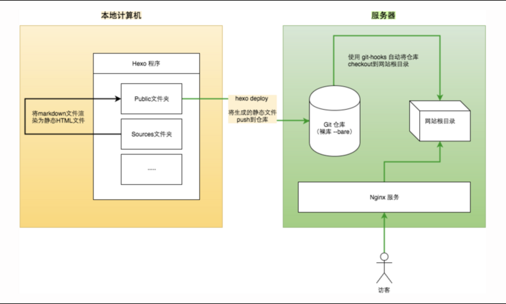

>本文由Scarb发表于[金甲虫的博客](http://47.106.131.90/blog)，转载请注明出处

# 阿里云Ubuntu使用git-hook部署Hexo博客

## 1. 引言

买了阿里云VPS后主要目的是要把以前的博客续一下命。
以前的博客用的是[Wordpress](https://wordpress.org)，然后用[WPCMD](https://blog.zengrong.net/wpcmd/)实现静态化。
这次用[Hexo](https://hexo.io)实现静态化。

并没有选择将博客部署在Github上，而是在本地编写，服务器上用git-hook拉取。

## 2. 架构

具体流程是：本地编写MarkDown文档→本地Hexo解析成静态页→提交到VPS上的Git和GitHub等多仓库→Nginx对外服务→用户访问

架构图如下：



整个流程就是本地将 *.md 渲染成静态文件，然后Git推送到服务器的repository,服务器再通过 git-hooks 同步网站根目录。

<!-- more -->

## 3. 运行环境

- Ubuntu 16.04 x64
- hexo 3.7.1
- Nginx 1.10

## 4. 本地安装Hexo

安装Hexo需要本地安装`Node.js`和`Git`
随后运行命令`npm install hexo-cli -g`安装hexo。

随后要指定一个目录作为Hexo目录

```shell
$ hexo init <folder>
$ cd <folder>
$ npm install
```

该目录就被初始化为Hexo目录，并且安装了`node_module`

## 5. VPS配置git-hook

这里是重点，要在VPS上配置git-hook。
git-hook可以监听git指令，并作出动作。

### 5.1. 安装git
`sudo apt-get install git`

### 5.2. 添加git用户

为VPS添加一个git用户和用户组，专门用来进行git操作。
这里我们创建git用户，为期设置密码，并为其添加sudo权限。

```shell
$ useradd -m git            # 创建 git 用户，也可以用 adduser
$ passwd git                # 设置密码
$ chmod 740 /etc/sudoers    # 设置sudoers文件可写
$ vim /etc/sudoers
```

将新建的用户添加sudo权限
在打开的文本中添加

```shell
git   ALL=(ALL)     ALL
```

然后再把sudoers设为不可写

```shell
chmod 440 /etc/sudoers
```

### 5.3. 配置git，和ssh秘钥

随后我们配置git的信息

```shell
$ git config --global user.email 'youremail@example.com'
$ git config --global user.name 'yourusername'
```

然后本地生成ssh秘钥，并需要将公钥传到VPS，使VPS中的git能够识别本地机器。

```shell
$ ssh-keygen -t rsa -C 'youremail@example.com'
```

生成的秘钥在`~/.ssh`
运行以下命令可以将本地秘钥传到VPS

```shell
$ ssh-copy-id -i ~/.ssh/id_rsa.pub 'git@vps地址'
```

### 5.4. 配置git-hook

接下来要在VPS上创建一个裸仓库，然后为其配置git-hook
我们在`/home/git`这个git用户的文件夹下创建一个裸仓库
`git init blog.git --bare`
这个仓库的功能就是将我们deploy的文件通过git-hook的方式共享到Nginx的web目录下

如果git用户文件夹不存在，需要手动创建并且将所有者设为git用户

```shell
$ mkdir /home/git
$ chown git:git git
```

我们要进行git-hook的配置。此时`blog.git`中有一个`hook`目录，里面存放着hook配置。
我们进入该目录创建`post-receive`文件，意思是在git`receive`到信息之后运行该文件中的命令。

```shell
$ cd blog.git/hooks
$ vim post-receive
```

在`post-receive`中添加内容

```shell
#!/bin/bash
git --work-tree=/这里是Nginx服务器web目录 --git-dir=/home/git/blog.git checkout -f
```

>注意：这里的#!/bin/bash 要写当前系统使用的shell以免无法运行，会报No such directory错误。

设置post-receive为可以行

```shell
$ chmod +x post-receive
```

## 6. 本地Hexo配置deploy

最后一步，修改本地Hexo目录下的`_config.yml`文件，找到`deploy`进行修改

```yml
# Deployment
## Docs: https://hexo.io/docs/deployment.html
deploy:
    type: git
    repo: git@47.106.131.90:/home/git/blog.git                                    # <repository url>
    branch: master                                                                # 这里填写分支   [branch]
    # message: Site updated: {{ now('YYYY-MM-DD HH:mm:ss') }}                     # 自定义提交信息 (默认为 Site updated: {{ now('YYYY-MM-DD HH:mm:ss') }})
```

然后在Hexo目录调用终端执行

```shell
$ hexo clean
$ hexo g
$ hexo d
```

可以看到文件已经被配置到服务器上的Nginx的web目录下相应位置。

## 7. 参考资料

1. [Deploy Hexo Blog to VPS |部署Hexo博客到VPS](https://blog.peiyingchi.com/2017/03/20/deploy-hexo-blog-to-VPS/)
2. [开始新的折腾，Hexo博客Git-VPS部署完整记录](https://sobaigu.com/Hexo-git-to-vps.html)
3. [阿里云VPS搭建自己的的Hexo博客](https://segmentfault.com/a/1190000005723321)
4. [Hexo建站记录(VPS+git+apache2)](http://paranoth.me/2017/10/29/Hexo%E5%BB%BA%E7%AB%99%E8%AE%B0%E5%BD%95/)
5. [Hexo官方文档](https://hexo.io/docs/)