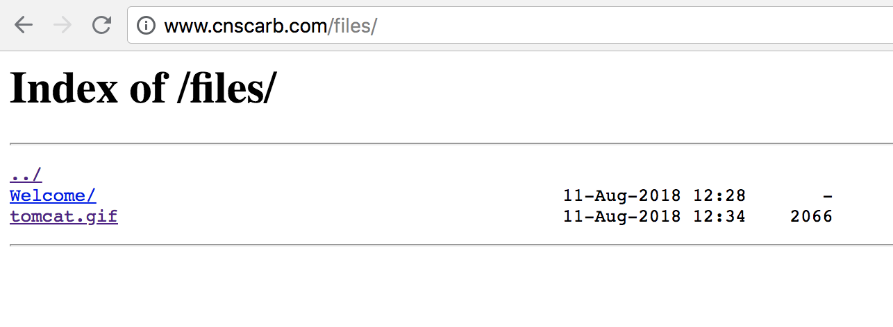

>本文由Scarb发表于[金甲虫的博客](http://47.106.131.90/blog)，转载请注明出处

# 如何让Nginx显示文件目录

最终效果如下图所示: 



修改`nginx.conf`，添加如下内容

```shell
location / {   
        root /data/www/file                  # 指定实际目录绝对路径；   
        autoindex on;                        # 开启目录浏览功能；   
        autoindex_exact_size off;            # 关闭详细文件大小统计，让文件大小显示MB，GB单位，默认为b；   
        autoindex_localtime on;              # 开启以服务器本地时区显示文件修改日期！   
}
```