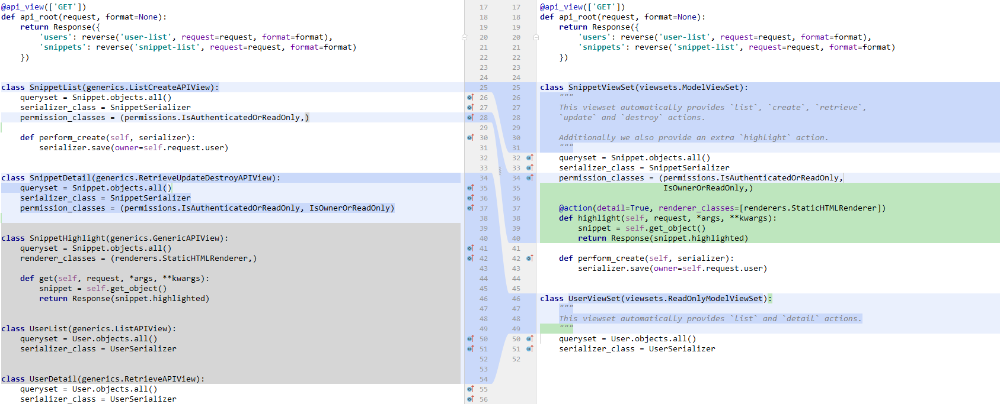

>本文由Scarb发表于[金甲虫的博客](http://47.106.131.90/blog)，转载请注明出处

# Django REST framework 官方教程 笔记

[Django REST framework](http://www.django-rest-framework.org/)是一个django框架，可以快速生成[RESTful API](http://www.ruanyifeng.com/blog/2014/05/restful_api.html)，并且会生成一个基于django模板和dataForm的UI界面，可以方便地查询和操作APi。

官方教程分为两部分，[快速开始](http://www.django-rest-framework.org/tutorial/quickstart/)和[教程](http://www.django-rest-framework.org/tutorial/1-serialization/)。
快速开始部分演示了框架的安装配置，和如何以最少的代码实现一组API。
教程部分依次介绍了框架组件的概念和用法，将冗长的代码一步步简化成快速开始种的代码形式，并且介绍了每一步的原理。最后会完成一个简单的代码高亮web API。

这里做一下笔记(翻译+心得)

环境：

- python 2.7.15
- django 1.11.15
- djangorestframework 3.8.2

<<<<<<< HEAD
=======
<!-- more -->

>>>>>>> e241d060b18ab46398569d280b3761f93eebc75a
## 0. 快速开始

首先[创建django项目](http://www.cnscarb.com/blog/post/328.html)并且`pip djangorestframework`。

项目目录结构如下
```directory
.
./manage.py
./tutorial
./tutorial/__init__.py
./tutorial/quickstart
./tutorial/quickstart/__init__.py
./tutorial/quickstart/admin.py
./tutorial/quickstart/apps.py
./tutorial/quickstart/migrations
./tutorial/quickstart/migrations/__init__.py
./tutorial/quickstart/models.py
./tutorial/quickstart/tests.py
./tutorial/quickstart/views.py
./tutorial/settings.py
./tutorial/urls.py
./tutorial/wsgi.py
```

创建管理员用户，用于登录django rest framework后台(以下简称DRF)。
`python manage.py createsuperuser --email admin@example.com --username admin`

创建序列化器`tutorial/quickstart/serializers.py`

```python
from django.contrib.auth.models import User, Group
from rest_framework import serializers


class UserSerializer(serializers.HyperlinkedModelSerializer):
    class Meta:
        model = User
        fields = ('url', 'username', 'email', 'groups')


class GroupSerializer(serializers.HyperlinkedModelSerializer):
    class Meta:
        model = Group
        fields = ('url', 'name')
```


修改`tutorial/quickstart/views.py`

```python
from django.contrib.auth.models import User, Group
from rest_framework import viewsets
from tutorial.quickstart.serializers import UserSerializer, GroupSerializer


class UserViewSet(viewsets.ModelViewSet):
    """
    API endpoint that allows users to be viewed or edited.
    """
    queryset = User.objects.all().order_by('-date_joined')
    serializer_class = UserSerializer


class GroupViewSet(viewsets.ModelViewSet):
    """
    API endpoint that allows groups to be viewed or edited.
    """
    queryset = Group.objects.all()
    serializer_class = GroupSerializer
```

然后为全局url增加routers `tutorial/urls.py`

```python
from django.conf.urls import url, include
from rest_framework import routers
from tutorial.quickstart import views

router = routers.DefaultRouter()
router.register(r'users', views.UserViewSet)
router.register(r'groups', views.GroupViewSet)

# Wire up our API using automatic URL routing.
# Additionally, we include login URLs for the browsable API.
urlpatterns = [
    url(r'^', include(router.urls)),
    url(r'^api-auth/', include('rest_framework.urls', namespace='rest_framework'))
]
```

最后添加分页参数

```python
REST_FRAMEWORK = {
    'DEFAULT_PAGINATION_CLASS': 'rest_framework.pagination.PageNumberPagination',
    'PAGE_SIZE': 10
}
```

然后将DRF安装到项目中，User和Group的API就自己生成了。
可以通过访问url的方式访问，返回json字符串。

```shell
bash: curl -H 'Accept: application/json; indent=4' -u admin:password123 http://127.0.0.1:8000/users/
{
    "count": 2,
    "next": null,
    "previous": null,
    "results": [
        {
            "email": "admin@example.com",
            "groups": [],
            "url": "http://127.0.0.1:8000/users/1/",
            "username": "admin"
        },
        {
            "email": "tom@example.com",
            "groups": [                ],
            "url": "http://127.0.0.1:8000/users/2/",
            "username": "tom"
        }
    ]
}
```

也可以通过浏览器访问`http://127.0.0.1:8000/users/`，会进入DRF后台，查看API具体信息


## 1. 序列化

### 1.1 环境配置

下面的教程会从创建一个代码高亮API入手来一步步介绍如何使用DRF。

引入代码高亮`pipinstall pygments`

新建app`python manage.py startapp snippets`

新建代码片段模型`snippets/models.py`

```python
from django.db import models
from pygments.lexers import get_all_lexers
from pygments.styles import get_all_styles

LEXERS = [item for item in get_all_lexers() if item[1]]
LANGUAGE_CHOICES = sorted([(item[1][0], item[0]) for item in LEXERS])
STYLE_CHOICES = sorted((item, item) for item in get_all_styles())


class Snippet(models.Model):
    created = models.DateTimeField(auto_now_add=True)
    title = models.CharField(max_length=100, blank=True, default='')
    code = models.TextField()
    linenos = models.BooleanField(default=False)
    language = models.CharField(choices=LANGUAGE_CHOICES, default='python', max_length=100)
    style = models.CharField(choices=STYLE_CHOICES, default='friendly', max_length=100)

    class Meta:
        ordering = ('created',)
```

然后更新数据库。

### 1.2 创建序列化器

创建序列化器`snippets/serializers.py`，序列化器可以将`Snippet`模型序列化和反序列化成json之类的表达式。
声明序列化器的方法和Django的表单类似。

```python
class SnippetSerializer(serializers.Serializer):
    id = serializers.IntegerField(read_only=True)
    title = serializers.CharField(required=False, allow_blank=True, max_length=100)
    code = serializers.CharField(style={'base_template': 'textarea.html'})
    linenos = serializers.BooleanField(required=False)
    language = serializers.ChoiceField(choices=LANGUAGE_CHOICES, default='python')
    style = serializers.ChoiceField(choices=STYLE_CHOICES, default='friendly')

    def create(self, validated_data):
        """
        Create and return a new `Snippet` instance, given the validated data.
        """
        return Snippet.objects.create(**validated_data)

    def update(self, instance, validated_data):
        """
        Update and return an existing `Snippet` instance, given the validated data.
        """
        instance.title = validated_data.get('title', instance.title)
        instance.code = validated_data.get('code', instance.code)
        instance.linenos = validated_data.get('linenos', instance.linenos)
        instance.language = validated_data.get('language', instance.language)
        instance.style = validated_data.get('style', instance.style)
        instance.save()
        return instance
```

第一部分的域定义表示了哪些域会被序列化和反序列化，`create()`和`update()`方法表示在`serializer.save()`时哪些属性会被创建和修改。
序列化器的类型和Django的`Form`类型类似，会域中包含一些验证标旗，比如`required`、`max_length`等。
这些域的标旗也可以指定序列化器在特定的情形下该如何显示，比如渲染HTML时。
在上面的`style={'base_template': 'textarea.html'}`等于在Django中的`Form`用`widget=widgets.Textarea`。

### 1.3 用序列化器序列化和反序列化

```python
# 序列化
snippet = Snippet(code='print "hello, world"\n')
snippet.save()

serializer = SnippetSerializer(snippet)
serializer.data
# {'id': 2, 'title': u'', 'code': u'print "hello, world"\n', 'linenos': False, 'language': u'python', 'style': u'friendly'}

# 反序列化
stream = BytesIO(content)
data = JSONParser().parse(stream)

serializer = SnippetSerializer(data=data)
serializer.is_valid()
# True
serializer.validated_data
# OrderedDict([('title', ''), ('code', 'print "hello, world"\n'), ('linenos', False), ('language', 'python'), ('style', 'friendly')])
serializer.save()
# <Snippet: Snippet object>

# 序列化Queryset
serializer = SnippetSerializer(Snippet.objects.all(), many=True)
serializer.data
# [OrderedDict([('id', 1), ('title', u''), ('code', u'foo = "bar"\n'), ('linenos', False), ('language', 'python'), ('style', 'friendly')]), OrderedDict([('id', 2), ('title', u''), ('code', u'print "hello, world"\n'), ('linenos', False), ('language', 'python'), ('style', 'friendly')]), OrderedDict([('id', 3), ('title', u''), ('code', u'print "hello, world"'), ('linenos', False), ('language', 'python'), ('style', 'friendly')])]
```

### 1.4 使用模型序列化器

`ModelSerializer`类和Django的`ModelForm`类似，能对于一个模型的序列化器的编写进行简化。
重构`SnippetSerializer`

```python
class SnippetSerializer(serializers.ModelSerializer):
    class Meta:
        model = Snippet
        fields = ('id', 'title', 'code', 'linenos', 'language', 'style')
```

可以查看该序列化器的所有域

```python
from snippets.serializers import SnippetSerializer
serializer = SnippetSerializer()
print(repr(serializer))
# SnippetSerializer():
#    id = IntegerField(label='ID', read_only=True)
#    title = CharField(allow_blank=True, max_length=100, required=False)
#    code = CharField(style={'base_template': 'textarea.html'})
#    linenos = BooleanField(required=False)
#    language = ChoiceField(choices=[('Clipper', 'FoxPro'), ('Cucumber', 'Gherkin'), ('RobotFramework', 'RobotFramework'), ('abap', 'ABAP'), ('ada', 'Ada')...
#    style = ChoiceField(choices=[('autumn', 'autumn'), ('borland', 'borland'), ('bw', 'bw'), ('colorful', 'colorful')...
```

`ModelSerializer`做了两件事

- 自动声明模型的域
- 简单实现了`create`和`update`方法

### 1.5 在view中使用序列化器

写两个简单的view在`snippets/views.pyt`，分别是snippet列表`snippet_list`和snippet信息`snippet_detail`。
因为需要用到POST方法，但是目前还没有`CSRF token`，所以在view上用`csrf_exempt`装饰器。

```python
@csrf_exempt
def snippet_list(request):
    """
    List all code snippets, or create a new snippet.
    """
    if request.method == 'GET':
        snippets = Snippet.objects.all()
        serializer = SnippetSerializer(snippets, many=True)
        return JsonResponse(serializer.data, safe=False)

    elif request.method == 'POST':
        data = JSONParser().parse(request)
        serializer = SnippetSerializer(data=data)
        if serializer.is_valid():
            serializer.save()
            return JsonResponse(serializer.data, status=201)
        return JsonResponse(serializer.errors, status=400)

@csrf_exempt
def snippet_detail(request, pk):
    """
    Retrieve, update or delete a code snippet.
    """
    try:
        snippet = Snippet.objects.get(pk=pk)
    except Snippet.DoesNotExist:
        return HttpResponse(status=404)

    if request.method == 'GET':
        serializer = SnippetSerializer(snippet)
        return JsonResponse(serializer.data)

    elif request.method == 'PUT':
        data = JSONParser().parse(request)
        serializer = SnippetSerializer(snippet, data=data)
        if serializer.is_valid():
            serializer.save()
            return JsonResponse(serializer.data)
        return JsonResponse(serializer.errors, status=400)

    elif request.method == 'DELETE':
        snippet.delete()
        return HttpResponse(status=204)
```

修改`snippets/urls.py`，加入view方法后就可以测试这个API。

```python
urlpatterns = [
    url(r'^snippets/$', views.snippet_list),
    url(r'^snippets/(?P<pk>[0-9]+)/$', views.snippet_detail),
]
```

## 2. Request 和 Response

DRF引入了`Request`和`Response`类，他们分别扩展了`HttpRequest`和`TemplateResponse`，有更强大的功能。

```python
request.POST  # Only handles form data.  Only works for 'POST' method.
request.data  # Handles arbitrary data.  Works for 'POST', 'PUT' and 'PATCH' methods.

return Response(data)  # Renders to content type as requested by the client.
```

### 2.1 使用API view

要用到这两个类，需要将view定义为`API view`。以下两个方法可以定义`API view`

1. `@api_view`装饰器修饰的view方法
2. 继承`APIView`的view类

`API view`保证了你在view中接收到`Request`，并且提供了`Response`的环境。

接下来用`API view`改进之前的view

```python
@api_view(['GET', 'POST'])
def snippet_list(request):
    """
    List all code snippets, or create a new snippet.
    """
    if request.method == 'GET':
        snippets = Snippet.objects.all()
        serializer = SnippetSerializer(snippets, many=True)
        return Response(serializer.data)

    elif request.method == 'POST':
        serializer = SnippetSerializer(data=request.data)
        if serializer.is_valid():
            serializer.save()
            return Response(serializer.data, status=status.HTTP_201_CREATED)
        return Response(serializer.errors, status=status.HTTP_400_BAD_REQUEST)


@api_view(['GET', 'PUT', 'DELETE'])
def snippet_detail(request, pk):
    """
    Retrieve, update or delete a code snippet.
    """
    try:
        snippet = Snippet.objects.get(pk=pk)
    except Snippet.DoesNotExist:
        return Response(status=status.HTTP_404_NOT_FOUND)

    if request.method == 'GET':
        serializer = SnippetSerializer(snippet)
        return Response(serializer.data)

    elif request.method == 'PUT':
        serializer = SnippetSerializer(snippet, data=request.data)
        if serializer.is_valid():
            serializer.save()
            return Response(serializer.data)
        return Response(serializer.errors, status=status.HTTP_400_BAD_REQUEST)

    elif request.method == 'DELETE':
        snippet.delete()
        return Response(status=status.HTTP_204_NO_CONTENT)
```

注意到`Response`中提供的`status`参数可以指定返回的页面错误类型。

### 2.2 使用格式化后缀 format_suffix_parrterns

如果想要API可以被这样访问：`http://example.com/api/items/4.json`,即可以添加后缀名，需要做如下操作：

在view方法中添加`format`关键字

```python
def snippet_list(request, format=None):
def snippet_detail(request, pk, format=None):
```

在`snippets/urls.py`中使用格式化后缀方法

```python
urlpatterns = [
    url(r'^snippets/$', views.snippet_list),
    url(r'^snippets/(?P<pk>[0-9]+)$', views.snippet_detail),
]

urlpatterns = format_suffix_patterns(urlpatterns)
```

然后就可以根据后缀的类型控制返回结果类型了

```shell
http http://127.0.0.1:8000/snippets.json  # JSON suffix
http http://127.0.0.1:8000/snippets.api   # Browsable API suffix
```

## 3. 使用基于类的视图

这一节中，会见证`views.py`的代码一步步急剧缩短。

### 3.1 将视图从方法定义改为类视图

重写两个view方法，并修改url路由

```python
class SnippetList(APIView):
    """
    List all snippets, or create a new snippet.
    """
    def get(self, request, format=None):
        snippets = Snippet.objects.all()
        serializer = SnippetSerializer(snippets, many=True)
        return Response(serializer.data)

    def post(self, request, format=None):
        serializer = SnippetSerializer(data=request.data)
        if serializer.is_valid():
            serializer.save()
            return Response(serializer.data, status=status.HTTP_201_CREATED)
        return Response(serializer.errors, status=status.HTTP_400_BAD_REQUEST)

class SnippetDetail(APIView):
    """
    Retrieve, update or delete a snippet instance.
    """
    def get_object(self, pk):
        try:
            return Snippet.objects.get(pk=pk)
        except Snippet.DoesNotExist:
            raise Http404

    def get(self, request, pk, format=None):
        snippet = self.get_object(pk)
        serializer = SnippetSerializer(snippet)
        return Response(serializer.data)

    def put(self, request, pk, format=None):
        snippet = self.get_object(pk)
        serializer = SnippetSerializer(snippet, data=request.data)
        if serializer.is_valid():
            serializer.save()
            return Response(serializer.data)
        return Response(serializer.errors, status=status.HTTP_400_BAD_REQUEST)

    def delete(self, request, pk, format=None):
        snippet = self.get_object(pk)
        snippet.delete()
        return Response(status=status.HTTP_204_NO_CONTENT)
```

### 3.2 使用mixin

目前view类中的create/retrieve/update/delete方法都是基于模型的API中常用的方法，这些方法在DRF中的`mixin`类中都已经实现了。接下来用mixin改写view方法。

```python
class SnippetList(mixins.ListModelMixin,
                  mixins.CreateModelMixin,
                  generics.GenericAPIView):
    queryset = Snippet.objects.all()
    serializer_class = SnippetSerializer

    def get(self, request, *args, **kwargs):
        return self.list(request, *args, **kwargs)

    def post(self, request, *args, **kwargs):
        return self.create(request, *args, **kwargs)

class SnippetDetail(mixins.RetrieveModelMixin,
                    mixins.UpdateModelMixin,
                    mixins.DestroyModelMixin,
                    generics.GenericAPIView):
    queryset = Snippet.objects.all()
    serializer_class = SnippetSerializer

    def get(self, request, *args, **kwargs):
        return self.retrieve(request, *args, **kwargs)

    def put(self, request, *args, **kwargs):
        return self.update(request, *args, **kwargs)

    def delete(self, request, *args, **kwargs):
        return self.destroy(request, *args, **kwargs)
```

基类`generics.GenericAPIView`提供一些核心方法，mixin提供`list()`、`create()`等方法。
然后我们显式地将`get`、`post`方法绑定到这些方法上。

### 3.3 使用标准视图类

DRF提供了一些已经加入mixin的标准视图类，使用这些类可以进一步简化代码。

```python
class SnippetList(generics.ListCreateAPIView):
    queryset = Snippet.objects.all()
    serializer_class = SnippetSerializer


class SnippetDetail(generics.RetrieveUpdateDestroyAPIView):
    queryset = Snippet.objects.all()
    serializer_class = SnippetSerializer
```

可以看到，这些视图类为我们将`get`、`post`代码绑定到了mixin提供的`list()`和`create()`等方法上。根据集成的视图类类型，觉定哪些方法被绑定。

## 4. 权限认证

### 4.1 将Snippet与用户联系起来

为`Snippet`模型加一些域。
用户域：与创建它的用户联系起来
高亮域：保存这段代码的高亮信息
然后创建`save()`方法，用`pygment`生成高亮并保存高亮信息

```python
owner = models.ForeignKey('auth.User', related_name='snippets', on_delete=models.CASCADE)
highlighted = models.TextField()

def save(self, *args, **kwargs):
    """
    Use the `pygments` library to create a highlighted HTML
    representation of the code snippet.
    """
    lexer = get_lexer_by_name(self.language)
    linenos = 'table' if self.linenos else False
    options = {'title': self.title} if self.title else {}
    formatter = HtmlFormatter(style=self.style, linenos=linenos,
                              full=True, **options)
    self.highlighted = highlight(self.code, lexer, formatter)
    super(Snippet, self).save(*args, **kwargs)
```

这里需要用到`User`，它是Django默认定义的类型，我们需要为它添加序列化器。
在`Snippet`模型中，存在一个用户的引用，所以在用户中存在`Snippet`的反引用，即一个用户可以创建多个Snippet，一个Snippet只能有一个owner。
在序列化器中默认不包含这个反引用，需要显示声明。

```python
class UserSerializer(serializers.ModelSerializer):
    snippets = serializers.PrimaryKeyRelatedField(many=True, queryset=Snippet.objects.all())

    class Meta:
        model = User
        fields = ('id', 'username', 'snippets')
```

然后为User定义view，包含列表和查询功能，加到url路由表中。

```python
class UserList(generics.ListAPIView):
    queryset = User.objects.all()
    serializer_class = UserSerializer


class UserDetail(generics.RetrieveAPIView):
    queryset = User.objects.all()
    serializer_class = UserSerializer
```

但是现在当我们创建Snippet的时候，仍然不会将用户与之关联。
需要在Snippet的view中重载`.perform_create()`方法。这个方法会在mixin的`create()`方法中被调用，这里贴一下源码

```python
class CreateModelMixin(object):
    """
    Create a model instance.
    """
    def create(self, request, *args, **kwargs):
        serializer = self.get_serializer(data=request.data)
        serializer.is_valid(raise_exception=True)
        self.perform_create(serializer)             # perform_create 被调用
        headers = self.get_success_headers(serializer.data)
        return Response(serializer.data, status=status.HTTP_201_CREATED, headers=headers)

    def perform_create(self, serializer):           # 需要重载
        serializer.save()

    def get_success_headers(self, data):
        try:
            return {'Location': str(data[api_settings.URL_FIELD_NAME])}
        except (TypeError, KeyError):
            return {}
```

在`SnippetList`类重载这个方法，保存owner为创建者。

```python
def perform_create(self, serializer):
    serializer.save(owner=self.request.user)
```

为序列化器加上owner域，并将`owner`添加到Meta类的`fields`表中，这样该域能够被序列化和反序列化。

```python
    owner = serializers.ReadOnlyField(source='owner.username')
```

`source`参数表示填充该域的属性类型，可以指向一个可序列化类型的任意属性。
`ReadOnlyField`与其他有类型的域不同，它没有类型。它是只读的，用作序列化的表达式，不能用于反序列化时的更新。(?)
这里也可以用`CharField(read_only=True)`。

### 4.2 添加权限限制

这里要实现的是只有有权限的用户能创建、修改、删除`Snippet`，其他访客只能查看列表和查看详细信息。

这里要引用DRF的`permissions`类，然后在`SnippetList`和`SnippetDetail`中加下列属性

```python
permission_classes = (permissions.IsAuthenticatedOrReadOnly)
```

`IsAuthenticatedOrReadOnly`这一权限类型可以满足我们的需要。

这样，我们就需要登录以后才能增删改了。

接下来添加DRF的登录认证页面，登录后可以进行增删改。

```python
urlpatterns += [
    url(r'^api-auth/', include('rest_framework.urls')),
]
```

-----

接下来我们要实现：只有创建者可以删改他自己的Snippet。

DRF没有提供这样的权限类，需要自己实现`permissions.py`

```python
class IsOwnerOrReadOnly(permissions.BasePermission):
    """
    Custom permission to only allow owners of an object to edit it.
    """

    def has_object_permission(self, request, view, obj):
        # Read permissions are allowed to any request,
        # so we'll always allow GET, HEAD or OPTIONS requests.
        if request.method in permissions.SAFE_METHODS:
            return True

        # Write permissions are only allowed to the owner of the snippet.
        return obj.owner == request.user
```

将这个方法加到`SnippetDetail`，这样只有创建者能删改它。
`permission_classes = (permissions.IsAuthenticatedOrReadOnly, IsOwnerOrReadOnly,)`

访问API的时候也需要带上验证信息。

```shell
http POST http://127.0.0.1:8000/snippets/ code="print 123"
{
    "detail": "Authentication credentials were not provided."
}
```

```shell
http -a admin:password123 POST http://127.0.0.1:8000/snippets/ code="print 789"
{
    "id": 1,
    "owner": "admin",
    "title": "foo",
    "code": "print 789",
    "linenos": false,
    "language": "python",
    "style": "friendly"
}
```

## 5. 关系和超链接API

### 5.1 API入口节点

现在我们有snippets和users两个节点，接下来创建一个API的入口节点。

```python
@api_view(['GET'])
def api_root(request, format=None):
    return Response({
        'users': reverse('user-list', request=request, format=format),
        'snippets': reverse('snippet-list', request=request, format=format)
    })
```

DRF的`reverse`函数会返回有效的URL来进入users和snippets的API。URL组有他们自己的名字，这里会在后面定义在`snippets/urls.py`

我们还缺少展示代码高亮信息的API。这里我们不用返回json，而是直接返回一个渲染好的HTML，展示高亮的代码。
在DRF中有两种方式渲染HTML。
`TemplateHTMLRenderer`：用于使用模板的HTML
`StaticHTMLRenderer`：用于已经渲染好的HTML

这里用第二种。为高亮信息创建一个view并且重载`get`方法，返回`highlighted`属性。
这样访问这个view时就会返回一个渲染完成的显示代码高亮信息的HTML。

```python
class SnippetHighlight(generics.GenericAPIView):
    queryset = Snippet.objects.all()
    renderer_classes = (renderers.StaticHTMLRenderer,)

    def get(self, request, *args, **kwargs):
        snippet = self.get_object()
        return Response(snippet.highlighted)
```

为刚才创建的两个view添加路径路由

```python
path('', views.api_root),
path('snippets/<int:pk>/highlight/', views.SnippetHighlight.as_view()),
```

### 5.2 用超链接关联API

有许多方法解决实体间的关联问题。之前我们用的是主键，DRF也提供了使用超链接关联的方式。
每个实体都有其对应的API超链接，实体与实体之间的关联用超链接的方式保存，就是超链接关联方式。

用超链接关联方式，需要用`HyperlinkedModelSerializer`替换`ModelSerializer`。

超链接模型序列化器与模型序列化器的区别

- 默认不含`id`域
- 默认包含`url`域，用`HyperlinkedIdentityField`类型
- 用`HyperlinkedRelatedField`而不是`PrimaryKeyRelatedField`表示关系

重写两个序列化器

```python
class SnippetSerializer(serializers.HyperlinkedModelSerializer):
    owner = serializers.ReadOnlyField(source='owner.username')
    highlight = serializers.HyperlinkedIdentityField(view_name='snippet-highlight', format='html')

    class Meta:
        model = Snippet
        fields = ('url', 'id', 'highlight', 'owner',
                  'title', 'code', 'linenos', 'language', 'style')


class UserSerializer(serializers.HyperlinkedModelSerializer):
    snippets = serializers.HyperlinkedRelatedField(many=True, view_name='snippet-detail', read_only=True)

    class Meta:
        model = User
        fields = ('url', 'id', 'username', 'snippets')
```

注意这里加了新的`highlight`域，指向`snippet-highlight`域，而不是`snippet-detail`。
这里也通过`format`指明`highlight`域返回的类型应该是`.html`。


这里的`view_name`、之前`reverse()`函数中的`user-list`等都指向了一个URL组的名字，接下来就要命名这些URL组。

- 两个模型的url根为`user-list`和`snippet-list`
- snippet序列化器有一个高亮域叫`snippet-highlight`
- user序列化器有一个域指向`snippet-detail`
- user和snippet序列化器有`url`域，默认指向的URL组叫`{model_name}-detail`，也就是`user-detail`和`snippet-detail`

```python
# API endpoints
urlpatterns = format_suffix_patterns([
    path('', views.api_root),
    path('snippets/',
        views.SnippetList.as_view(),
        name='snippet-list'),
    path('snippets/<int:pk>/',
        views.SnippetDetail.as_view(),
        name='snippet-detail'),
    path('snippets/<int:pk>/highlight/',
        views.SnippetHighlight.as_view(),
        name='snippet-highlight'),
    path('users/',
        views.UserList.as_view(),
        name='user-list'),
    path('users/<int:pk>/',
        views.UserDetail.as_view(),
        name='user-detail')
])
```

最后添加分页，在全局设置中`tutorial/settings.py`

```python
REST_FRAMEWORK = {
    'DEFAULT_PAGINATION_CLASS': 'rest_framework.pagination.PageNumberPagination',
    'PAGE_SIZE': 10
}
```

## 6. 视图集(ViewSet)和路由(Router)

### 6.1 视图集

`ViewSet`与`View`很像，是包含一系列视图的视图集。使用`ViewSet`可以将ListView和DetailView合并在一个`ViewSet`中，进一步减少代码量。

我们用ViewSet重构snippet视图和user视图

```python
class UserViewSet(viewsets.ReadOnlyModelViewSet):
    """
    This viewset automatically provides `list` and `detail` actions.
    """
    queryset = User.objects.all()
    serializer_class = UserSerializer

class SnippetViewSet(viewsets.ModelViewSet):
    """
    This viewset automatically provides `list`, `create`, `retrieve`,
    `update` and `destroy` actions.

    Additionally we also provide an extra `highlight` action.
    """
    queryset = Snippet.objects.all()
    serializer_class = SnippetSerializer
    permission_classes = (permissions.IsAuthenticatedOrReadOnly,
                          IsOwnerOrReadOnly,)

    @action(detail=True, renderer_classes=[renderers.StaticHTMLRenderer])
    def highlight(self, request, *args, **kwargs):
        snippet = self.get_object()
        return Response(snippet.highlighted)

    def perform_create(self, serializer):
        serializer.save(owner=self.request.user)
```

下面是重构前后的对比



`ReadOnlyModelViewSet`自动生成只读的操作，`ModelViewSet`完成读写操作。
这里的`@action`装饰器创建了一个自定义操作，除了`create`/`update`/`delete`以外类型的方法需要用`@action`修饰。
默认的`@action`方法会响应`GET`请求，用`method`参数可以指定其响应的请求类型。
`@action`生成的url默认由方法名决定，如果要自定义生成url的格式，用`url_path`参数指定。

接下来要为视图集重定向一些方法，并进行路由。

```python
snippet_list = SnippetViewSet.as_view({
    'get': 'list',
    'post': 'create'
})
snippet_detail = SnippetViewSet.as_view({
    'get': 'retrieve',
    'put': 'update',
    'patch': 'partial_update',
    'delete': 'destroy'
})
snippet_highlight = SnippetViewSet.as_view({
    'get': 'highlight'
}, renderer_classes=[renderers.StaticHTMLRenderer])
user_list = UserViewSet.as_view({
    'get': 'list'
})
user_detail = UserViewSet.as_view({
    'get': 'retrieve'
})

urlpatterns = format_suffix_patterns([
    path('', api_root),
    path('snippets/', snippet_list, name='snippet-list'),
    path('snippets/<int:pk>/', snippet_detail, name='snippet-detail'),
    path('snippets/<int:pk>/highlight/', snippet_highlight, name='snippet-highlight'),
    path('users/', user_list, name='user-list'),
    path('users/<int:pk>/', user_detail, name='user-detail')
])
```

### 6.2 使用Router

当我们用`ViewSet`类时我们不需要自己指定URL路由参数。这些操作可以用`Router`类自动完成。

```python
# Create a router and register our viewsets with it.
router = DefaultRouter()
router.register(r'snippets', views.SnippetViewSet)
router.register(r'users', views.UserViewSet)

# The API URLs are now determined automatically by the router.
urlpatterns = [
    path('', include(router.urls)),
]
```

`DefaultRouter`也会自动创建API根目录，所以我们可以删除views中的`api_root`方法了。

