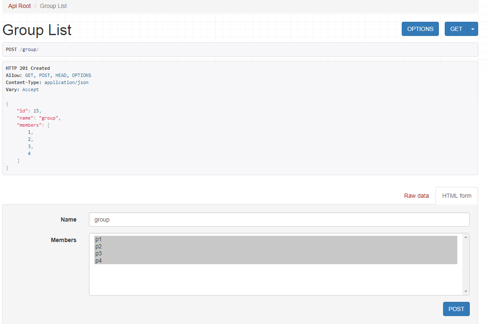

>本文由Scarb发表于[金甲虫的博客](http://47.106.131.90/blog)，转载请注明出处

# Django REST framework manytomany relationship with extra fields DRF中有外部域的多对多关系处理

在开发中，模型会存在多对多关系，并且多对多关系中可能会有额外的域。
这种情况下用DRF框架生成API会比较复杂，POST和PUT方法的处理也很复杂。
在这里记录一下这几天找到的一些解决方法。

## 1. 问题模型

在[Django官方文档](https://docs.djangoproject.com/en/dev/topics/db/models/#extra-fields-on-many-to-many-relationships)中提到了这种特定的问题，要使用`through`参数指定一个额外的连接模型表，这样就可以在额外的模型表中添加域。
官方文档给出的模型如下，是

```python
from django.db import models

class Person(models.Model):
    name = models.CharField(max_length=128)

    def __str__(self):
        return self.name

class Group(models.Model):
    name = models.CharField(max_length=128)
    members = models.ManyToManyField(Person, through='Membership')

    def __str__(self):
        return self.name

class Membership(models.Model):
    person = models.ForeignKey(Person, on_delete=models.CASCADE)
    group = models.ForeignKey(Group, on_delete=models.CASCADE)
    date_joined = models.DateField()
    invite_reason = models.CharField(max_length=64)
```

我们可以对这些模型进行一些操作

```python
>>> ringo = Person.objects.create(name="Ringo Starr")
>>> paul = Person.objects.create(name="Paul McCartney")
>>> beatles = Group.objects.create(name="The Beatles")
>>> m1 = Membership(person=ringo, group=beatles,
...     date_joined=date(1962, 8, 16),
...     invite_reason="Needed a new drummer.")
>>> m1.save()
>>> beatles.members.all()
<QuerySet [<Person: Ringo Starr>]>
>>> ringo.group_set.all()
<QuerySet [<Group: The Beatles>]>
>>> m2 = Membership.objects.create(person=paul, group=beatles,
...     date_joined=date(1960, 8, 1),
...     invite_reason="Wanted to form a band.")
>>> beatles.members.all()
<QuerySet [<Person: Ringo Starr>, <Person: Paul McCartney>]>
```

但是不能进行以下操作，因为用指定关联表的模型会有一些限制：

```python
>>> # The following statements will not work
>>> beatles.members.add(john)
>>> beatles.members.create(name="George Harrison")
>>> beatles.members.set([john, paul, ringo, george])
```

## 2. 问题描述

在创建`Group`时，我希望能够指定该组的成员(在已经创建的`Person`中选择)。并且能够指定该`Person`的`invite_reason`。

在研究该问题时，我将模型简化为如下：
省去了`date_joined`域

```python
class Person(models.Model):
    name = models.CharField(max_length=128)

class Group(models.Model):
    name = models.CharField(max_length=128)
    members = models.ManyToManyField(Person, through='Membership')

class Membership(models.Model):
    person = models.ForeignKey(Person, on_delete=models.CASCADE)
    group = models.ForeignKey(Group, on_delete=models.CASCADE)
    invite_reason = models.CharField(max_length=64, blank=True)
```

## 3. 用PrimaryKeyRelatedField，并自动生成关联表

在[网上给出的一种解答中](https://stackoverflow.com/questions/28706072/drf-3-creating-many-to-many-update-create-serializer-with-though-table)，推荐在`GroupSerializer`中使用`PrimaryKeyRelatedField`将`Person`关联入`Group`。

[DRF文档: PrimaryKeyRelatedField](http://www.django-rest-framework.org/api-guide/relations/#primarykeyrelatedfield)

这种解答确实可以在创建`Group`时复选`Person`，并创建相应的`Membership`。
但是无法为该`Membership`指定`invite_reason`。

这种解决方法适合关联表没有额外域的情况，或者是额外域有默认值得情况。
创建关联表时不会设置额外域的值。

这种方法的代码如下

```python
# serializer.py
class MemberShipSerializer(serializers.ModelSerializer):
    class Meta:
        model = Membership
        fields = ('id', 'person')           # 注意这里没有`group`，只有`person`，这样在创建`Group`时只需要传入`person`的主键即可

class GroupSerializer(serializers.ModelSerializer):
    # 在创建Group时提供person的queryset进行复选
    members = serializers.PrimaryKeyRelatedField(many=True, queryset=Person.objects.all())

    class Meta:
        model = Group
        fields = ('id', 'name', 'members')

class PersonSerializer(serializers.ModelSerializer):
    class Meta:
        model = Person
        fields = ('id', 'name')
```

```python
# models.py
class Membership(models.Model):
    person = models.ForeignKey(Person, on_delete=models.CASCADE)
    group = models.ForeignKey(Group, on_delete=models.CASCADE)
    invite_reason = models.CharField(max_length=64, blank=True)

    class Meta:
        auto_created = True                 # 关联模型需要设置为可以自动创建，这样在创建`Group`时选了`Person`后会自动创建一些关联表
```

随后可以创建`Group`，自动生成`Member`
创建需要POST的json如下

```json
{
    "name": "gp",
    "members": [1,2,3]
}
```



## 4. 用HyperlinkedRelatedField，自动生成关联表

既然能用`PrimaryKeyRelatedField`，那么我想`HyperlinkedRelatedField`应该也可以。
改为超链接方式的关系只需要修改一下`serializers.py`
(我这里也把其他序列化器改成`HyperlinkedModelSerializer`，不改也可以)

```python
class MemberShipSerializer(serializers.HyperlinkedModelSerializer):
    class Meta:
        model = Membership
        fields = ('url', 'person')

class GroupSerializer(serializers.HyperlinkedModelSerializer):
    # 改为超链接关系，并指定view_name为person-detail
    members = serializers.HyperlinkedRelatedField(many=True,
                                                  queryset=Person.objects.all(),
                                                  view_name='person-detail')

    class Meta:
        model = Group
        fields = ('url', 'name', 'members')

class PersonSerializer(serializers.HyperlinkedModelSerializer):
    class Meta:
        model = Person
        fields = ('url', 'name')
```

创建需要POST的json如下

```json
{
    "name": "gp",
    "members": [
        "http://127.0.0.1:8000/person/1/",
        "http://127.0.0.1:8000/person/2/"
    ]
}
```

## 5. 手动重载create和update方法

使用`Nested Relationship`，[DRF文档：Writable nested serializers](http://www.django-rest-framework.org/api-guide/relations/#writable-nested-serializers)

Nested Relationship即级联关系，在`GroupSerializer`中放入`MembershipSerializer`，在序列化和反序列化时，`Group`的信息中会嵌套`Membership`的信息。

这需要手动重载`serializer`的`create`和`update`方法。

```python
class MemberShipSerializer(serializers.ModelSerializer):
    class Meta:
        model = Membership
        # 这里的fields会影响创建group时所需要传入的参数，这里设置传入person和invite_reason
        fields = ('id', 'person', 'invite_reason')

class GroupSerializer(serializers.ModelSerializer):
    memberships = MemberShipSerializer(many=True, required=False)

    # 重载create和update方法，手动创建Membership，并设置group和person的连接
    def create(self, validated_data):
        person_data = validated_data.pop('memberships')
        group = Group.objects.create(**validated_data)
        for person in person_data:
            d=dict(person)
            Membership.objects.create(group=group, person=d['person'])
        return group

    def update(self, instance, validated_data):
        person_data = validated_data.pop('memberships')
        for item in validated_data:
            if Group._meta.get_field(item):
                setattr(instance, item, validated_data[item])
        Membership.objects.filter(group=instance).delete()
        for person in person_data:
            d=dict(person)
            Membership.objects.create(group=instance, person=d['person'])
        instance.save()
        return instance

    class Meta:
        model = Group
        depth = 1
        fields = ('id', 'name', 'members', 'memberships')

class PersonSerializer(serializers.ModelSerializer):
    class Meta:
        model = Person
        fields = ('id', 'name')
```

此时POST的json参数如下

```python
{
    "name": "gp",
    "memberships": [
        { "person": 1, "invite_reason": "reason1" },
        { "person": 2, "invite_reason": "reason2" }
    ]
}
```

但是我发现只在serializer层面重载`create`和`update`方法确实能创建关联表，但是无法设定额外域的值，即`invite_reason`的值。
因为serializer层面无法获取`request`传来的`invite_reason`数据，`validated_data`中只包含`Group`中的域(即`Person`)，而`invite_reason`被排除。

## 6. 在view层手动为关联表添加额外域

前面的三种方法都可以成功创建关联模型，但是无法设定额外域的值。

目前的方法只能在view层为关联表添加额外域。

重载`GroupViewSet`的`perform_create()`方法。

```python
class GroupViewSet(viewsets.ModelViewSet):
    queryset = Group.objects.all()
    serializer_class = GroupSerializer

    def perform_create(self, serializer):
        serializer.save()
        #
        group = serializer.instance
        print(serializer.instance)
        mems = Membership.objects.filter(group=group)
        print(mems)
        if 'memberships' in self.request.data:
            for membership in self.request.data['memberships']:
                if 'invite_reason' in membership and 'person' in membership:
                    mem = mems.get(person_id=membership['person'])
                    mem.invite_reason = membership['invite_reason']
                    mem.save()
```

## 7. 参考

1. [DRF 3 - Creating Many-to-Many update/create serializer with though table](https://stackoverflow.com/questions/28706072/drf-3-creating-many-to-many-update-create-serializer-with-though-table)
2. [Django文档：Extra fields on many-to-many relationships](https://docs.djangoproject.com/en/dev/topics/db/models/#extra-fields-on-many-to-many-relationships)
3. [How to POST Model with Many to Many through in Django REST](https://stackoverflow.com/questions/49633926/how-to-post-model-with-many-to-many-through-in-django-rest)