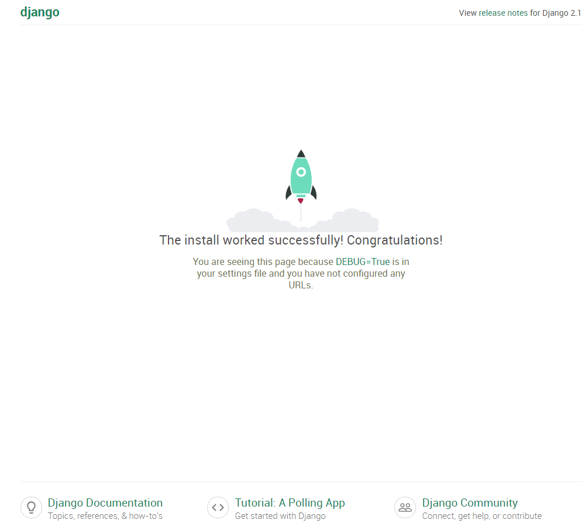

>本文由Scarb发表于[金甲虫的博客](http://47.106.131.90/blog)，转载请注明出处

# Django Nginx uWSGI 配置

## 1. Django

前置准备：
部署好python环境
在机器上安装django，并创建一个django项目。
django项目的创建可见[django 官方教程笔记](http://www.cnscarb.com/blog/post/328.html)

创建完之后运行测试

```shell
python manage.py runserver 0.0.0.0:8000
```

访问8000端口可以看到django项目成功启动

<!-- more -->

## 2. uWSGI

### 2.1 概念和原理

> WSGI（Python Web Server GateWay Interface）: WSGI是一种Web服务器网关接口。它是一个Web服务器（如nginx）与应用服务器（如uWSGI服务器）通信的一种规范。由于WSGI的通用性，出现了独立的WSGI程序，例如uWSGI和Apacke的mod_wsgi。

> uWSGI: 是一个Web服务器，它实现了WSGI协议、uwsgi、http等协议。用于接收前端服务器转发的动态请求并处理后发给 web 应用程序。

> uwsgi: 是uWSGI服务器实现的独有的协议。

#### nginx/uWSGI/Django项目工作流程

1. 用户通过浏览器发出http请求到服务器。
2. nginx负责接受外部http请求并进行解包，若请求是静态文件则根据设置好的静态文件路径返回对应内容。若请求是动态内容则将请求交给uWSGI服务器（nginx和uWSGI使用端口或socket通信）。
3. uWSGI服务器收到请求后，根据wsgi协议解析并回调Django应用。
4. Django应用则根据请求进行数据库增删查改和模版渲染等工作，然后再逆方向返回nginx。
5. nginx将响应交付用户浏览器。

## 2.2 安装和配置uWSGI

用pip安装uwsgi

```shell
pip install uwsgi
```

装完之后测试一下，创建`test.py`

```python
# test.py
def application(env, start_response):
    start_response('200 OK', [('Content-Type','text/html')])
    return [b"Hello World"] # python3
    #return ["Hello World"] # python2
```

然后用uWSGI运行刚才创建的简单web app

```shell
uwsgi --http :8000 --wsgi-file test.py
```

访问8000端口可以看到Hello World

接下来在我们的Django项目上使用uWSGI

```shell
uwsgi --http :8000 --module mysite.wsgi
# module mysite.wsgi: 加载指定的wsgi模块
```

> 注意，这里并没有mysite.wsgi这个文件，这是一个python模块路径，实际上的文件路径是 mysite/wsgi.py ，Django项目创建时会自动创建该文件

访问机器的8000端口就可以看到django项目创建成功的提示页面。

## 3. nginx

### 3.1 安装nginx

在Linux上安装nginx，ubuntu上可以用apt-get安装

```shell
sudo apt-get install nginx
sudo /etc/init.d/nginx start    # 启动nginx
```

### 3.2 配置nginx

安装完成之后进行配置
我们需要用到`uwsgi_params`文件，这个文件在nginx目录下有，把它复制到django项目目录下，或者到[github下载](https://github.com/nginx/nginx/blob/master/conf/uwsgi_params)

然后我们要创建nginx配置文件，在`/etc/nginx/sites-available`目录下创建`mysite_nginx.conf`

```conf
# mysite_nginx.conf

# the upstream component nginx needs to connect to
upstream django {
    server unix:///path/to/your/mysite/mysite.sock; # for a file socket
    # server 127.0.0.1:8001; # for a web port socket (we'll use this first)
}

# configuration of the server
server {
    # the port your site will be served on
    listen      8000;
    # the domain name it will serve for
    server_name example.com; # substitute your machine's IP address or FQDN
    charset     utf-8;

    # max upload size
    client_max_body_size 75M;   # adjust to taste

    # Django media
    location /media  {
        alias /path/to/your/mysite/media;  # your Django project's media files - amend as required
    }

    location /static {
        alias /path/to/your/mysite/static; # your Django project's static files - amend as required
    }

    # Finally, send all non-media requests to the Django server.
    location / {
        uwsgi_pass  django;
        include     /path/to/your/mysite/uwsgi_params; # the uwsgi_params file you installed
    }
}
```

在配置文件开头可以看到有两种django的upstream，文件类型的socket和web类型的socket，文件类型的性能会更好一些。
这个配置文件让nginx转发对静态文件的请求，同时处理发向Django的请求。
更好的实现是用一个服务器处理静态文件，一个服务器处理Django应用。

### 3.3 处理Django静态文件，测试nginx对静态文件请求的转发

然后将静态文件链接到django目录

```shell
sudo ln -s ~/path/to/your/mysite/mysite_nginx.conf /etc/nginx/sites-enabled/
```

在启动nginx之前，必须把Django的静态文件收集到static目录下。
先修改`settings.py`

```python
STATIC_ROOT = os.path.join(BASE_DIR, "statis/")
```

然后运行

```shell
python manage.py collectstatic
```

这样就可以启动nginx了

```shell
sudo /etc/init.d/nginx restart
```

将一张图片放进`/path/to/your/project/project/media`目录，访问 http://example.com:8000/media/media.png
如果得到正确的图片，那么nginx运行正常。

## 4. uWSGI + NginX 配置

### 4.1 用文件类型的socket启动

在Django项目目录用uwsgi启动Django应用

```shell
uwsgi --socket mysite.sock --module mysite.wsgi --chmod-socket=664
```

这里的mysite.sock本身不存在，运行命令后uwsgi会自动生成。
随后访问 http://example.com:8000 应该能看到django欢迎页。



如果没有看到，那么检查nginx的日志`/var/log/nginx/error.log`。
如果是

```log
connect() to unix:///path/to/your/mysite/mysite.sock failed (13: Permission
denied)
```

那么是权限问题，尝试给socket更高的权限。

```shell
uwsgi --socket mysite.sock --wsgi-file test.py --chmod-socket=666 # (very permissive)
```

如果是其他的，推荐查看文件名、文件路径是否配置正确。

### 4.2 用ini文件运行uWSGI

之前启动uwsgi用了一串参数，可以将这些参数写在一个配置文件中，让uwsgi直接读取配置文件启动，这样会更方便。
在项目目录创建`mysite_uwsgi.ini`

```ini
# mysite_uwsgi.ini file
[uwsgi]

# Django-related settings
# the base directory (full path)
chdir           = /path/to/your/project
# Django's wsgi file
module          = project.wsgi
# the virtualenv (full path)
home            = /path/to/virtualenv

# process-related settings
# master
master          = true
# maximum number of worker processes
processes       = 10
# the socket (use the full path to be safe
socket          = /path/to/your/project/mysite.sock
# ... with appropriate permissions - may be needed
# chmod-socket    = 664
# clear environment on exit
vacuum          = true

# 以下为可选
env = DJANGO_SETTINGS_MODULE=mysite.settings # set an environment variable
safe-pidfile = /tmp/project-master.pid # create a pidfile
harakiri = 20 # respawn processes taking more than 20 seconds
limit-as = 128 # limit the project to 128 MB
max-requests = 5000 # respawn processes after serving 5000 requests
daemonize = /var/log/uwsgi/yourproject.log # background the process & log
```

然后运行启动命令

```shell
uwsgi --ini mysite_uwsgi.ini
```

### 4.3 君主模式

君主模式下，uwsgi会对一个目录的配置文件进行实时监控。当有新的配置文件进入，君主会分配一个奴隶去运作该配置文件。

```shell
# create a directory for the vassals
sudo mkdir /etc/uwsgi
sudo mkdir /etc/uwsgi/vassals
# symlink from the default config directory to your config file
sudo ln -s /path/to/your/mysite/mysite_uwsgi.ini /etc/uwsgi/vassals/
# run the emperor
sudo uwsgi --emperor /etc/uwsgi/vassals --uid www-data --gid www-data
```

这些选项的意思

- emperor: 在哪找配置文件
- uid: 程序启动的user id
- gid: 程序启动的group id

> 如果用www-data用户启动带有log的uwsgi 君主，log文件可能会permission denied。那么用root用户启动可以解决。详见 https://stackoverflow.com/questions/50195313/nginx-uwsgi-permission-denied-when-trying-to-start-server

PS: uWSGI作者真是个人才。

```shell
*** starting uWSGI Emperor ***
# 君主启动！
*** has_emperor mode detected (fd: 6) ***
[uWSGI] getting INI configuration from sc2rank_uwsgi.ini
Thu Nov  8 00:11:55 2018 - [emperor] vassal sc2rank_uwsgi.ini has been spawned
# 奴隶甲出生了
Thu Nov  8 00:11:55 2018 - [emperor] vassal sc2rank_uwsgi.ini is ready to accept requests
# 奴隶甲准备好干活了
Thu Nov  8 00:11:59 2018 - [emperor] vassal sc2rank_uwsgi.ini is now loyal
# 奴隶甲很忠诚
^C[emperor] *** RAGNAROK EVOKED ***
# *** 诸神的黄昏降临 ***
Thu Nov  8 00:12:13 2018 - [emperor] stop the uwsgi instance sc2rank_uwsgi.ini
Thu Nov  8 00:12:16 2018 - [emperor] removed uwsgi instance sc2rank_uwsgi.ini
# 奴隶甲滚蛋了
Thu Nov  8 00:12:17 2018 - The Emperor is buried.
# 君主被埋了...
```

## 参考资料

1. [Setting up Django and your web server with uWSGI and nginx](https://uwsgi-docs.readthedocs.io/en/latest/tutorials/Django_and_nginx.html)
2. [How to use Django with uWSGI](https://docs.djangoproject.com/en/dev/howto/deployment/wsgi/uwsgi/)
3. [uWSGI+django+nginx的工作原理流程与部署历程](https://blog.csdn.net/c465869935/article/details/53242126)
4. [Django + Uwsgi + Nginx 的生产环境部署](https://www.cnblogs.com/chenice/p/6921727.html)
5. [django+nginx+uwsgi部署完全指导](https://blog.csdn.net/eightbrother888/article/details/79503716)
6. [Django Nginx+uwsgi 安装配置](http://www.runoob.com/django/django-nginx-uwsgi.html)
7. [从零开始搭建个人网站（6）nginx+uWSGI部署Django项目（上）](https://blog.csdn.net/zuimrs/article/details/79091518)