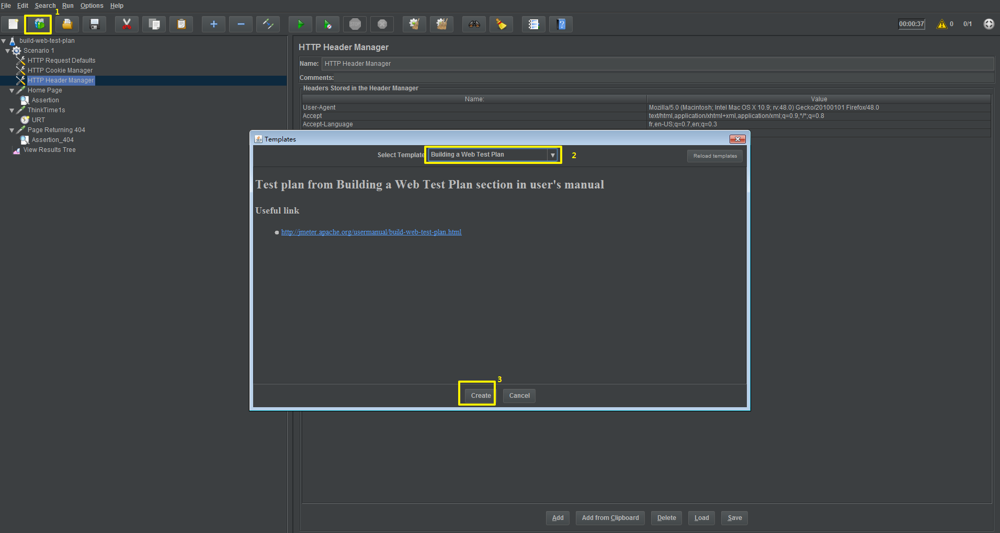
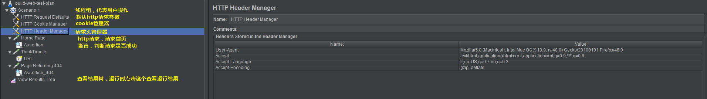
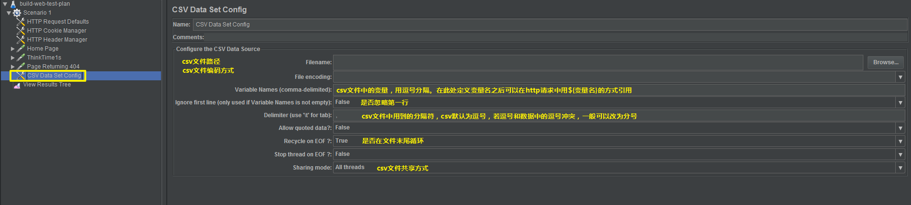
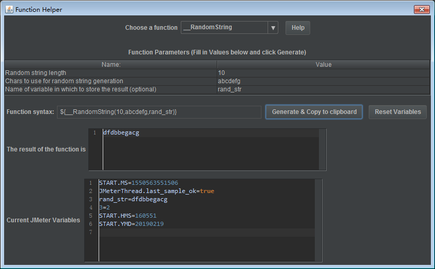
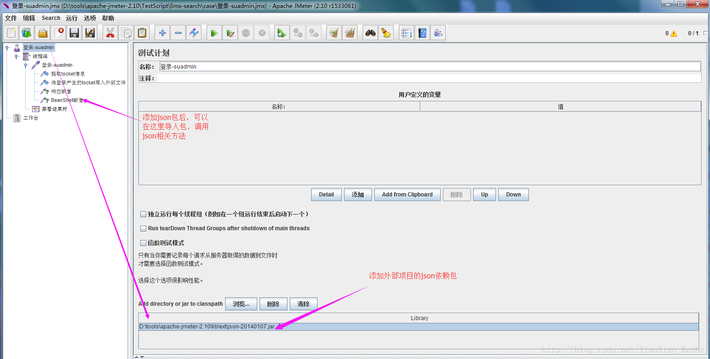

>本文由Scarb发表于[金甲虫的博客](http://47.106.131.90/blog)，转载请注明出处

# Jmeter 使用指南

　　Apache JMeter是Apache组织开发的基于Java的压力测试工具。用于对软件做压力测试，它最初被设计用于Web应用测试，但后来扩展到其他测试领域。 它可以用于测试静态和动态资源，例如静态文件、Java 小服务程序、CGI 脚本、Java 对象、数据库、FTP 服务器， 等等。JMeter 可以用于对服务器、网络或对象模拟巨大的负载，来自不同压力类别下测试它们的强度和分析整体性能。另外，JMeter能够对应用程序做功能/回归测试，通过创建带有断言的脚本来验证你的程序返回了你期望的结果。为了最大限度的灵活性，JMeter允许使用正则表达式创建断言。
Apache jmeter 可以用于对静态的和动态的资源（文件，Servlet，Perl脚本，java 对象，数据库和查询，FTP服务器等等）的性能进行测试。它可以用于对服务器、网络或对象模拟繁重的负载来测试它们的强度或分析不同压力类型下的整体性能。你可以使用它做性能的图形分析或在大并发负载测试你的服务器/脚本/对象。

## 1. 安装和运行

[JMeter官方文档：1. 新手入门](http://www.testclass.net/jmeter/jmeter-doc-01)

### 1.1 安装

使用Jmeter之前首先需要[安装Java](http://www.testclass.net/selenium_java/install-java/)环境。下载jdk进行安装。
之后去Jmeter官网下载jmeter的tgz包，然后解压即可。
[官网下载地址](http://jmeter.apache.org/download_jmeter.cgi)

### 1.2 运行

在Jmeter根目录的bin目录下有一些jmeter的运行文件。他们的用处如下。

- jmeter.bat
run JMeter (in GUI mode by default)
- jmeterw.cmd
run JMeter without the windows shell console (in GUI mode by default)
- jmeter-n.cmd
drop a JMX file on this to run a non-GUI test
- jmeter-n-r.cmd
drop a JMX file on this to run a non-GUI test remotely
- jmeter-t.cmd
drop a JMX file on this to load it in GUI mode
- jmeter-server.bat
start JMeter in server mode
- mirror-server.cmd
runs the JMeter Mirror Server in non-GUI mode
- shutdown.cmd
Run the Shutdown client to stop a non-GUI instance gracefully
- stoptest.cmd
Run the Shutdown client to stop a non-GUI instance abruptly

#### 1.2.1 界面运行

在Windows下，打开Jmeter根目录的`bin\jmeter.bat`，可以打开图形界面。
在Linux下运行`$ sh bin/jmeter.sh`可以打开图形界面。

另一种方法是用`java -jar`的方式运行
`java -jar bin/ApacheJMeter.jar`

#### 1.2.2 无界面运行

Jmeter可以无界面后台运行一个测试文件，并指定参数。
首先将测试配置文件保存为一个`jmx`文件，然后用命令行启动。

jmeter支持一些选项。

- -n
让Jmeter在无界面模式运行。
- -t
后面跟jmx文件名，指定运行的jmx文件。
- -l
[name of JTL file to log sample results to].
- -j
[name of JMeter run log file].
- -r
Run the test in the servers specified by the JMeter property "remote_hosts"
- -R
[list of remote servers] Run the test in the specified remote servers
- -g
[path to CSV file] generate report dashboard only
- -e
generate report dashboard after load test
- -o
output folder where to generate the report dashboard after load test. Folder must not exist or be empty
The script also lets you specify the optional firewall/proxy server information:

- -H
代理的hostname
- -P
代理的端口号

运行命令举例：

```shell
$ jmeter -n -t my_test.jmx -l log.jtl -H my.proxy.server -P 8000
```

### 1.2.3 服务模式

[Server Mode](http://jmeter.apache.org/usermanual/get-started.html#server)

## 2. 基本元素和使用

### 2.1 基础原件介绍

直接引用一篇比较详细的基础原件介绍。
[JMeter基础元件介绍-testclass.net](http://www.testclass.net/jmeter/base-element)
使用基础原件可以创建测试计划。
[创建一个简单的性能测试-testclass.net](http://www.testclass.net/jmeter/creat-performance-test)

----

官方文档也有相应教程
[JMeter官方文档：3. 测试计划中的元素](http://www.testclass.net/jmeter/jmeter-doc-03) | [英文原文](http://jmeter.apache.org/usermanual/test_plan.html)
[JMeter官方文档：4. 创建web测试计划](http://www.testclass.net/jmeter/jmeter-doc-04) | [英文原文](http://jmeter.apache.org/usermanual/build-web-test-plan.html)

----

使用模板可以根据需求快速创建一个测试计划的框架。



这里创建一个web测试计划模板。



---

我用到比较多的是将流量列表存到csv文件里面，用jmeter去依次读取csv文件中的流量，进行回放。
这需要用到`CSV Data Set Config`



用查看结果树可以查看请求的结果，并且支持将请求结果保存为日志文件。


### 2.2 变量

Jmeter中有两种变量类型`variables`和`properties`，变量和属性。他们的主要区别是`vars`的作用域是当前线程组，`prop`的作用域是全局。
文档：[Properties and Variables](http://jmeter.apache.org/usermanual/test_plan.html#properties)

#### 定义和使用变量

- 变量

变量可以在Test Plan组件中定义，也可以添加User Defined Variables。
然后用`${变量名}`的表达式在JMeter中使用该变量。

- 属性

定义属性需要用到`__P()`函数，在User Defined Variables中定义。

```text
HOST             ${__P(host,www.example.com)}
HREADS           ${__P(threads,10)}
LOOPS            ${__P(loops,20)}
```

在用无界面模式启动JMeter时可以改动

`jmeter … -Jhost=www3.example.org -Jloops=13`

### 2.3 函数

JMeter函数是可以在任意域和采样器中插入的特殊值。
函数可以这样插入使用
`${__functionName(var1,var2,var3)}`

对于每个函数的用法可以查看[官方文档](http://jmeter.apache.org/usermanual/functions.html)
[官方文档翻译](http://www.testclass.net/jmeter/jmeter-doc-20)

#### Function Helper

JMeter有一个Function Helper，可以用界面的形式查看各个函数的用法。
`Options -> Function Helper Dialog`
给定入参，JMeter会自动生成函数表达式和计算出参。



## 3. BeanShell

BeanShell是JMeter支持的一种语法类似Java的脚本。
JMeter中有`BeanShell PreProcessor`、`BeanShell PostProcessor`等组件，可以在请求的前后插入一些自定义的操作。
这里记录一下我使用BeanShell的经验。

### 3.1 BeanShell中的变量和属性

- vars

>vars是Jmeter变量，在Jmeter中最常用的组件。它是一个`org.apache.jmeter.threads.JMeterVariables`类的实例，提供读写当前变量的能力。它能够改变或美剧当前存在的变量，创建新变量，存储级联的属性。
>全部的Jmter变量是Java字符串，如果要往JMeter变量中添加数据，要先转化为字符串的形式。
>```java
>byte [] samplerdata = ctx.getPreviousResult().getResponseData();
>String samplerdatastring = new String(samplerdata);
>vars.put("samplerdata",samplerdatastring);
>```

其他用法查看[JavaDoc](http://jmeter.apache.org/api/org/apache/jmeter/threads/JMeterVariables.html)

- props

>类似于vars，prop表示JMeter的属性。

引用: [How to Use BeanShell: JMeter's Favorite Built-in Component](https://www.blazemeter.com/blog/queen-jmeters-built-componentshow-use-beanshell)

----

使用方法：

- vars - ( JMeterVariables) - gives read/write access to variables:

```java
vars.get(key);
vars.put(key,val);
vars.putObject("OBJ1",new Object());
vars.getObject("OBJ2");
```

- props - (JMeterProperties - class java.util.Properties):

```java
props.get("START.HMS");
props.put("PROP1","1234");
```

### 3.2 BeanShell中常用内置变量

[BeanShellSampler](https://jmeter.apache.org/usermanual/component_reference.html#BeanShell_Sampler)

- log：写入信息到jmeber.log文件，使用方法：log.info(“Agoly”);
- ctx：该变量引用了当前线程的上下文，使用方法可参考：org.apache.jmeter.threads.JMeterContext。
- vars：(JMeterVariables)：操作jmeter变量，这个变量实际引用了JMeter线程中的局部变量容器（本质上是Map），它是测试用例与BeanShell交互的桥梁，常用方法：
  1. vars.get(String key)：从jmeter中获得变量值
  2. vars.put(String key，String value)：数据存到jmeter变量中
- props: (JMeterProperties - class java.util.Properties)：操作jmeter属性，该变量引用了JMeter的配置信息，可以获取Jmeter的属性，它的使用方法与vars类似，但是只能put进去String类型的值，而不能是一个对象。对应于java.util.Properties。
  1. props.get("START.HMS");　　注：START.HMS为属性名，在文件jmeter.properties中定义
  2. props.put("PROP1","1234"); 
- prev：(SampleResult)：获取前面的sample返回的信息，常用方法：
  1. getResponseDataAsString()：获取响应信息
  2. getResponseCode() ：获取响应code
  3. 更多方法可参考：[org.apache.jmeter.samplers.SampleResult](http://jmeter.apache.org/api/org/apache/jmeter/samplers/SampleResult.html)
- sampler：(Sampler): 能够访问当前Sampler
- SampleResult：指向当前SampleResult的指针

## 4. 其他

### 4.1 使用外部Jar包

1. 下载jar包
2. 放入jmeter目录的`lib\ext`目录下，以便jmeter调用
3. jmeter脚本引入该json报，如截图所示



### 4.2 响应数据中文乱码问题

用notepad++打开{JMETER_HOME}\bin\jmeter.properties


默认编码为：ISO-8859-1

```conf
# The encoding to be used if none is provided (default ISO-8859-1)
# sampleresult.default.encoding=ISO-8859-1
```

根据测试系统修改对应的编码，如为utf-8
则增加编码设置为：
`sampleresult.default.encoding=utf-8`
修改配置后，要重启jmeter才会生效！

## 5. 参考资料

1. [JMeter User's Manual](http://jmeter.apache.org/usermanual/index.html)
2. [Jmeter性能测试文档翻译](http://www.testclass.net/jmeter)
3. [Jmeter（一）简介以及环境搭建](https://www.cnblogs.com/richered/p/8324039.html)
4. [性能测试工具 JMeter 入门基础](https://zhuanlan.zhihu.com/p/33683980)
5. [How to Use BeanShell: JMeter's Favorite Built-in Component](https://www.blazemeter.com/blog/queen-jmeters-built-componentshow-use-beanshell)
6. [beanshell常用内置变量总结](https://www.cnblogs.com/qmfsun/p/6282984.html)
7. [jmeter引用json的jar包处理beanshell的json响应](https://blog.csdn.net/XiaoXiao_RenHe/article/details/79037594)
8. [Jmeter--参数&相应数据中文乱码问题](https://www.cnblogs.com/itzhazha/articles/6707928.html)
