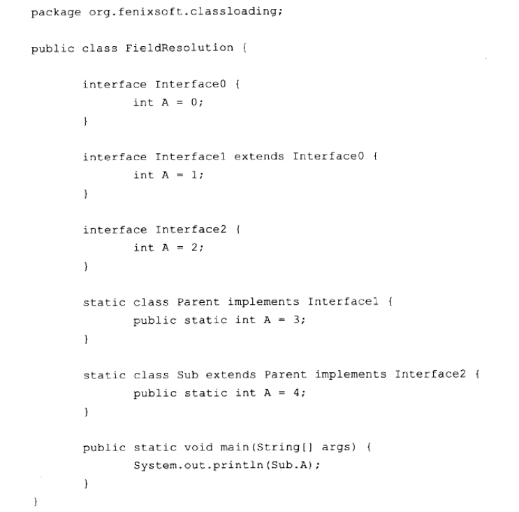
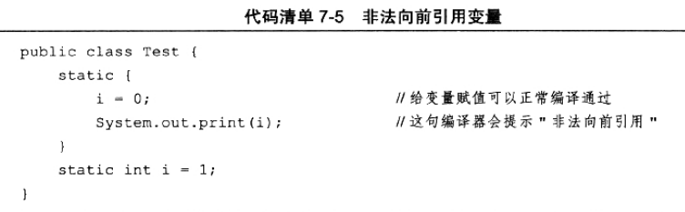
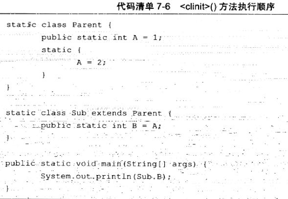
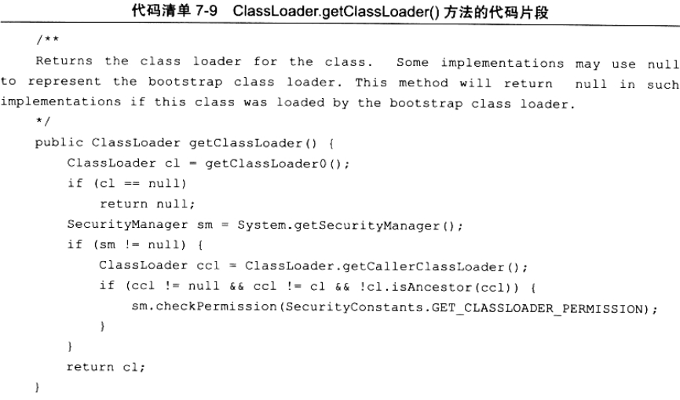
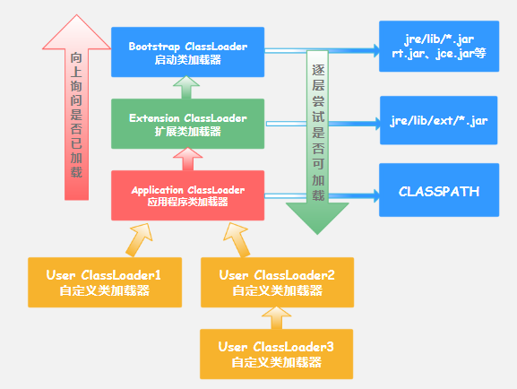
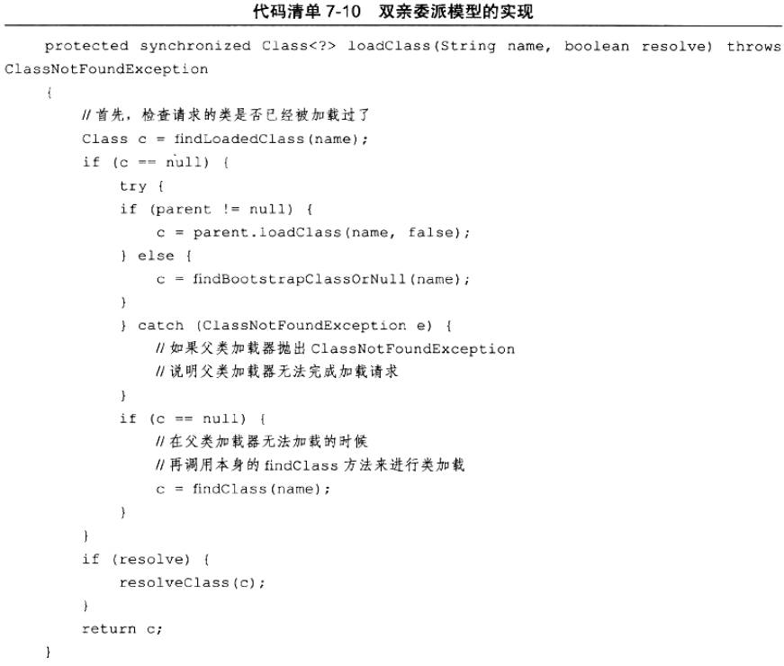

>本文由Scarb发表于[金甲虫的博客](http://47.106.131.90/blog)，转载请注明出处

# JVM类加载机制

## 1. 类加载的时机

```flow
st=>start: 加载 Loading
op1=>operation: 验证 Verification
op2=>operation: 准备 Preparation
op3=>operation: 解析 Resolution
op4=>operation: 初始化 Initialization
op5=>operation: 使用 Using
e=>end: 卸载
st->op1->op2->op3->op4->op5->e
```

其中验证、准备、解析3个部分统称为链接（Linking）。
解析阶段在某些情况下可以在初始化阶段之后再开始，这是为了支持Java语言的运行时绑定。

虚拟机规范严格规定有且仅有5种情况必须立即对类进行初始化。
类进行初始化的5种情况，称为主动引用

1. 遇到new、getstatic、putstatic、invokestatic这4条字节码指令。场景：使用`new`实例化对象、读取或设置一个类的静态字段、调用一个类的静态方法时。
2. 使用反射调用时
3. 初始化一个类时，先初始化父类。
4. 用户指定的主类（包含`main()`方法）
5. 使用JDK 1.7动态语言支持，一个`java.lang.invoke.MethodHandle`实力最后解析结果REF_getStatic、REF_pubStatic、REF_invokeStatic的方法句柄。

## 2. 类加载的过程

### 2.1 加载

加载阶段，虚拟机完成3件事情。

1. 通过一个类的全限定名获取定义此类的二进制字节流。
2. 讲这个字节流所代表的静态存储结构转化为方法区的运行时数据结构。
3. 在内存中生成一个代表这个类的`java.lang.Class`对象，作为方法区这个类的各种数据的访问入口。

* 非数组类的加载阶段可控性强，可以用系统或者自动以的类加载器去完成。（重写`loadClass()`）
* 数组类不通过类加载器创建，由Java虚拟机直接创建。数组类的元素类型最终靠类加载器创建。
  * 如果数组的组件类型是引用类型，递归采用加载过程去加载该组件类型。
  * 如果组件类型不是引用类型，Java虚拟机将会把数据标记为与引导类加载器关联。
  * 数组类的可见性与它的组件类型的可见性一致，如果组件类型不是引用类型，那数组类可见性默认为public

加载阶段与连接阶段部分内容交叉进行，但在加载阶段中进行的动作仍然属于连接阶段，这两个阶段的开始时间仍然保持固定的先后顺序。

### 2.2 验证

连接阶段第一步

为了确保Class文件的字节流种包含的信息符合当前虚拟机的要求，并且不会危害虚拟机自身的安全。

#### 2.2.1 文件格式验证

字节流是否符合Class文件格式的规范，并且能被当前版本的虚拟机处理。

#### 2.2.2 元数据验证

对字节码描述的信息进行语义分析，以保证其描述的信息符合Java语言规范的要求。

* 类是否有父类
* 父类是否继承了不允许被继承的类
* 如果不是抽象类，是否实现了父类或接口中要求实现的所有方法
* 字段、方法是否与父类发生矛盾

#### 2.2.3 字节码验证

通过数据流和控制流分析，确定程序语义是合法的、符合逻辑的。

* 保证任务时刻操作数栈的数据类型与指令代码序列都能配合工作，如：在操作栈防止一个int类型数据，使用时按long类型加载如本地变量表中。
* 保证跳转指令不会跳转到方法体以外的字节码指令上。
* 保证方法体中的类型转换是有效的。

#### 2.2.4 符号引用验证

发生在虚拟机讲符号引用转化为直接引用的时候，这个转化动作将在连接的第三阶段——解析阶段中发生。

可以看做是对类自身以外的信息进行匹配性校验。

### 2.3 准备

正式为类变量分配内存并设置类变量初始值的阶段，这些变量所使用的内存都将在方法区中进行分配。

* 此时进行内存分配的仅包括类变量（`static`修饰的变量），而不包括实例变量。实例变量将会在对象实例化时随着对象一起分配在Java堆中。
* 初始值通常情况下是数据类型的零值。
  * `public static int value = 123` 经过准备阶段后初始值为0而不是123，因为此时尚未开始执行任何Java方法。而把`value`赋值为123的动作在初始化阶段才会执行。
  * 特殊情况：如果类字段是常量，那在准备阶段变量`value`就会被初始化为常量属性指定的值
    * `public static final int value = 123`，在准备阶段`value`就会赋值为123。

### 2.4 解析

解析阶段虚拟机将常量池内的符号引用替换为直接引用。

#### 2.4.1 引用

##### 2.4.1.1 符号引用

以一组符号来描述所引用的目标。引用的目标不一定已经加载到内存中。虚拟机实现的内存布局可以不同，但它们能接受的符号引用必须都是一致的，因为符号引用的字面量形式明确定义在Java虚拟机规范的Class文件格式中。

##### 2.4.1.2 直接引用

可以是直接指向目标的指针、相对偏移量或是一个能间接定位到目标的句柄。和虚拟机内存布局相关。有了直接引用，那引用的目标必定已经在内存中存在。

#### 2.4.2 解析

主要针对类或接口、字段、类方法、接口方法、方法类型、方法句柄和调用点限定符7类符号引用进行，在常量池中有7种对应的常量类型。

##### 2.4.2.1 类或接口的解析

当前代码所处类D，如果要把一个从未解析过的符号引用N解析为一个类或接口C的直接引用，那虚拟机完成整个解析过程进过以下3个步骤：

1. C不是数组类型，虚拟机把代表N的全限定名传递给D的类加载器去加载这个类C。加载过程中又可能触发其他相关类的加载动作，例如加载父类或实现的接口。
2. 如果C是数组类型，并且数组的元素类型为对象，会按照第1点的规则加载数组元素类型。接着由虚拟机生成一个代表此数组维度和元素的数组对象。
3. 如果上面步骤没有出现任何异常，那么C在虚拟机中实际上已经成为一个有效的类或接口了，在解析完成之前还要进行符号引用验证，确认D是否具备对C的访问权限。

##### 2.4.2.2 字段解析

要解析一个未被解析过的字段符号引用，首先会对字段表内`class_index`项中索引的`CONSTANT_Class_info`符号引用进行解析，也就是字段所属的类或接口的符号引用。如果解析成功，将字段所属类或接口用C表示，虚拟机规范要求按照如下步骤对C进行后续字段的搜索。

1. 如果C本身包含了简单名称和字段描述符都与目标相匹配的字段，则返回这个字段的直接引用
2. 否则，如果在C中实现了接口，将会按照继承关系从下往上递归搜索各个接口和它的父接口，如果接口中包含了简单名称和字段描述符都与目标相匹配的字段，则返回这个字段的直接引用
3. 否则，如果C不是`java.lang.Object`，将会按照集成关系从下往上地柜搜索其父类，如果在父类中包含了简单名称和字段描述符都与目标相匹配的字段，返回这个字段的直接引用
4. 否则，查找失败

如果查找过程成功返回了引用，将会对这个字段进行权限验证。



##### 2.4.2.3 类方法解析

解析出方法表的`class_index`项中索引的方法属性的类或接口的符号引用，如果解析成功，用C表示这个类，接下来虚拟机按照以下步骤进行后续方法的搜索。

##### 2.4.2.4 接口方法解析

接续处接口方法表的`class_index`项中索引的方法所属的类或接口的符号引用，如果解析成功，用C表示这个接口，接下来虚拟机按照如下步骤进行后续接口方法搜索。

### 2.5 初始化

类加载过程的最后一步，真正开始执行类中定义的Java程序代码。

在初始化阶段，执行类构造器`<clinit>()`方法，去初始化类变量和其他资源。

#### 2.5.1 `<clinit>()`方法

* `<clinit>()`方法由编译器自动收集类中所有类变量的**赋值动作**和**静态语句块**(`static{}`)中的语句合并产生的。收集的顺序**由语句在源文件中出现的顺序所决定**。静态语句块只能访问定义在其之前的变量，定义在其之后的变量可以赋值，不能访问。

* `<clinit>()`方法与类的构造函数不同，不需要显示调用父类构造器，虚拟机会保证在子类的`<clinit>()`方法执行前，父类的`<clinit>()`方法执行完毕。因此在虚拟机中第一个被执行的`<clinit>()`方法的类肯定是`java.lang.Object`。
* 由于父类的`<clinit>()`方法先执行，意味着父类中定义的静态语句块要优先于子类的变量赋值操作。这里B的值将会是2。
* `<clinit>()`方法对于类或接口来说不是必须的，如果类中没有静态语句块和对变量的赋值操作，编译器可以不为这个类生成`<clinit>()`方法方法。
* 接口中没有静态语句块，有变量初始化赋值操作，因此接口也会生成`<clinit>()`方法。与类不同的是只有当父接口中定义的变量使用时，父接口才会初始化。接口的实现类在初始化时一样不会执行接口的`<clinit>()`方法。
* 虚拟机会保证一个类的`<clinit>()`方法在多线程环境中被正确地加锁、同步，多个线程同时初始化一个类时，只会有一个线程去执行这个类的`<clinit>()`方法，其他线程都阻塞，知道活动线程执行`<clinit>()`方法完毕。

## 3. 类加载器

应用程序自己决定如何去“通过一个类的全限定名来获取描述此类的二进制字节流”的动作的代码模块。

### 3.1 类与类加载器

对任意一个类，都需要由加载它的类加载器和这个类本身一同确立其在Java虚拟机中的唯一性。

由系统应用程序类加载器加载的类和自定义类加载器加载的类，虽然都来自一个Class文件，但依然是两个独立的类，做对象所属类型检查时结果为false。

### 3.2 双亲委派模型

从Java虚拟机角度来讲，只存在两种不同的类加载器

1. 启动类加载器`Bootstrap ClassLoader`：用C++语言实现，是虚拟机自身的一部分
2. 其他类加载器：由Java语言实现，独立于虚拟机外部，全部继承自抽象类`java.lang.ClassLoader`。

从开发者角度看，可以分为3种系统提供的类加载器

#### 3.2.1 启动类加载器`Bootstrap ClassLoader`

这个类加载器负责将存放在`<JAVA_HOME>\lib`目录中的，或者被`-Xbootclasspath`参数所指定的路径中的，并且是虚拟机识别的（按照文件名识别）类库加载到虚拟机内存中。

启动类加载器无法被Java程序直接引用，如果编写自定义类加载器时需要把加载请求委派给启动类加载器，直接用`null`替代即可。



#### 3.2.2 扩展类加载器`Extension ClassLoader`

由`sun.misc.Launcher$ExtClassLoader`实现，负责加载`<JAVA_HOME>\lib\ext`目录中的，或者被`java.ext.dirs`系统变量所指定的路径中的所有类库。开发者可以直接使用。

#### 3.2.3 应用程序类加载器`Application ClassLoader`

由`sun.misc.Launcher$AppClassLoader`实现。是`ClassLoader`中`getSystemClassLoader()`方法的返回值，也称为系统类加载器。负责加载用户路径`ClassPath`上锁指定的类库。

#### 3.2.4 双亲委派模型



双亲委派模型要求除了顶层的启动类加载器外，其余的类加载器都应当有自己的父类加载器。这里的父子关系都是用组合关系来服用父加载器的代码。

双亲委派模型不是一个强制性的约束模型，而是推荐的加载器实现方式。

##### 工作过程

如果一个类加载器收到了类加载请求，首先把请求委派给父类加载去完成，只有当父加载器反馈自己无法完成这个加载请求（它的搜索范围中没有找到所需的类）时，子加载器才会尝试自己去加载。

##### 实现代码

实现双亲委派模型的代码在`java.lang.ClassLoader`的`loadClass()`中。

* 先检查是否已经被加载过
  * 若没有则调用父加载器的`loadClass()方法`
  * 若父加载器为空则默认使用启动类加载器作为父加载器
* 如果父类加载失败
  * 抛出`ClassNotFoundException`
  * 调用自己的`findClass()`方法进行加载



### 3.3 破坏双亲委派模型

自定义类加载器类加载逻辑应当写到`findClass()`方法中，保证新写出来的类加载器符合双亲委派规则。

#### 3.3.1 线程上下文类加载器`Thread Context ClassLoader`

这个类加载器可以通过`java.lang.Thread`类的`setContextClassLoader()`方法进行设置，如果创建线程时还未设置，将会从父线程中继承一个，如果在应用程序的全局范围内都没有设置过，那默认是应用程序类加载器。

用线程上下文类加载器去加载代码，打通了双亲微泡模型的层次结构来你逆向使用类加载器，违背了双亲委派模型的一般性原则。

#### 3.3.2 热部署`Hot Deployment`、热替换`HotSwap`

为了实现代码热替换、模块热部，OSGi模块化规范将类加载器发展为更加复杂的网状结构。

