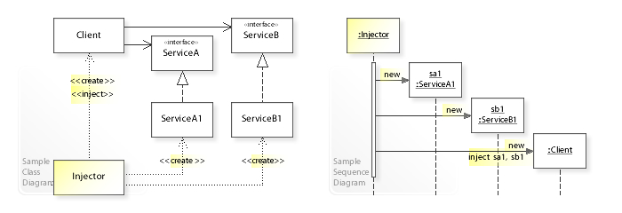

>本文由Scarb发表于[金甲虫的博客](http://47.106.131.90/blog)，转载请注明出处

# 依赖注入和控制反转 Inversion of Control Containers and the Dependency Injection pattern

## UML class and sequence diagram



## 依赖注入类型

有三种方式将外部模块注入对象：

* 构造器注入：依赖用该委托对象类的构造器注入
* setter注入：委托对象暴露一个setter方法，用于注入
* 接口注入：委托对象实现一个用来注入依赖的接口
* 其他类型

It is possible for DI frameworks to have other types of injection beyond those presented above.[29]

Testing frameworks may also use other types. Some modern testing frameworks do not even require that clients actively accept dependency injection thus making legacy code testable. In particular, in the Java language it is possible to use reflection to make private attributes public when testing and thus accept injections by assignment.[30]

Some attempts at Inversion of Control do not provide full removal of dependency but instead simply substitute one form of dependency for another. As a rule of thumb, if a programmer can look at nothing but the client code and tell what framework is being used, then the client has a hard-coded dependency on the framework.

## 例子

### 原始代码

In the following Java example, the Client class contains a Service member variable that is initialized by the Client constructor. The client controls which implementation of service is used and controls its construction. In this situation, the client is said to have a hard-coded dependency on ExampleService.


```java
// An example without dependency injection
public class Client {
    // Internal reference to the service used by this client
    private ExampleService service;

    // Constructor
    Client() {
        // Specify a specific implementation in the constructor instead of using dependency injection
        service = new ExampleService();
    }

    // Method within this client that uses the services
    public String greet() {
        return "Hello " + service.getName();
    }
}
```

Dependency injection is an alternative technique to initialize the member variable rather than explicitly creating a service object as shown above. We can adjust this example using the various techniques described and illustrated in the subsections below.

### 构造器注入

Preferred when all dependencies can be constructed first because it can be used to ensure the client object is always in a valid state, as opposed to having some of its dependency references be null (not be set). However, on its own, it lacks the flexibility to have its dependencies changed later. This can be a first step towards making the client immutable and therefore thread safe.

```java
// Constructor
Client(Service service, Service otherService) {
    if (service == null) {
        throw new InvalidParameterException("service must not be null");
    }
    if (otherService == null) {
        throw new InvalidParameterException("otherService must not be null");
    }

    // Save the service references inside this client
    this.service = service;
    this.otherService = otherService;
}
```

### Setter注入

Requires the client to provide a setter method for each dependency. This gives the freedom to manipulate the state of the dependency references at any time. This offers flexibility, but if there is more than one dependency to be injected, it is difficult for the client to ensure that all dependencies are injected before the client could be provided for use.

Because these injections happen independently there is no way to tell when the injector is finished wiring the client. A dependency can be left null simply by the injector failing to call its setter. This forces the check that injection was completed from when the client is assembled to whenever it is used.

```java
// Set the service to be used by this client
public void setService(Service service) {
    this.service = service;
}

// Set the other service to be used by this client
public void setOtherService(Service otherService) {
    this.otherService = otherService;
}

// Check the service references of this client
private void validateState() {
    if (service == null) {
        throw new IllegalStateException("service must not be null");
    }
    if (otherService == null) {
        throw new IllegalStateException("otherService must not be null");
    }
}

// Method that uses the service references
public void doSomething() {
    validateState();
    service.doYourThing();
    otherService.doYourThing();
}
```

### 接口注入

The advantage of interface injection is that dependencies can be completely ignorant of their clients yet can still receive a reference to a new client and, using it, send a reference-to-self back to the client. In this way, the dependencies become injectors. The key is that the injecting method (which could just be a classic setter method) is provided through an interface.

An assembler is still needed to introduce the client and its dependencies. The assembler would take a reference to the client, cast it to the setter interface that sets that dependency, and pass it to that dependency object which would turn around and pass a reference-to-self back to the client.

For interface injection to have value, the dependency must do something in addition to simply passing back a reference to itself. This could be acting as a factory or sub-assembler to resolve other dependencies, thus abstracting some details from the main assembler. It could be reference-counting so that the dependency knows how many clients are using it. If the dependency maintains a collection of clients, it could later inject them all with a different instance of itself.

```java
// Service setter interface.
public interface ServiceSetter {
    public void setService(Service service);
}

// Client class
public class Client implements ServiceSetter {
    // Internal reference to the service used by this client.
    private Service service;

    // Set the service that this client is to use.
    @Override
    public void setService(Service service) {
        this.service = service;
    }
}

// Injector class
public class ServiceInjector {
	Set<ServiceSetter> clients;
	public void inject(ServiceSetter client) {
		clients.add(client);
		client.setService(new ServiceFoo());
	}
	public void switchToBar() {
		for (Client client : clients) {
			client.setService(new ServiceBar());
		}
	}
}

// Service classes
public class ServiceFoo implements Service {}
public class ServiceBar implements Service {}
```

## 参考资料

* [Spring IoC有什么好处呢?](https://www.zhihu.com/question/23277575/answer/169698662)
* [Inversion of Control Containers and the Dependency Injection pattern](https://martinfowler.com/articles/injection.html)
* [Dependency Injection](https://en.wikipedia.org/wiki/Dependency_injection)

