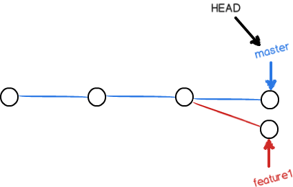

>本文由Scarb发表于[金甲虫的博客](http://47.106.131.90/blog)，转载请注明出处

# Git 操作笔记

[TOC]

## 1. Git简介

### 1.1 关于版本控制

版本控制是一种记录一个或若干文件内容变化，以便将来查阅特定版本修订情况的系统。 有了它你就可以将选定的文件回溯到之前的状态，甚至将整个项目都回退到过去某个时间点的状态，你可以比较文件的变化细节，查出最后是谁修改了哪个地方，从而找出导致怪异问题出现的原因，又是谁在何时报告了某个功能缺陷等等。

#### 1.1.1 本地版本控制

采用某种简单的数据库来记录文件的历次更新差异。


#### 1.1.2 集中化版本控制

如何让在不同系统上的开发者协同工作？ 

诸如 CVS、Subversion 以及 Perforce 等，都有一个单一的集中管理的服务器，保存所有文件的修订版本，而协同工作的人们都通过客户端连到这台服务器，取出最新的文件或者提交更新。 多年以来，这已成为版本控制系统的标准做法。


如果中心数据库所在的磁盘发生损坏，又没有做恰当备份，毫无疑问你将丢失所有数据——包括项目的整个变更历史，只剩下人们在各自机器上保留的单独快照。 

#### 1.1.3 分布式版本控制

客户端并不只提取最新版本的文件快照， 而是把代码仓库完整地镜像下来，包括完整的历史记录。

任何一处协同工作用的服务器发生故障，事后都可以用任何一个镜像出来的本地仓库恢复。 因为每一次的克隆操作，实际上都是一次对代码仓库的完整备份。


### 1.2 Git基本工作原理

#### 1.2.1 基于快照

Git 和其它版本控制系统（包括 Subversion 和近似工具）的主要差别在于 Git 对待数据的方法。 从概念上来说，其它大部分系统以文件变更列表的方式存储信息，这类系统（CVS、Subversion、Perforce、Bazaar 等等） 将它们存储的信息看作是一组基本文件和每个文件随时间逐步累积的差异 （它们通常称作 **基于差异（delta-based）** 的版本控制）。


Git 不按照以上方式对待或保存数据。反之，Git 更像是把数据看作是对小型文件系统的一系列快照。 在 Git 中，每当你提交更新或保存项目状态时，它基本上就会对当时的全部文件创建一个快照并保存这个快照的索引。 为了效率，如果文件没有修改，Git 不再重新存储该文件，而是只保留一个链接指向之前存储的文件。 Git 对待数据更像是一个 **快照流**。


在 Git 中的绝大多数操作都只需要访问本地文件和资源，一般不需要来自网络上其它计算机的信息。

#### 1.2.2 保证完整性

Git 中所有的数据在存储前都计算校验和，然后以校验和来引用。

Git 用以计算校验和的机制是 SHA-1 散列，由 40 个十六进制字符（0-9 和 a-f）组成的字符串。

`24b9da6552252987aa493b52f8696cd6d3b00373`

#### 1.2.3 三种状态

Git 有三种状态

1. 已提交：已修改表示修改了文件，但还没保存到数据库中。
2. 已修改：已暂存表示对一个已修改文件的当前版本做了标记，使之包含在下次提交的快照中。
3. 已暂存：已提交表示数据已经安全地保存在本地数据库中。

------

Git 项目拥有三个阶段：工作区、暂存区以及 Git 目录


* 工作区：对项目的某个版本独立提取出来的内容。 这些从 Git 仓库的压缩数据库中提取出来的文件，放在磁盘上供你使用或修改。

* 暂存区：一个文件，保存了下次将要提交的文件列表信息，一般在 Git 仓库目录中。 按照 Git 的术语叫做“索引”，不过一般说法还是叫“暂存区”。

* Git 仓库目录： Git 用来保存项目的元数据和对象数据库的地方。 这是 Git 中最重要的部分，从其它计算机克隆仓库时，复制的就是这里的数据。

## 2. Git准备工作

### 2.1 Git config配置

#### 初次使用

```shell
$ git config --global user.name "John Doe"
$ git config --global user.email johndoe@example.com
```

```shell
$ git config --list
user.name=John Doe
user.email=johndoe@example.com
color.status=auto
color.branch=auto
color.interactive=auto
color.diff=auto
```

#### autoclrf

> https://stackoverflow.com/questions/1967370/git-replacing-lf-with-crlf

```shell
core.autocrlf=true:      core.autocrlf=input:     core.autocrlf=false:

        repo                     repo                     repo
      ^      V                 ^      V                 ^      V
     /        \               /        \               /        \
crlf->lf    lf->crlf     crlf->lf       \             /          \      
   /            \           /            \           /            \
```

> LF will be replaced by CRLF

**When does this warning show up (under Windows)**

* `autocrlf` = `true` if you have unix-style `lf` in one of your files (= RARELY),
* `autocrlf` = `input` if you have win-style `crlf` in one of your files (= almost ALWAYS),
* `autocrlf` = `false` – NEVER!

**Moral** (for Windows):

* use `core.autocrlf` = `true` if you plan to use this project under Unix as well (and unwilling to configure your editor/IDE to use unix line endings),
* use `core.autocrlf` = `false` if you plan to use this project under Windows only (or you have configured your editor/IDE to use unix line endings),
* *never* use `core.autocrlf` = `input` unless you have a good reason to (*eg* if you're using unix utilities under windows or if you run into makefiles issues),

### 2.2 ssh key

```shell
$ ssh-keygen -o
Generating public/private rsa key pair.
Enter file in which to save the key (/home/schacon/.ssh/id_rsa):
Created directory '/home/schacon/.ssh'.
Enter passphrase (empty for no passphrase):
Enter same passphrase again:
Your identification has been saved in /home/schacon/.ssh/id_rsa.
Your public key has been saved in /home/schacon/.ssh/id_rsa.pub.
The key fingerprint is:
d0:82:24:8e:d7:f1:bb:9b:33:53:96:93:49:da:9b:e3 schacon@mylaptop.local
```

### 2.3 git help

打开Git命令的`manpage`

```shell
$ git help <verb>
$ git <verb> --help
$ man git-<verb>
```

可用选项的快速参考，用`-h`选项获得更简明的`help`

```shell
$ git add -h
usage: git add [<options>] [--] <pathspec>...

    -n, --dry-run         dry run
    -v, --verbose         be verbose

    -i, --interactive     interactive picking
    -p, --patch           select hunks interactively
    -e, --edit            edit current diff and apply
    -f, --force           allow adding otherwise ignored files
    -u, --update          update tracked files
    --renormalize         renormalize EOL of tracked files (implies -u)
    -N, --intent-to-add   record only the fact that the path will be added later
    -A, --all             add changes from all tracked and untracked files
    --ignore-removal      ignore paths removed in the working tree (same as --no-all)
    --refresh             don't add, only refresh the index
    --ignore-errors       just skip files which cannot be added because of errors
    --ignore-missing      check if - even missing - files are ignored in dry run
    --chmod (+|-)x        override the executable bit of the listed files
```


## 3. Git基础操作

### 3.1 记录更新

工作目录下的每一个文件都不外乎这两种状态：**已跟踪** 或 **未跟踪**。

* 已跟踪：被纳入了版本控制的文件，在上一次快照中有它们的记录
  * 未修改
  * 已修改
  * 已暂存


#### git add 跟踪/暂存

`git add <files>`开始跟踪当前目录下的文件/暂存已修改的文件

使用文件或目录的路径作为参数；如果参数是目录的路径，该命令将递归地跟踪/暂存该目录下的所有文件。

#### git status 查看状态

```shell
$ vim CONTRIBUTING.md
$ git status
On branch master
Your branch is up-to-date with 'origin/master'.
Changes to be committed:
  (use "git reset HEAD <file>..." to unstage)

    new file:   README
    modified:   CONTRIBUTING.md

Changes not staged for commit:
  (use "git add <file>..." to update what will be committed)
  (use "git checkout -- <file>..." to discard changes in working directory)

    modified:   CONTRIBUTING.md
```

#### .gitignore 忽略文件

```config
# 忽略所有的 .a 文件
*.a

# 但跟踪所有的 lib.a，即便你在前面忽略了 .a 文件
!lib.a

# 只忽略当前目录下的 TODO 文件，而不忽略 subdir/TODO
/TODO

# 忽略任何目录下名为 build 的文件夹
build/

# 忽略 doc/notes.txt，但不忽略 doc/server/arch.txt
doc/*.txt

# 忽略 doc/ 目录及其所有子目录下的 .pdf 文件
doc/**/*.pdf
```

#### git diff 查看修改

* `git diff`查看尚未暂存的文件更新了哪些部分

```shell
$ git diff
diff --git a/CONTRIBUTING.md b/CONTRIBUTING.md
index 8ebb991..643e24f 100644
--- a/CONTRIBUTING.md
+++ b/CONTRIBUTING.md
@@ -65,7 +65,8 @@ branch directly, things can get messy.
 Please include a nice description of your changes when you submit your PR;
 if we have to read the whole diff to figure out why you're contributing
 in the first place, you're less likely to get feedback and have your change
-merged in.
+merged in. Also, split your changes into comprehensive chunks if your patch is
+longer than a dozen lines.

 If you are starting to work on a particular area, feel free to submit a PR
 that highlights your work in progress (and note in the PR title that it's

```

* `git diff --staged`查看已暂存的将要添加到下次提交里的内容

#### git commit 提交更新

* `git commit -m `提交更新

```shell
$ git commit -m "Story 182: Fix benchmarks for speed"
[master 463dc4f] Story 182: Fix benchmarks for speed
 2 files changed, 2 insertions(+)
 create mode 100644 README
```

* `git commit -a -m`跳过暂存直接提交

```shell
$ git status
On branch master
Your branch is up-to-date with 'origin/master'.
Changes not staged for commit:
  (use "git add <file>..." to update what will be committed)
  (use "git checkout -- <file>..." to discard changes in working directory)

    modified:   CONTRIBUTING.md

no changes added to commit (use "git add" and/or "git commit -a")
$ git commit -a -m 'added new benchmarks'
[master 83e38c7] added new benchmarks
 1 file changed, 5 insertions(+), 0 deletions(-)
```

#### git rm 移除文件

要从 Git 中移除某个文件，就必须要从已跟踪文件清单中移除（确切地说，是从暂存区域移除），然后提交。 可以用 `git rm` 命令完成此项工作，并连带从工作目录中删除指定的文件，这样以后就不会出现在未跟踪文件清单中了。

```shell
$ rm PROJECTS.md
$ git status
On branch master
Your branch is up-to-date with 'origin/master'.
Changes not staged for commit:
  (use "git add/rm <file>..." to update what will be committed)
  (use "git checkout -- <file>..." to discard changes in working directory)

        deleted:    PROJECTS.md

no changes added to commit (use "git add" and/or "git commit -a")
$ git rm PROJECTS.md
rm 'PROJECTS.md'
$ git status
On branch master
Your branch is up-to-date with 'origin/master'.
Changes to be committed:
  (use "git reset HEAD <file>..." to unstage)

    deleted:    PROJECTS.md
```

让文件保留在磁盘，但是并不想让 Git 继续跟踪，用`--cached`选项

```shell
$ git rm --cached README
```

#### git mv 移动文件

运行 `git mv` 就相当于运行了下面三条命令：

```shell
$ mv README.md README
$ git rm README.md
$ git add README
```

### 3.2 查看历史

#### git log

```shell
$ git log
commit ca82a6dff817ec66f44342007202690a93763949
Author: Scott Chacon <schacon@gee-mail.com>
Date:   Mon Mar 17 21:52:11 2008 -0700

    changed the version number

commit 085bb3bcb608e1e8451d4b2432f8ecbe6306e7e7
Author: Scott Chacon <schacon@gee-mail.com>
Date:   Sat Mar 15 16:40:33 2008 -0700

    removed unnecessary test

commit a11bef06a3f659402fe7563abf99ad00de2209e6
Author: Scott Chacon <schacon@gee-mail.com>
Date:   Sat Mar 15 10:31:28 2008 -0700

    first commit
```

```shell
$ git log --stat
commit ca82a6dff817ec66f44342007202690a93763949
Author: Scott Chacon <schacon@gee-mail.com>
Date:   Mon Mar 17 21:52:11 2008 -0700

    changed the version number

 Rakefile | 2 +-
 1 file changed, 1 insertion(+), 1 deletion(-)

commit 085bb3bcb608e1e8451d4b2432f8ecbe6306e7e7
Author: Scott Chacon <schacon@gee-mail.com>
Date:   Sat Mar 15 16:40:33 2008 -0700

    removed unnecessary test

 lib/simplegit.rb | 5 -----
 1 file changed, 5 deletions(-)

commit a11bef06a3f659402fe7563abf99ad00de2209e6
Author: Scott Chacon <schacon@gee-mail.com>
Date:   Sat Mar 15 10:31:28 2008 -0700

    first commit

 README           |  6 ++++++
 Rakefile         | 23 +++++++++++++++++++++++
 lib/simplegit.rb | 25 +++++++++++++++++++++++++
 3 files changed, 54 insertions(+)
```

```shell
$ git log --pretty=format:"%h %s" --graph
* 2d3acf9 ignore errors from SIGCHLD on trap
*  5e3ee11 Merge branch 'master' of git://github.com/dustin/grit
|\
| * 420eac9 Added a method for getting the current branch.
* | 30e367c timeout code and tests
* | 5a09431 add timeout protection to grit
* | e1193f8 support for heads with slashes in them
|/
* d6016bc require time for xmlschema
*  11d191e Merge branch 'defunkt' into local
```

### 3.3 撤销操作

#### git commit --amend 重新提交

```shell
$ git commit -m 'initial commit'
$ git add forgotten_file
$ git commit --amend
```

最终你只会有一个提交——第二次提交将代替第一次提交的结果。

#### git reset 取消暂存的文件

```shell
$ git add *
$ git status
On branch master
Changes to be committed:
  (use "git reset HEAD <file>..." to unstage)

    renamed:    README.md -> README
    modified:   CONTRIBUTING.md
$ git reset HEAD CONTRIBUTING.md
Unstaged changes after reset:
M	CONTRIBUTING.md
$ git status
On branch master
Changes to be committed:
  (use "git reset HEAD <file>..." to unstage)

    renamed:    README.md -> README

Changes not staged for commit:
  (use "git add <file>..." to update what will be committed)
  (use "git checkout -- <file>..." to discard changes in working directory)

    modified:   CONTRIBUTING.md

```

#### git checkout -- \<file\> 撤销对文件的修改

```shell
Changes not staged for commit:
  (use "git add <file>..." to update what will be committed)
  (use "git checkout -- <file>..." to discard changes in working directory)

    modified:   CONTRIBUTING.md
$ git checkout -- CONTRIBUTING.md
$ git status
On branch master
Changes to be committed:
  (use "git reset HEAD <file>..." to unstage)

    renamed:    README.md -> README

```

### 3.4 使用远程仓库

#### git remote 查看/修改远程仓库

##### git remote -v

```shell
$ git remote -v
bakkdoor  https://github.com/bakkdoor/grit (fetch)
bakkdoor  https://github.com/bakkdoor/grit (push)
cho45     https://github.com/cho45/grit (fetch)
cho45     https://github.com/cho45/grit (push)
defunkt   https://github.com/defunkt/grit (fetch)
defunkt   https://github.com/defunkt/grit (push)
koke      git://github.com/koke/grit.git (fetch)
koke      git://github.com/koke/grit.git (push)
origin    git@github.com:mojombo/grit.git (fetch)
origin    git@github.com:mojombo/grit.git (push)
```

##### git remote add

```shell
$ git remote
origin
$ git remote add pb https://github.com/paulboone/ticgit
$ git remote -v
origin	https://github.com/schacon/ticgit (fetch)
origin	https://github.com/schacon/ticgit (push)
pb	https://github.com/paulboone/ticgit (fetch)
pb	https://github.com/paulboone/ticgit (push)
```

##### git remote show

```shell
$ git remote show origin
* remote origin
  URL: https://github.com/my-org/complex-project
  Fetch URL: https://github.com/my-org/complex-project
  Push  URL: https://github.com/my-org/complex-project
  HEAD branch: master
  Remote branches:
    master                           tracked
    dev-branch                       tracked
    markdown-strip                   tracked
    issue-43                         new (next fetch will store in remotes/origin)
    issue-45                         new (next fetch will store in remotes/origin)
    refs/remotes/origin/issue-11     stale (use 'git remote prune' to remove)
  Local branches configured for 'git pull':
    dev-branch merges with remote dev-branch
    master     merges with remote master
  Local refs configured for 'git push':
    dev-branch                     pushes to dev-branch                     (up to date)
    markdown-strip                 pushes to markdown-strip                 (up to date)
    master                         pushes to master                         (up to date)
```

##### git remote rename

```shell
$ git remote rename pb paul
$ git remote
origin
paul
```

##### git remote remove

```shell
$ git remote remove paul
$ git remote
origin
```

## 4. Git 分支操作

### 4.1 分支简介和原理

在进行提交操作时，Git 会保存一个提交对象（commit object）。该提交对象会包含一个指向暂存内容快照的指针，作者的姓名和邮箱、提交时输入的信息以及只想它父对象的指针。

```shell
$ git add README test.rb LICENSE
$ git commit -m 'The initial commit of my project'
```

* **blob**对象：Git用blob保存文件的快照
* **树**对象：记录着目录结构和blob对象索引
* **提交**对象：包含着只想前述树对象的指针和所有提交信息


做些修改后再次提交，那么这次产生的提交对象会包含一个指向上次提交对象（父对象）的指针。


Git 的分支，其实本质上仅仅是指向提交对象的可变指针。`master` 分支会在每次提交时自动向前移动。


创建新分支会在当前提交对象上创建一个指针

```shell
$ git branch testing
```


Git有一个`HEAD`特殊指针，指向当前所在的本地分支。

```shell
$ git checkout testing
```


HEAD分支随着提交操作自动向前移动


```shell
$ git log --oneline --decorate --graph --all
* c2b9e (HEAD, master) made other changes
| * 87ab2 (testing) made a change
|/
* f30ab add feature #32 - ability to add new formats to the
* 34ac2 fixed bug #1328 - stack overflow under certain conditions
* 98ca9 initial commit of my project
```

### 4.2 新建分支

* `git branch <name>`：新建分支
* git checkout -b <name>：新建分支并切换到该分支

### 4.3 合并分支

#### 快速合并

通常合并分支时会用`Fast forward`模式


```shell
$ git checkout master
$ git merge hotfix
Updating f42c576..3a0874c
Fast-forward
 index.html | 2 ++
 1 file changed, 2 insertions(+)
```


#### 分叉分支合并


```shell
$ git checkout master
Switched to branch 'master'
$ git merge iss53
Merge made by the 'recursive' strategy.
index.html |    1 +
1 file changed, 1 insertion(+)
```


和之前将分支指针向前推进所不同的是，Git 将此次三方合并的结果做了一个新的快照并且自动创建一个新的提交指向它。 这个被称作一次合并提交，它的特别之处在于他有不止一个父提交。

#### 合并冲突

如果你在两个不同的分支中，对同一个文件的同一个部分进行了不同的修改，Git 就没法干净的合并它们。



```shell
$ git merge feature1
Auto-merging readme.txt
CONFLICT (content): Merge conflict in readme.txt
Automatic merge failed; fix conflicts and then commit the result.

$ git status
On branch master
Your branch is ahead of 'origin/master' by 2 commits.
  (use "git push" to publish your local commits)

You have unmerged paths.
  (fix conflicts and run "git commit")
  (use "git merge --abort" to abort the merge)

Unmerged paths:
  (use "git add <file>..." to mark resolution)

	both modified:   readme.txt

no changes added to commit (use "git add" and/or "git commit -a")
```

此时 Git 做了合并，但是没有自动地创建一个新的合并提交。 Git 会暂停下来，等待你去解决合并产生的冲突。

```txt
Git is a distributed version control system.
Git is free software distributed under the GPL.
Git has a mutable index called stage.
Git tracks changes of files.
<<<<<<< HEAD
Creating a new branch is quick & simple.
=======
Creating a new branch is quick AND simple.
>>>>>>> feature1
```

```shell
$ git add readme.txt 
$ git commit -m "conflict fixed"
[master cf810e4] conflict fixed
```


### 4.4 分支管理

`git branch`命令展示当前本地分支

`git branch -a`展示所有分支（包含远程分支）

```shell
$ git branch -v
  iss53   93b412c fix javascript issue
* master  7a98805 Merge branch 'iss53'
  testing 782fd34 add scott to the author list in the readmes
```

```shell
$ git branch --merged
  iss53
* master
```

```shell
$ git branch --no-merged
  testing
```

### 4.5 远程分支

远程引用是对远程仓库的引用（指针），包括分支、标签等等。它们以`<remove>/<branch>`的形式命名。

#### `git fetch <remote>`同步远程仓库数据


#### `git push <remote> <branch>` 推送到远程分支

```shell
$ git push origin serverfix
Counting objects: 24, done.
Delta compression using up to 8 threads.
Compressing objects: 100% (15/15), done.
Writing objects: 100% (24/24), 1.91 KiB | 0 bytes/s, done.
Total 24 (delta 2), reused 0 (delta 0)
To https://github.com/schacon/simplegit
 * [new branch]      serverfix -> serverfix
```

#### 跟踪分支

##### 拉取远程分支并跟踪

从一个远程跟踪分支检出一个本地分支会自动创建所谓的“跟踪分支”。 跟踪分支是与远程分支有直接关系的本地分支。 如果在一个跟踪分支上输入 `git pull`，Git 能自动地识别去哪个服务器上抓取、合并到哪个分支。

`git checkout -b <branch> <remote>/<branch>`

```shell
$ git checkout -b sf origin/serverfix
Branch sf set up to track remote branch serverfix from origin.
Switched to a new branch 'sf'
```

##### 修改跟踪分支

设置已有的本地分支跟踪一个刚刚拉取下来的远程分支，或者想要修改正在跟踪的上游分支， 你可以在任意时间使用 `-u` 或 `--set-upstream-to` 选项运行 `git branch` 来显式地设置。

```shell
$ git branch -u origin/serverfix
Branch serverfix set up to track remote branch serverfix from origin.
```

##### 查看当前跟踪分支

```shell
$ git branch -vv
  iss53     7e424c3 [origin/iss53: ahead 2] forgot the brackets
  master    1ae2a45 [origin/master] deploying index fix
* serverfix f8674d9 [teamone/server-fix-good: ahead 3, behind 1] this should do it
  testing   5ea463a trying something new
```

##### 删除远程分支

```shell
$ git push origin --delete serverfix
To https://github.com/schacon/simplegit
 - [deleted]         serverfix
```

### 4.6 变基


## 5. Git工作流

### 5.1 Git Flow

[A successful Git branching model](https://nvie.com/posts/a-successful-git-branching-model/)


### 5.2 Aone Flow


## 6. Git进阶操作

### 6.1 git cherry-pick
