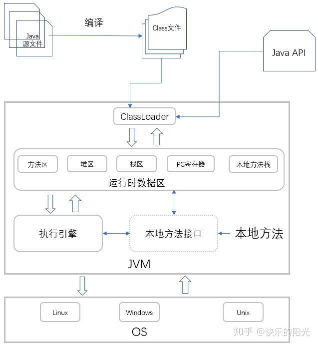
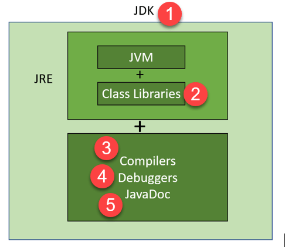

>本文由Scarb发表于[金甲虫的博客](http://47.106.131.90/blog)，转载请注明出处

# JVM虚拟机基础概念

* JVM时一种规范
  * java virtual machine specifications
* JVM跟java无关，只要能编译成class文件，JVM就能执行
* 虚构出来的一台计算机
  * 字节码指令集（汇编语言）
  * 内存管理

## 常见的JVM实现[^1]

* Hotspot
  * oracle官方
* Jrockeit
  * BEA，曾经号称世界上最快的JVM
  * 被Oracle收购，合并于hotspot
* J9
  * IBM

* Microsoft VM
* TaobaoVM
  * hotspot深度定制版
* LiquidVM
  * 直接针对硬件
* azul zing
  * 最新垃圾回收的业界标杆

## JDK JRE JVM[^2]

| **JDK**                                                      | **JRE**                                                      | **JVM**                                                      |
| ------------------------------------------------------------ | ------------------------------------------------------------ | ------------------------------------------------------------ |
| The full form of JDK is Java Development Kit.                | The full form of JRE is Java Runtime Environment.            | The full form of JVM is Java Virtual Machine.                |
| JDK is a software development kit to develop applications in Java. | It is a software bundle which provides Java class libraries with necessary components to run Java code. | JVM executes Java byte code and provides an environment for executing it. |
| JDK is platform dependent.                                   | JRE is also platform dependent.                              | JVM is platform-independent.                                 |
| It contains tools for developing, debugging, and monitoring java code. | It contains class libraries and other supporting files that JVM requires to execute the program. | Software development tools are not included in JVM.          |
| It is the superset of JRE                                    | It is the subset of JDK.                                     | JVM is a subset of JRE.                                      |
| The JDK enables developers to create Java programs that can be executed and run by the JRE and JVM. | The JRE is the part of Java that creates the JVM.            | It is the Java platform component that executes source code. |
| JDK comes with the installer.                                | JRE only contain environment to execute source code.         | JVM bundled in both software JDK and JRE.                    |

[^1]: [Comparison of Java virtual machines](https://en.wikipedia.org/wiki/Comparison_of_Java_virtual_machines)
[^2]: [JDK vs JRE vs JVM](https://www.guru99.com/difference-between-jdk-jre-jvm.html)