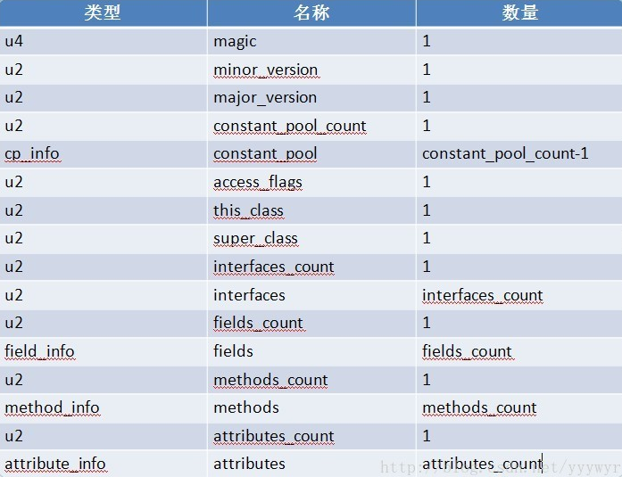

>本文由Scarb发表于[金甲虫的博客](http://47.106.131.90/blog)，转载请注明出处

# JVM class文件结构[^1]

Class文件的存储结构使得Java虚拟机实现了语言无关性，不同的语言，如java、groovy等程序语言通过编译可以转化为存储字节码的Class文件，从而使得Class文件在虚拟机中运行。

Class文件是一组以8位字节为单位的二进制流，各数据项严格按照顺序紧凑的排列在Class文件之中，中间无任何分隔符号。根据JVM Specification规定，Class文件格式采用一种类似于C语言结构体的伪结构来存储。这种伪结构中只有两种数据类型：无符号数和表。

无符号数：基本数据类型，以u1、u2、u4和u8分别代表1个字节、2个字节、4个字节和8个字节的无符号数，用于描述数字、索引引用、数量值等。

表：由多个无符号数或其他表作为数据项构成的复合数据类型，以_info结尾，用于描述有层次关系的复合机构的数据。

下图是Class文件格式：

## 查看class格式工具

* javap -v class
* JBE 可以直接修改
* JClassLib
  * idea插件

[^1]: [JVM Class 文件结构详解一](https://blog.csdn.net/yyywyr/article/details/39482285)