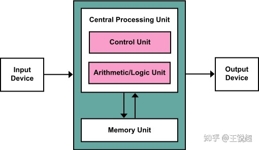
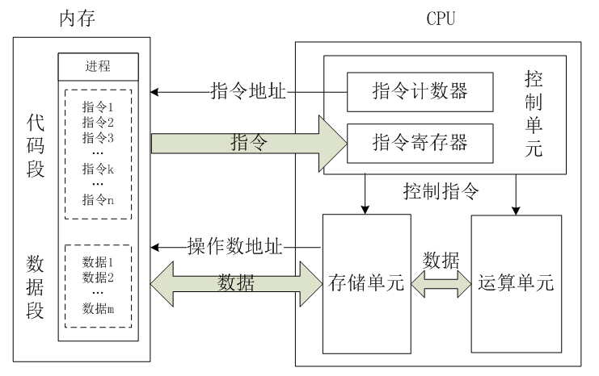

# CPU工作原理[^1]

## 内部架构

CPU 的根本任务就是执行指令，对计算机来说最终都是一串由 0 和 1 组成的序列。CPU 从逻辑上可以划分成 3 个模块，分别是控制单元、运算单元和存储单元 。其内部架构如下：

### 控制单元

控制单元是整个CPU的指挥控制中心，由指令寄存器IR（Instruction Register）、指令译码器ID（Instruction Decoder）和 操作控制器OC（Operation Controller） 等组成，对协调整个电脑有序工作极为重要。它根据用户预先编好的程序，依次从存储器中取出各条指令，放在指令寄存器IR中，通过指令译码（分析）确定应该进行什么操作，然后通过操作控制器OC，按确定的时序，向相应的部件发出微操作控制信号。操作控制器OC中主要包括：节拍脉冲发生器、控制矩阵、时钟脉冲发生器、复位电路和启停电路等控制逻辑。

### 运算单元

运算单元是运算器的核心。可以执行算术运算（包括加减乘数等基本运算及其附加运算）和逻辑运算（包括移位、逻辑测试或两个值比较）。相对控制单元而言，运算器接受控制单元的命令而进行动作，即运算单元所进行的全部操作都是由控制单元发出的控制信号来指挥的，所以它是执行部件。

### 存储单元

存储单元包括` CPU 片内缓存`和`寄存器组`，是 CPU 中暂时存放数据的地方，里面保存着那些等待处理的数据，或已经处理过的数据，CPU 访问寄存器所用的时间要比访问内存的时间短。采用寄存器，可以减少 CPU 访问内存的次数，从而提高了 CPU 的工作速度。寄存器组可分为专用寄存器和通用寄存器。专用寄存器的作用是固定的，分别寄存相应的数据；而通用寄存器用途广泛并可由程序员规定其用途。

## 工作原理

总的来说，CPU 从内存中一条一条地取出指令和相应的数据，按指令操作码的规定，对数据进行运算处理，直到程序执行完毕为止。具体过程可分为以下四步：

### 取指令

CPU 控制器从内存读取一条指令并放入`指令寄存器`。指令的格式如下：

* 操作码：汇编语言里的 mov，add，jmp 等符号码。
* 操作数地址：说明该指令需要的操作数所在的地方，是在内存里还是在CPU的内部寄存器里。

### 指令译码

`指令寄存器`中的指令经过`译码`，决定该指令应进行何种操作（就是指令里的操作码）、操作数在哪里（操作数的地址） 。

### 执行指令

执行指令分为两个阶段： 取操作数 和 进行运算 。

* 取操作数：CPU 通过寻址操作，从内存（数据段）中读取操作数到通用寄存器中，暂存起来。
* 进行运算：运算单元通过指令中的操作码，对寄存器中的操作数进行 mov，add，jmp 操作。

### 指令计数

修改指令计数器，决定下一条指令的地址 。CPU 重复上述三步操作，处于内存代码段的指令被逐个的执行，直到程序执行完毕为止。

## CPU字长

CPU在单位时间内(同一时间)能一次处理的二进制数的位数叫`字长`。所以，能处理字长为 8 位数据的 CPU 通常就叫 8 位的 CPU。同理，32 位CPU 能在单位时间内处理字长为 32 位的二进制数据 。

常见的 32位 CPU 和 64位 CPU 主要存在以下两个差异：

1. 处理能力不同
   * 32位CPU的一个指令，最大能处理32位二进制数据，即一次处理4个字节数据
   * 64位CPU的一个指令，最大能处理64位二进制数据，即一次处理8个字节数据
2. 寻址空间不同
   * 32位CPU的寻址范围是2的32次方，即寻址空间最大为4GB
   * 64位CPU的寻址范围是2的64次方

-----

## 参考资料

[^1]: [[简单介绍 CPU 的工作原理](https://www.cnblogs.com/onepixel/p/8724526.html)](https://www.cnblogs.com/onepixel/p/8724526.html)