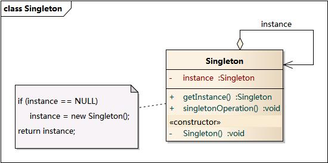

# Java设计模式——单例模式

> 原文作者： blinkfox
> 原文地址：https://blinkfox.github.io/2018/10/28/hou-duan/java/java-yi-chang-zhi-shi-hui-zong/

## 模式动机

对于系统中的某些类来说，只有一个实例很重要，例如，一个系统中可以存在多个打印任务，但是只能有一个正在工作的任务；一个系统只能有一个窗口管理器或文件系统；一个系统只能有一个计时工具或ID（序号）生成器。

如何保证一个类只有一个实例并且这个实例易于被访问呢？定义一个全局变量可以确保对象随时都可以被访问，但不能防止我们实例化多个对象。

一个更好的解决办法是让类自身负责保存它的唯一实例。这个类可以保证没有其他实例被创建，并且它可以提供一个访问该实例的方法。这就是单例模式的模式动机。

## 模式定义

> **单例模式(`Singleton Pattern`)**：单例模式确保某一个类只有一个实例，而且自行实例化并向整个系统提供这个实例，这个类称为单例类，它提供全局访问的方法。单例模式是一种**对象创建型模式**。单例模式又名单件模式或单态模式。

单例模式的要点有三个：

- 一是某个类只能有一个实例；
- 二是它必须自行创建这个实例；
- 三是它必须自行向整个系统提供这个实例。

## 模式结构

### 参与角色

- `Singleton`: 单例

### UML类图



### 时序图


## 代码实现方式

### 1. 饿汉式（推荐使用）

```java
/**
 * 饿汉式单例模式.
 *
 * @author blinkfox on 2017-10-23.
 */
public class Singleton {

    /** 全局唯一实例. */
    private static final Singleton singleton = new Singleton();

    private Singleton() {}

    public static Singleton getSingleton() {
        return singleton;
    }

}
```

> **注**：这种方式避免了多线程的同步问题，但不是懒加载。如果不需要懒加载的方式，推荐使用。

### 2. 非线程安全懒汉式（不推荐使用）

```java
/**
 * 非线程安全的懒汉式.
 *
 * @author blinkfox on 2017-10-23.
 */
public class Singleton {

    private static Singleton singleton;

    private Singleton() {}

    /**
     * 通过懒加载的方式获取实例，但是非线程安全.
     * @return Singleton实例
     */
    public static Singleton getSingleton() {
        if (singleton == null) {
            singleton = new Singleton();
        }
        return singleton;
    }

}
```

> **注**：是懒加载的方式，但非线程安全。不推荐使用。

### 3. 低效的线程安全懒汉式（不推荐使用）

```java
/**
 * 低效的线程安全的懒汉式.
 *
 * @author blinkfox on 2017-10-23.
 */
public class Singleton {

    private static Singleton singleton;

    private Singleton() {}

    /**
     * 通过 synchronized 关键字来保证线程安全，也是懒加载的方式来获取实例.
     * @return Singleton实例
     */
    public static synchronized Singleton getSingleton() {
        if (singleton == null) {
            singleton = new Singleton();
        }
        return singleton;
    }

}
```

> **注**：是懒加载的方式，也线程安全，但是效率很低。因为99%的情况下是不需要去同步的。不推荐使用。

### 4. 双重校验锁线程安全懒汉式（不推荐使用）

```java
/**
 * 双重校验锁线程安全懒汉式.
 *
 * @author blinkfox on 2017-10-23.
 */
public class Singleton {

    private static Singleton singleton;

    private Singleton() {}

    /**
     * 通过'双重校验锁'来更高效的保证线程安全，也是懒加载的方式来获取实例.
     * @return Singleton实例
     */
    public static Singleton getSingleton() {
        if (singleton == null) {
            synchronized (Singleton.class) {
                if (singleton == null) {
                    singleton = new Singleton();
                }
            }
        }
        return singleton;
    }

}
```

> **注**：是懒加载的方式，也线程安全，效率也不错。但受限于Jdk5以前的Java内存模型，仍然会有bug，Java5及之后才能正常达到单例效果。

### 5. 枚举式（强烈推荐使用）

```java
/**
 * 枚举方式的单例.
 *
 * @author blinkfox on 2017-10-23.
 */
public enum Singleton {

    INSTANCE;

}
```

> **注**：在`《Effective Java》`一书中强烈推荐使用枚举来实现单例模式，该方式简单可自由序列化；保证只有一个实例（即使使用反射机制也无法多次实例化一个枚举量）；线程安全。唯一的缺点是非懒加载方式。

### 6. 静态内部类（推荐使用）

```java
/**
 * 通过使用静态内部类的方式来实现懒加载且线程安全的创建单例.
 *
 * @author blinkfox on 2017-10-23.
 */
public class Singleton {

    private Singleton() {}

    /**
     * 静态内部类.
     */
    private static final class SingletonHolder {

        private SingletonHolder() {}

        private static Singleton4 instance = new Singleton();

    }

    /**
     * 通过懒加载的方式获取Singleton唯一实例的方法.
     * @return Singleton实例
     */
    public static Singleton getInstance() {
        return SingletonHolder.instance;
    }

}
```

> **注**：这种方式利用了`ClassLoader`的机制保证初始化`instance`时只有一个线程，其只有显示通过调用`getInstance`方法时，才会显示装载`SingletonHolder`类，从而实例化`instance`。

## 模式分析

单例模式的目的是保证一个类仅有一个实例，并提供一个访问它的全局访问点。单例模式包含的角色只有一个，就是单例类——`Singleton`。

### 优点

- 提供了对唯一实例的受控访问。因为单例类封装了它的唯一实例，所以它可以严格控制客户怎样以及何时访问它，并为设计及开发团队提供了共享的概念。
- 由于在系统内存中只存在一个对象，因此可以节约系统资源，对于一些需要频繁创建和销毁的对象，单例模式无疑可以提高系统的性能。
- 允许可变数目的实例。我们可以基于单例模式进行扩展，使用与单例控制相似的方法来获得指定个数的对象实例。

### 缺点

- 由于单例模式中没有抽象层，因此单例类的扩展有很大的困难。
- 单例类的职责过重，在一定程度上违背了“单一职责原则”。因为单例类既充当了工厂角色，提供了工厂方法，同时又充当了产品角色，包含一些业务方法，将产品的创建和产品的本身的功能融合到一起。
- 滥用单例将带来一些负面问题，如为了节省资源将数据库连接池对象设计为单例类，可能会导致共享连接池对象的程序过多而出现连接池溢出；现在很多面向对象语言(如`Java`、`C#`)的运行环境都提供了自动垃圾回收的技术，因此，如果实例化的对象长时间不被利用，系统会认为它是垃圾，会自动销毁并回收资源，下次利用时又将重新实例化，这将导致对象状态的丢失。

### 适用环境

在以下情况下可以使用单例模式：

- 系统只需要一个实例对象，如系统要求提供一个唯一的序列号生成器，或者需要考虑资源消耗太大而只允许创建一个对象。
- 客户调用类的单个实例只允许使用一个公共访问点，除了该公共访问点，不能通过其他途径访问该实例。
- 在一个系统中要求一个类只有一个实例时才应当使用单例模式。反过来，如果一个类可以有几个实例共存，就需要对单例模式进行改进，使之成为多例模式。

## 总结

- 单例模式确保某一个类只有一个实例，而且自行实例化并向整个系统提供这个实例，这个类称为单例类，它提供全局访问的方法。单例模式的要点有三个：一是某个类只能有一个实例；二是它必须自行创建这个实例；三是它必须自行向整个系统提供这个实例。单例模式是一种对象创建型模式。
- 单例模式只包含一个单例角色：在单例类的内部实现只生成一个实例，同时它提供一个静态的工厂方法，让客户可以使用它的唯一实例；为了防止在外部对其实例化，将其构造函数设计为私有。
- 实现单例模式，如果不需要懒加载的效果，则推荐使用枚举和饿汉式的方式；如果需要懒加载的效果，则推荐使用静态内部类来实现更好。
- 单例模式的主要优点在于提供了对唯一实例的受控访问并可以节约系统资源；其主要缺点在于因为缺少抽象层而难以扩展，且单例类职责过重。
- 单例模式适用情况包括：系统只需要一个实例对象；客户调用类的单个实例只允许使用一个公共访问点。