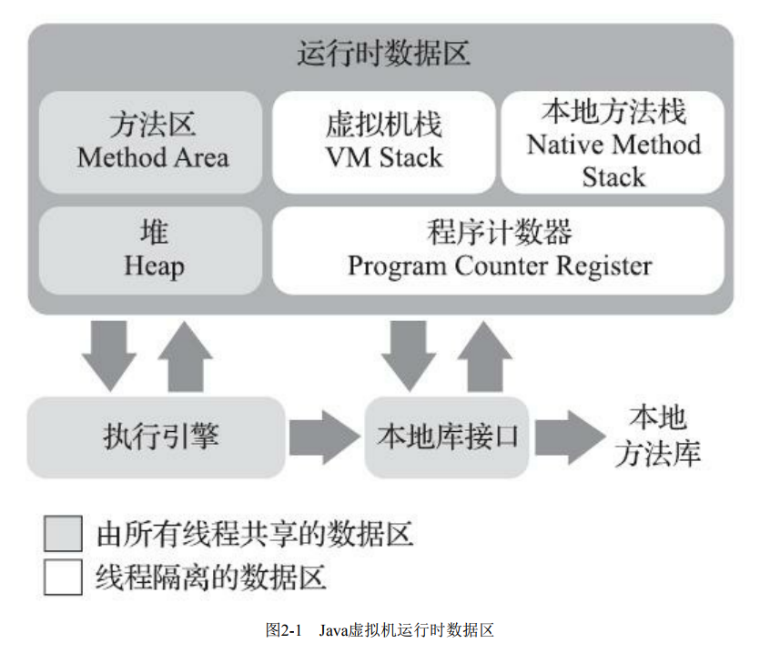

>本文由Scarb发表于[金甲虫的博客](http://47.106.131.90/blog)，转载请注明出处

# JVM Runtime Data Area | JVM运行时数据区



## 1. 程序计数器 Program Counter Register

* 较小的内存空间
* 可以看作是当前线程所执行的字节码的行号指示器
* 线程私有：每条线程有独立的程序计数器，各线程之间计数器互不影响
* 可能的取值
  * 执行Java方法：虚拟机字节码指令的地址
  * 执行Native方法：空（Undefined）
* 虚拟机的运行，类似于这样的循环

```java
while(not end) {
    取PC中的位置，找到对应位置的指令;
    执行该指令;
    PC++;
}
```

## 2. Java虚拟机栈 Java Virtual Machine Stack

* 线程私有

### 2.1 栈帧 Stack Frame

每个方法被执行的时候，Java虚拟机都会同步创建一个栈帧用于存储局部变量表、操作数栈、动态连接、方法出口等信 
息。每一个方法被调用直至执行完毕的过程，就对应着一个栈帧在虚拟机栈中从入栈到出栈的过程

存储数据和中间结果、执行动态链接，返回方法结果值，分发异常

#### 2.1.1 局部变量表

存放了编译期可知的各种Java虚拟机基本数据类型（boolean、byte、char、short、int、
float、long、double）、对象引用（reference类型，它并不等同于对象本身，可能是一个指向对象起始地址的引用指针，也可能是指向一个代表对象的句柄或者其他与此对象相关的位置）和returnAddress类型

#### 2.1.2 操作数栈

#### 2.1.3 动态链接

#### 2.1.4 方法返回地址

#### 2.1.5 附加信息

## 3. 本地方法栈 Native method stacks

* 线程私有
* 为Native方法服务

## 4. Java堆 Java Heap

* 线程共享
* 唯一目的：存放对象实例
* 虚拟机启动时创建
* 虚拟机管理内存中最大的一块
* 可以划分出多个线程私有的分配缓冲区，以提升对象分配时的效率
* 可以处于物理上不连续的内存空间中，但在逻辑上它应该被视为连续的

## 5. 方法区 Method Area

* 线程共享
* 存储已被虚拟机加载的类型（Class）信息、常量、静态变量、即时编译器编译后的代码缓存等数据

* 不同版本的Method Area实现：
  * Perm Space 永久区 (<1.8)
    * 字符串常量位于Perm Space
    * FGC不会清理
  * Meta Space 空间 (>=1.8)
    * 字符串常量位于堆
    * 会触发FGC处理

### 5.1. 运行时常量池 Runtime Constant Pool

* 在类加载后存放Class文件编译期生产的各种字面量与符号引用


## 6. 直接内存 Direct Memory

* JDK1.4中加入的NIO类引入的基于Channel与Buffer的I/O方式
* 可以使用Native函数库分配堆外内存，通过一个存储在Java堆内的`DirectByteBuffer`对象作为这块内存的引用进行操作
* 避免了在Java堆和Native堆中来回复制数据，实现零拷贝，提高性能

