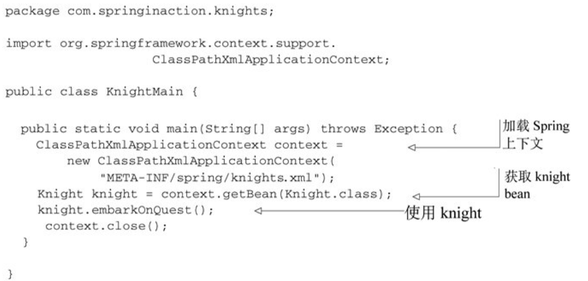
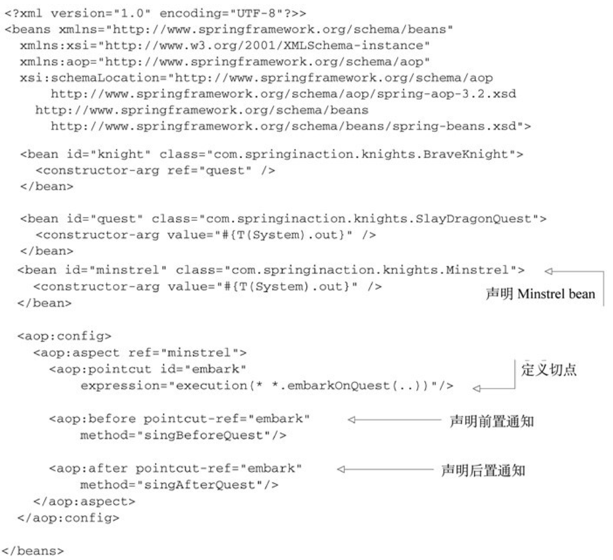
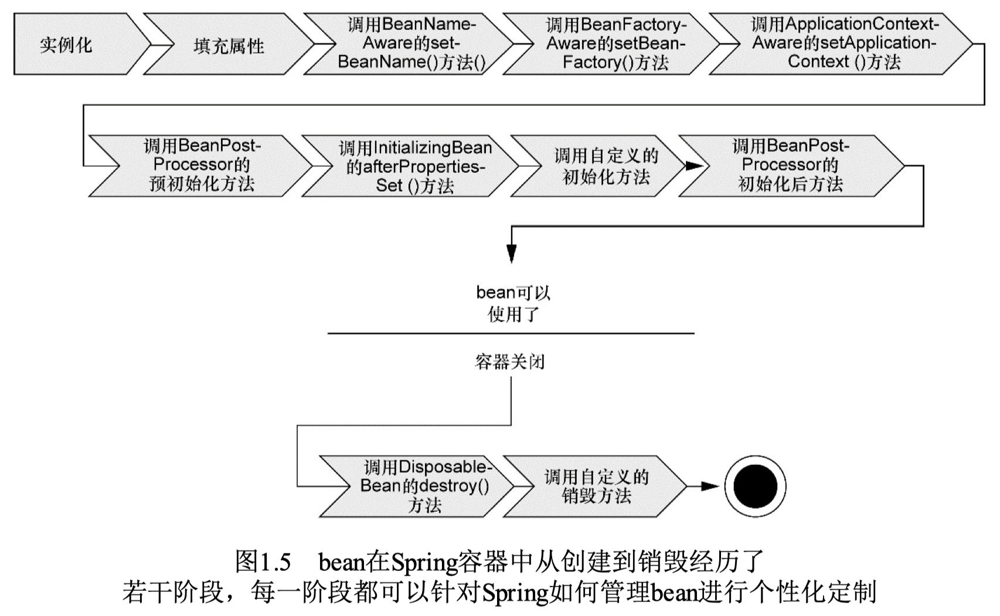
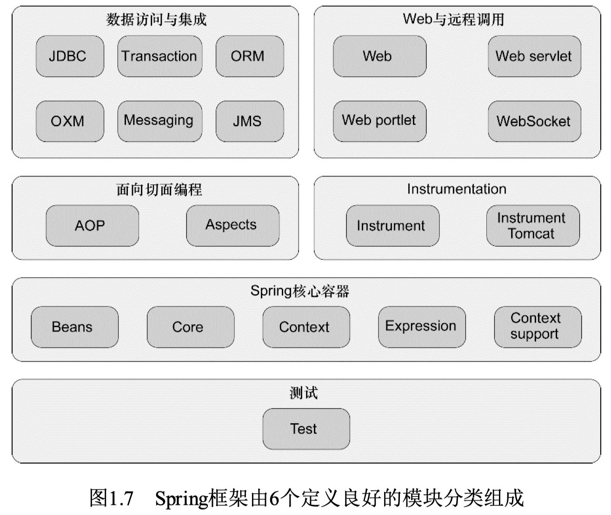

>本文由Scarb发表于[金甲虫的博客](http://47.106.131.90/blog)，转载请注明出处

# Spring实战 笔记

[TOC]

## 1. Spring概览

### 1.1 Spring如何简化Java开发

Spring的目标是致力于全方位的简化Java开发。为了简化Java开发的复杂性，Spring采取了以下4种关键策略：

* 基于POJO的轻量级和最小侵入性编程
* 通过依赖注入和面向接口实现松耦合
* 基于切面和惯例进行声明式编程
* 通过切面和模板减少样板式代码

#### Spring与POJO

Spring竭力避免因自身的API而弄乱你的应用代码。Spring不会强迫你实现Spring规范的接口或继承Spring规范的类，相反，在基于Spring构建的应用中，它的类通常没有任何痕迹表明你使用了Spring。一个类或许会使用Spring注解，但它依旧是POJO。

#### 依赖注入

通过依赖注入，对象的依赖广西将由系统中负责协调各对象的第三方组件在创建对象的时候进行设定。对象无需自行创建或管理它们的依赖关系。

创建应用组件之间的谢总的行为通常称为装配(wiring)。Spring有多重装配bean的方式。

* 基于Java
* 基于XML

Spring通过应用上下文（Application Context）装载bean的定义并把它们组装起来。Spring应用上下文全权负责对象的创建和组装。Spring自带了多种应用上下文的实现，它们之间主要的区别仅仅在于如何加载配置。

#### 应用切面

面向切面变成(AOP)允许用户把遍布应用各处的功能分离出来形成可重用的组件。

横切关注点：
诸如日志、事务管理和安全这样除了实现自身核心功能之外，经常融入到核心业务逻辑的系统服务。通常会跨域系统的多个组件。

AOP能够使这些服务模块化，并以声明的方式将它们应用到它们需要影响的组件中去。所造成的结果就是这些组件会具有更高的内聚性并且会更加关注自身的业务，完全不需要了解涉及系统服务所带来复杂性。总之，AOP能够确保POJO的简单性。

借助AOP，可以将横切关注点与核心业务逻辑相分离。

#### 使用模板消除样版式代码

Spring旨在通过模板封装来消除样板式代码。Spring的JdbcTemplate使得执行数据库操作时，避免传统的JDBC样板代码成为了可能。

### 1.2 Spring的Bean容器

Spring容器使用DI管理构成应用的组件，它会创建相互协作的组件之间的关联。

Spring自带了多个容器实现，可以归为两种不同的类型。

* Bean工厂`BeanFactory`是最简单的容器，提供基本的DI支持。
* 应用上下文`ApplicationContext`基于`BeanFactory`构建，并提供框架级别的服务，例如从属性文件解析文本信息以及发布应用事件给监听者。

#### 使用应用上下文`ApplicationContext`

Spring自带了多种类型的应用上下文

* `AnnotationConfigApplicationContext`：从一个或多个基于Java的配置类中加载Spring应用上下文。
* `AnnotationConfigWebApplicationContext`：从一个或多个基于Java的配置类中加载Spring Web应用上下文。
* `ClassPathXmlApplicationContext`：从类路径下的一个或多个XML配置文件中加载上下文定义，把应用上下文的定义文件作为类资源。
* `FileSystemXmlapplicationcontext`：从文件系统下的一个或多个XML配置文件中加载上下文定义。
* `XmlWebApplicationContext`：从Web应用下的一个或多个XML配置文件中加载上下文定义。

#### Bean的生命周期

1．Spring对bean进行实例化；
2．Spring将值和bean的引用注入到bean对应的属性中；
3．如果bean实现了`BeanNameAware`接口，Spring将bean的ID传递给`setBeanName()`方法；
4．如果bean实现了`BeanFactoryAware`接口，Spring将调用`setBeanFactory()`方法，将`BeanFactory`容器实例传入；
5．如果bean实现了`ApplicationContextAware`接口，Spring将调用`setApplicationContext()`方法，将bean所在的应用上下文的引用传入进来；
6．如果bean实现了`BeanPostProcessor`接口，Spring将调用它们的`postProcessBeforeInitialization()`方法；
7．如果bean实现了`InitializingBean`接口，Spring将调用它们的`afterPropertiesSet()`方法。类似地，如果bean使用`initmethod`声明了初始化方法，该方法也会被调用；
8．如果bean实现了`BeanPostProcessor`接口，Spring将调用它们的`postProcessAfterInitialization()`方法；
9．此时，bean已经准备就绪，可以被应用程序使用了，它们将一直驻留在应用上下文中，直到该应用上下文被销毁；
10．如果bean实现了`DisposableBean`接口，Spring将调用它的`destroy()`接口方法。同样，如果bean使用`destroymethod`声明了销毁方法，该方法也会被调用。

### 1.3 Spring框架基本组成部分

#### Spring模块

##### Spring核心容器

管理Spring应用中Bean的创建、配置和管理。包括Spring bean工厂和多种Spring应用上下文的实现，为Spring提供DI功能。

提供许多企业服务，如E-mail,JNDI访问，EJB集成和调度。

所有Spring模块都构建于核心容器之上。

##### Spring AOP模块

是Spring应用系统中开发切面的基础。对面向切面变成提供了丰富的支持。

##### 数据访问与集成

Spring的JDBC和DAO模块抽象了数据库处理的样版式代码。

提供ORM模块，建立在对DAO的支持之上，并为多个ORM框架提供了一种构建DAO的渐变方式。
Spring没有创建自己的ORM解决方案，而是对许多流行的ORM框架进行集成。

##### Web与远程调用

Spring能够与多种流行的MVC框架进行集成，但它的Web和远程调用模块自带了一个强大的MVC框架，有助于在Web层提升应用的松耦合水平。

该模块还提供了多种构建与其他应用交互的远程调用方案。集成了多种RPC，还提供了暴露和使用REST API的良好支持。

##### Instrumentation

提供了为JVM添加代理(agent)的功能。为Tomcat提供了一个织入代理，能够为Tomcat传递类文件，就想这些文件是被类加载器加载的一样。

##### 测试

通过该模块为使用JNDI、Servlet和Protlet编写待遇按测试提供了一系列的mock对象实现。

对于继承测试，该模块为加载Spring应用上下文中的bean集合以及Spring上下文中的bean进行交互提供了支持。

#### Spring protfolio

包括多个构建于核心Spring框架智商的框架和类库。几乎为每个领域的Java开发都提供了Spring编程模型。

