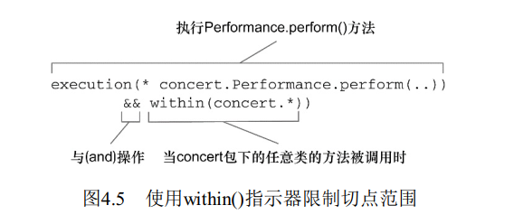
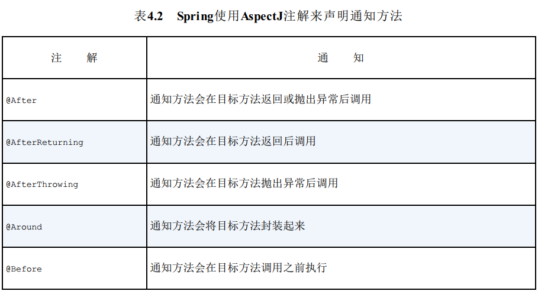

>本文由Scarb发表于[金甲虫的博客](http://47.106.131.90/blog)，转载请注明出处

# Spring实战 笔记

[TOC]

# Spring核心

## 1. Spring概览

### 1.1 Spring如何简化Java开发

Spring的目标是致力于全方位的简化Java开发。为了简化Java开发的复杂性，Spring采取了以下4种关键策略：

* 基于POJO的轻量级和最小侵入性编程
* 通过依赖注入和面向接口实现松耦合
* 基于切面和惯例进行声明式编程
* 通过切面和模板减少样板式代码

#### Spring与POJO

Spring竭力避免因自身的API而弄乱你的应用代码。Spring不会强迫你实现Spring规范的接口或继承Spring规范的类，相反，在基于Spring构建的应用中，它的类通常没有任何痕迹表明你使用了Spring。一个类或许会使用Spring注解，但它依旧是POJO。

#### 依赖注入

通过依赖注入，对象的依赖广西将由系统中负责协调各对象的第三方组件在创建对象的时候进行设定。对象无需自行创建或管理它们的依赖关系。

创建应用组件之间的谢总的行为通常称为装配(wiring)。Spring有多重装配bean的方式。

* 基于Java
* 基于XML

Spring通过应用上下文（Application Context）装载bean的定义并把它们组装起来。Spring应用上下文全权负责对象的创建和组装。Spring自带了多种应用上下文的实现，它们之间主要的区别仅仅在于如何加载配置。


#### 应用切面

面向切面变成(AOP)允许用户把遍布应用各处的功能分离出来形成可重用的组件。

横切关注点：
诸如日志、事务管理和安全这样除了实现自身核心功能之外，经常融入到核心业务逻辑的系统服务。通常会跨域系统的多个组件。

AOP能够使这些服务模块化，并以声明的方式将它们应用到它们需要影响的组件中去。所造成的结果就是这些组件会具有更高的内聚性并且会更加关注自身的业务，完全不需要了解涉及系统服务所带来复杂性。总之，AOP能够确保POJO的简单性。

借助AOP，可以将横切关注点与核心业务逻辑相分离。


#### 使用模板消除样版式代码

Spring旨在通过模板封装来消除样板式代码。Spring的JdbcTemplate使得执行数据库操作时，避免传统的JDBC样板代码成为了可能。

### 1.2 Spring的Bean容器

Spring容器使用DI管理构成应用的组件，它会创建相互协作的组件之间的关联。

Spring自带了多个容器实现，可以归为两种不同的类型。

* Bean工厂`BeanFactory`是最简单的容器，提供基本的DI支持。
* 应用上下文`ApplicationContext`基于`BeanFactory`构建，并提供框架级别的服务，例如从属性文件解析文本信息以及发布应用事件给监听者。

#### 使用应用上下文`ApplicationContext`

Spring自带了多种类型的应用上下文

* `AnnotationConfigApplicationContext`：从一个或多个基于Java的配置类中加载Spring应用上下文。
* `AnnotationConfigWebApplicationContext`：从一个或多个基于Java的配置类中加载Spring Web应用上下文。
* `ClassPathXmlApplicationContext`：从类路径下的一个或多个XML配置文件中加载上下文定义，把应用上下文的定义文件作为类资源。
* `FileSystemXmlapplicationcontext`：从文件系统下的一个或多个XML配置文件中加载上下文定义。
* `XmlWebApplicationContext`：从Web应用下的一个或多个XML配置文件中加载上下文定义。

#### Bean的生命周期


1．Spring对bean进行实例化；
2．Spring将值和bean的引用注入到bean对应的属性中；
3．如果bean实现了`BeanNameAware`接口，Spring将bean的ID传递给`setBeanName()`方法；
4．如果bean实现了`BeanFactoryAware`接口，Spring将调用`setBeanFactory()`方法，将`BeanFactory`容器实例传入；
5．如果bean实现了`ApplicationContextAware`接口，Spring将调用`setApplicationContext()`方法，将bean所在的应用上下文的引用传入进来；
6．如果bean实现了`BeanPostProcessor`接口，Spring将调用它们的`postProcessBeforeInitialization()`方法；
7．如果bean实现了`InitializingBean`接口，Spring将调用它们的`afterPropertiesSet()`方法。类似地，如果bean使用`initmethod`声明了初始化方法，该方法也会被调用；
8．如果bean实现了`BeanPostProcessor`接口，Spring将调用它们的`postProcessAfterInitialization()`方法；
9．此时，bean已经准备就绪，可以被应用程序使用了，它们将一直驻留在应用上下文中，直到该应用上下文被销毁；
10．如果bean实现了`DisposableBean`接口，Spring将调用它的`destroy()`接口方法。同样，如果bean使用`destroymethod`声明了销毁方法，该方法也会被调用。

### 1.3 Spring框架基本组成部分

#### Spring模块


##### Spring核心容器

管理Spring应用中Bean的创建、配置和管理。包括Spring bean工厂和多种Spring应用上下文的实现，为Spring提供DI功能。

提供许多企业服务，如E-mail,JNDI访问，EJB集成和调度。

所有Spring模块都构建于核心容器之上。

##### Spring AOP模块

是Spring应用系统中开发切面的基础。对面向切面变成提供了丰富的支持。

##### 数据访问与集成

Spring的JDBC和DAO模块抽象了数据库处理的样版式代码。

提供ORM模块，建立在对DAO的支持之上，并为多个ORM框架提供了一种构建DAO的渐变方式。
Spring没有创建自己的ORM解决方案，而是对许多流行的ORM框架进行集成。

##### Web与远程调用

Spring能够与多种流行的MVC框架进行集成，但它的Web和远程调用模块自带了一个强大的MVC框架，有助于在Web层提升应用的松耦合水平。

该模块还提供了多种构建与其他应用交互的远程调用方案。集成了多种RPC，还提供了暴露和使用REST API的良好支持。

##### Instrumentation

提供了为JVM添加代理(agent)的功能。为Tomcat提供了一个织入代理，能够为Tomcat传递类文件，就想这些文件是被类加载器加载的一样。

##### 测试

通过该模块为使用JNDI、Servlet和Protlet编写待遇按测试提供了一系列的mock对象实现。

对于继承测试，该模块为加载Spring应用上下文中的bean集合以及Spring上下文中的bean进行交互提供了支持。

#### Spring protfolio

包括多个构建于核心Spring框架智商的框架和类库。几乎为每个领域的Java开发都提供了Spring编程模型。

## 2. 装配Bean

### 2.1 装配Bean的可选方案

Spring提供了三种主要的Bean装配机制

* 在XML中进行显示配置。
* 在Java中进行显示配置。
* 隐式的Bean发现机制和自动装配。

建议尽可能地使用自动配置的机制，显示配置越少越好。当必须要显式配置Bean时，推荐用类型安全并且比XML更强大的JavaConfig。只有当想要使用便利的XML命名空间，并且在JavaConfig中没有同样的实现时，才应该使用XML。

### 2.2 自动装配Bean

Spring从两个角度来实现自动装配

* 组件扫描(component scanning): Spring会自动发现应用上下文中所创建的Bean。
* 自动装配(autowiring): Spring自动满足Bean之间的依赖

#### @Component 创建可被发现的Bean

在类上使用`Component`注解，会表明该类会作为组件类，并告知Spring要为这个类创建Bean。

#### 为组件扫描的Bean命名

Spring会根据类名为Bean指定一个ID，是将类名的第一个字母变成小写。

如果想指定不同的ID，可以将期望的ID作为值传递给`@Component`注解。

```java
@Component("lonelyHeartsClub")
public class SgtPeppers implements CompactDisc {
    ...
}
```

#### @ComponentScan 设置组件扫描的基础包

使用`@ComponentScan`会以配置类所在的包作为基础包来扫描组件。

可以通过`basePackages`属性来配置扫描的包

```java
@Configuration
@ComponentScan(basePackagesClasses={CDPlayer.class, DVDPlayer.class})
public class CDPlayerConfig{}
```

#### @Autowired 为Bean添加注解实现自动装配

Spring的`@Autowired`注解在Spring应用上下文中寻找匹配某个Bean需求的其他Bean。

`@Autowired`注解能用在构造器和属性的Setter方法上。

```java
@Component
public class CDPlayer implements MediaPlayer {
    private CompactDisc cd;

    @Autowired
    public CDPlayer(CompactDisc cd) {
        this.cd = cd;
    }

    public void play() {
        cd.play();
    }

    // Alternative
    @Autowired(required = false)
    public void setCompactDisc(CompactDisc cd) {
        this.cd = cd;
    }
}
```

将`required`设为`false`，Spring将会在没有匹配Bean时让这个Bean处于未装配状态。

如果多个Bean都能满足依赖关系，Spring将会抛出异常。

### 2.3 通过Java代码装配Bean

相比XML配置，JavaConfig是更好的方案，因为他更为强大、类型安全并且对重构友好。

JavaConfig是配置代码，不应该包含任何业务逻辑，也不应该侵入到业务逻辑代码中。通常会将JavaConfig放到单独的包中。

#### @Configuration 创建配置类

`@Configuration`注解表明这个类是一个配置类，应该包含在Spring应用上下文中如何创建Bean的细节。

#### @Bean 声明简单的Bean

在配置类中声明Bean，需要编写方法并添`@bean`注解。

`@Bean`注解告诉Spring这个方法将会返回一个对象，该对象要注册为Spring应用上下文中的Bean。方法体重包含了最重产生Bean的实例。

#### 借助JavaConfig实现注入

```java
@Bean
public CompactDisc sgtPeppers() {
    return new SgtPeppers();
}

@Bean
public CDPlayer cdPlayer() {
    return new CDPlayer(sgtPeppers());
}
```

由于`sgtPeppers()`方法上添加了`@Bean`注解，Spring将会拦截所有对它的调用，兵确保直接返回该方法所创建的Bean，而不是每次都对其进行实际的调用。

默认情况下，Spring中的Bean都是单例的。

更简单的注入方式：

```java
@Bean
public CompactDisc sgtPeppers() {
    return new SgtPeppers();
}

@Bean
public CDPlayer cdPlayer(CompactDisc compactDisc) {
    return new CDPlyaer(compactDisc);
}
```

Spring会自动装配一个`CompactDisc`到配置方法中，这个方法不用明确引用`CompactDisc`的`@Bean`方法。

### 2.4 通过XML装配Bean

略

### 2.5 导入和混合配置

#### @Import JavaConfig组合

```java
@Configuration
@Import({CDPlayerConfig.class, CDConfig.class})
@ImportResource("classpath:cd-config.xml)
public class SoundSystemConfig {

}
```

用`@Import`注解可以导入配置类

用`@ImportResource`注解可以导入XML配置文件

## 3. 高级装配

### 3.1 环境与profile

#### @Profile 配置profile bean

Spring支持Bean profile功能，可以根据欢就来决定创建哪个Bean。
Spring在运行时来确定而不是构建时。

要使用profile，先要将所有不同的Bean定义整理到一个或多个profile中，应用部署时要确保对应的profile处于激活状态。

`@Profile`注解指定某个Bean属于哪个profile，这个注解告诉Bean只有在该profile激活时才会创建，否则会忽略这个Bean。

```java
@Configuration
public class DataSourceConfig {
    @Bean(destroyMethod="shutdown")
    @Profile("dev")
    public DataSource embeddedDataSource() {
        ...
    }

    @Bean
    @Profile("prod)
    public DataSource jndiDataSource() {
        ...
    }
}
```

#### spring.profiles.active 激活profile

* `spring.profiles.active`: 设置了该属性，它的值会用来确定哪个profile是激活的
* `spring.profiles.default`: 如果没有设置`spring.profiles.active`激活profile时查询该值

有多重方式来设置这两个属性

* 作为DispatcherServlet的初始化参数
* 作为Web应用的上下文参数
* 作为JNDI条目
* 作为环境变量
* 作为JVM的系统属性
* 在集成测试类上，使用@ActiveProfiles注解设置

`@ActiveProfiles`注解可以被用来指定运行测试时要激活哪个profile

```java
@RunWith(SpringJUnit4ClassRunner.class)
@ContextConfiguration(classes={PersistenceTestConfig.class})
@ActiveProfiles("dev")
public class PersistenceTest {
    ...
}
```

### 3.2 条件化创建Bean

#### @Conditional 条件化创建Bean

`@Conditional`注解可以用到Bean上，只有给定条件计算成功才会创建Bean。

```java
@Bean
@Conditional(MagicExistsCondition.class)
public MagicBean magicBean() {
    return new MagicBean();
}
```

设置给`@Conditional`的类是实现`Condition`接口的类型，只需要提供`matches()`方法即可。

```java
public interface Condition {
    boolean matches(ConditionContext ctxt, AnnotatedTypeMetadata metadata);
}
```

* `ConditionContext`可以做到
  * 借助`getRegistry()`返回的`BeanDefinitionRegistry`检查bean定义
  * 借助`getBeanFactory()`返回的`ConfigurableListableBeanFactory`检查bean是否存在，甚至探查bean的属性
  * 借助`getEnvironment()`返回的`Environment`检查环境变量是否存在以及它的值是什么
  * 读取并探查`getResourceLoader()`返回的`ResourceLoader`所加载的资源
  * 借助`getClassLoader()`返回的`ClassLoader`加载并检查类是否存在
* `AnnotatedTypeMetadata`可以让我们检查带有`@Bean`注解的方法上还有什么其他注解
  * 借助`isAnnotated()`方法，能够判断带有`@Bean`注解的方法是不是还有其他特定注解
  * 借助其他方法能检查`@Bean`注解的方法上其他注解的属性。
 
#### `@Profile` 使用 `@Conditional` 实现

```java
@Retention(RetentionPolicy.RUNTIME)
@Target({ElementType.TYPE, ElementType.METHOD})
@Documented
@Conditional(ProfileConditon.class)
public @interface profile {
    String[] value();
}
```

```java
class ProfileCondition implements Condition {
    public boolean matches(ConditionContext context, AnnotatedTypeMetadata metadata) {
        if (context.getEnvironment() != null) {
            MultiValueMap<String, Object> attrs = 
                metadata.getAllAnnotationAttributes(Profile.class.getName());
            if (attrs != null) {
                for (Object value : attrs.get("value")) {
                    if (context.getEnvironment()).acceptsProfiles(((String[]) values)) {
                        return true;
                    }
                }
                return false
            }
        }
        return true;
    }
}
```

### 3.3 处理自动装配的歧义性

#### `@Primary` 标示首选的Bean

`@Primary`注解能够与`@Component`组合用在组件扫描的Bean伤，也可以与`@Bean`组合用在Java配置的Bean声明中，将该Bean设为首选，避免自动装配时的歧义性。

#### `@Qualifier` 限定自动装配的Bean

`@Qualifier`注解可以与`@Autowired`和`@Inject`协同使用，在注入的时候指定想要注入进去的是哪个Bean。

`@Qualifier`可以为Bean设置自定义的限定符，只要在Bean声明上添加即可。

```java
@Component
@Qualifier("cold)
public class IceCream implements Dessert {
    ...
}
```

```java
@Autowired
@Qualifier("cold")
public void setDessert(Dessert dessert) {
    this.dessert = dessert;
}
```

#### 使用 `@Qualifier` 创建自定义限定符注解

Java不允许在同一条目上重复出现相同类型的多个注解，可以创建注解，用`@Qualifier`注解来标注

```java
@Target({ElementType.CONSTRUCTOR, ElementType.FIELD, ElementType.METHOD, ElementType.TYPE})
@Retention(RetentionPolicy.RUNTIME)
@Qualifier
public @interface Cold {}
```

```java
@Target({ElementType.CONSTRUCTOR, ElementType.FIELD, ElementType.METHOD, ElementType.TYPE})
@Retention(RetentionPolicy.RUNTIME)
@Qualifier
public @interface Creamy {}
```

```java
@Component
@Cold
@Creamy
public class IceCream implments Dessert {
    ...
}
```

```java
@Autowired
@Cold
@Creamy
public void setDessert(Dessert dessert) {
    this.dessert = dessert;
}
```

### 3.4 `@Scope` Bean的作用域

默认情况下Spring上下文中所有的Bean都是以单例的形式创建的。

Spring定义了多种作用域，可以基于这些作用域创建Bean。如果选择单例以外的作用域，要使用`@Scope`注解

* 单例（Singleton）：在整个应用中，只创建bean的一个实例。
* 原型（Prototype）：每次注入或者通过Spring应用上下文获取的时候，都会创建一个新的bean实例。
* 会话（Session）：在Web应用中，为每个会话创建一个bean实例。
* 请求（Rquest）：在Web应用中，为每个请求创建一个bean实例。

#### Session & Request Scope 使用会话和请求作用域

就电子商务应用的购物车Bean来说，会话作用域是最为合适的，它与给定的用户关联性最大。

```java
@Component
@Scope(
    value=WebApplicationContext.SCOPE_SESSION,
    proxyMode=ScopedProxyMode.INTERFACES
)
public ShoppingCart cart() {
    ...
}
```

`proxyMode`属性解决了会话活请求作用域的Bean被注入到单例Bean中遇到的问题。

```java
@Component
public class StoreService {
    @Autowired
    public void setShoppingCart(ShoppingCart shoppingCart) {
        this.shoppingCart = shoppingCart;
    }
}
```

单例Bean在Spring应用上下文加载的时候创建，此时会话和请求作用域的Bean还不存在，也不知道注入哪个实例。

Spring会注入一个`ShoppingCart`的代理，该代理暴露与`ShoppingCart`相同的方法。

`proxyMode`的取值：

* `ScopedProxyMode.INTERFACES`: 表示这个代理要实现`ShoppingCart`接口，并将调用委托给实现Bean
* `ScopedProxyMode.TARGET_CLASS`: 用CGLib生成基于类的代理，生成目标类扩展的方式创建代理

### 3.5 运行时注入

有时我们希望避免硬编码Bean的属性，而是想让这些值在运行时再确定。Spring提供了两种在运行时求值的方式：

* 属性占位符（Property placeholder）
* Spring表达式语言（SpEL）

#### `@PropertySource` 和 `Environment` 注入和获取外部的值

```java
@Configuration
@PropertySource("classpath:/com/soundssystem/app.properties")   // 声明属性源
public class ExpressiveConfig {
    @Autowired
    Environment env;

    @Bean
    public BlankDisc disc() {
        return new BlankDisc(
            env.getProperty("disc.title"),      // 检索属性值
            env.getProperty("disc.artist")
        );
    }
}
```

```property
disc.title=Sgt. Peppers Lonely Hearts Club Band
disc.artist=The Beatles
```

这个属性文件会加载到Spring的Environment中，后可从这里检索属性。

##### Environment

* `String getProperty(String key, String defaultValue)`
* `T getProperty(String key, Class<Type> type, T defaultValue)`
* `String getRequiredProperty(String key)`: 没有定义该属性会抛异常
* `boolean containsProperty(String key)`
* `String[] getActiveProfiles()`: 返回激活profile名称的数组
* `String[] getDefaultProfiles():` 返回默认profile名称的数组
* `boolean acceptsProfiles(String.. profiles`: 如果environment支持给定profile，返回true

#### @Value 解析属性占位符

```java
public BlankDisc(
    @Value("${disc.title}") String title,
    @Value("${disc.artist}") String artist
) {
    this.title = title;
    this.artist = artist;
}
```

为了使用属性占位符，要配置一个`PropertySourcesPlaceholderConfigurer`Bean

```java
@Bean
public static PropertySourcesPlaceholderConfigurer placeholderConfigurer() {
    return new PropertySourcesPlaceholderConfigurer();
}
```

#### 使用SpEL进行装配

SpEL特性：

* 使用bean的ID来引用bean
* 调用方法和访问对象的属性
* 对值进行算术、关系和逻辑运算
* 正则表达式匹配
* 集合操作

略

## 4. Spring AOP 面向切面的Spring

AOP可以实现横切关注点与它们所影响的对象之间的解耦。

### 4.1 什么是面向切面编程

切面能帮助我们模块化横切关注点，横切关注点可以被描述为影响应用多处的功能。例如，安全、事物、日志等。

#### AOP术语


* **通知(Advide)**：切面必须完成的工作。定义了切面“是什么”以及“何时使用”，还定义了何时执行这个工作。
  * 前置通知（Before）：在目标方法被调用之前调用通知功能
  * 后置通知（After）：在目标方法完成之后调用通知，此时不会关心方法的输出是什么
  * 返回通知（After-returning）：在目标方法成功执行之后调用通知
  * 异常通知（After-throwing）：在目标方法抛出异常后调用通知
  * 环绕通知（Around）：通知包裹了被通知的方法，在被通知的方法调用之前和调用之后执行自定义的行为

* **连接点(Join point)**：应用可能应用通知的时机。是在应用执行过程中能够插入切面的一个点，可以是调用方法时、抛出异常时、修改一个字段时。切面代码可以利用这些点插入到应用的正常流程之中，并添加新的行为。

* **切点(Pointcut)**：定了“何处”。切点的定义会匹配通知所要织入的一个或多个连接点。通常使用明确的类和方法名称，或是用正则表达式定义所匹配的类和方法名称来指定。

* **切面(Aspect)**：通知和切点的结合，通知和切点共同定义了切面的全部内容——它是什么，在何时和何处完成其功能。

* **引入(Introduction)**：允许我们向现有的类添加新方法或属性。

* **织入(Weaving)**：把切面应用到目标对象并创建新的代理对象的过程。切面在指定的连接点被织入到目标对象中。在目标对象的生命周期里有多个点可以进行织入：
  * 编译期：切面在目标类编译时被织入。这种方式需要特殊的编译器。AspectJ的织入编译器就是以这种方式织入切面的。
  * 类加载期：切面在目标类加载到JVM时被织入。这种方式需要特殊的类加载器（ClassLoader），它可以在目标类被引入应用之前增强该目标类的字节码。AspectJ 5的加载时织入（load-time weaving，LTW）就支持以这种方式织入切面。
  * 运行期：切面在应用运行的某个时刻被织入。一般情况下，在织入切面时，AOP容器会 为目标对象动态地创建一个代理对象。Spring AOP就是以这种方式织入切面的。

#### Spring对AOP的4种类型的支持

* 基于代理的经典Spring AOP
* 纯POJO切面
* @AspectJ注解驱动的切面
* 注入式AspectJ切面（适用于Spring各版本）

引入简单的声明式AOP和基于注解的AOP后，基于代理的经典Spring AOP已经过时。

Spring只支持方法级别的连接点。如果AOP需求超过了建档的方法调用，需要考虑使用AspectJ来实现切面。

### 4.2 通过切点来选择连接点

#### 4.2.1 编写切点

```java
package concert;

public interface Performance {
    public void perform();
}
```


使用`execution()`指示器`Performance`的`perform()`方法。



#### 在切点中选择Bean

Spring引入了一个新的`bean()`指示器，允许我们在切点表达式中使用Bean的ID来标识Bean。

```java
execution(* concert.Performance.perform()) and bean ('woodstock')
```

在这里我们希望执行`Performance`的`perform()`方法时应用通知，但限定Bean的ID为`woodstock`。

或者用`!bean('woodstock')`通知编织到ID不为`woodstock`的Bean中。

### 4.3 使用注解创建切面

#### @Aspect 定义切面


`Audience`类使用`@Aspect`注解进行了标注。该注解表明`Audience`不仅仅是一个POJO，还是一个切面。`Audience`类中的方法都使用注解来定义切面的具体行为。



#### @Pointcut 在切面内定义可重用的切点

`@Pointcut`注解能够在一个切面内定义可重用的切点


#### @EnableAspectJAutoProxy 启用自动代理功能


Spring的AspectJ自动代理仅仅使用`@Aspect`作为创建切面的指导，切面依然是基于代理的。在本质上，它依然是Spring基于代理的切面。

#### @Around 创建环绕通知


它接受`ProceedingJoinPoint`作为参数。这个对象是必须要有的，因为你要在通知中通过它来调用被通知的方法。通知方法中可以做任何事情，当要将控制权交给被通知的方法时，它需要调用`ProceedingJoinPoint`的`proceed()`方法。

如果不调用`proceed()`方法，通知会阻塞对被通知方法的调用。也可以对它进行多次调用。

#### 处理通知中的参数


#### @DeclareParents 通过注解引入新功能

```java
package concert

public interface Encoreable {
    void performanceEncore();
}
```

我们需要将`Encoreable`接口应用到`Performance`视线中。并不是所有`Performance`都是有`Encoreable`特性的，也有可能无法修改所有的`Performance`实现。
借助AOP的引入功能，我们可以不必在设计上妥协或者侵入性地修改现有的实现。

```java
package concert;

import org.aspectj.lang.annotation.Aspect;
import org.aspectj.lang.annotation.DeclareParents;

@Aspect
public class EncoreableIntroducer {
    @DeclareParents(value="concert.Performance+", defaultImpl=DefaultEncoreable.class)
    public static Encoreable encoreable;
}
```

`EncoreableIntroducer`是一个切面，它通过`@DeclareParents`注解，将`Encoreable`接口引入到`Performance`Bean中。我们需要在Spring应用中将`EncoreableIntroducer`声明为一个Bean。

Spring的自动代理机制会获取它的声明，当Spring发现一个bean使用`@Aspect`注解时会创建一个代理，将调用委托给被代理的bean或被引入的实现。

`@DeclareParents`属性：

* `value`属性指定了哪种类型的bean要引入该接口。
  * 在本例中，也就是所有实现`Performance`的类型。 （标记符后面的加号表示是`Performance`的所有子类型，而不是`Performance`本身。 ）
* `defaultImpl`属性指定了为引入功能提供实现的类。 
  * 在这里，我们指定的是`DefaultEncoreable`提供实现。
* `@DeclareParents`注解所标注的静态属性指明了要引入了接口。 
  * 在这里， 我们所引入的是`Encoreable`接口。

### 4.5 注入AspectJ切面

我们可以借助Spring的一来注入把bean装配进AspectJ切面中。

```java
package concert;
public aspect CriticAspect {
    public CriticAspect() {}

    pointcut performance() : execution(* perform(..));

    afterReturning() : performance() {
        System.out.println(criticismEngine.getCriticism());
    }

    private CriticismEngine criticismEngine;

    // inject CriticismEngine
    public void setCriticismEngine(CriticismEngine criticismEngine) {
        this.criticismEngine = criticismEngine;
    }
V}
```

要注入到`CriticAspect`中的`CriticismEngine`实现

```java
package com.springinaction.springidol;

public class CriticismEngineImpl implements CriticismEngine {
    public CriticismEngineImpl() {}

    public String getCriticism() {
        int i = (int) (Math.random() * criticismPool.length);
        return criticismPool[i];
    }

    // injected
    private String[] criticismPool;
    public void setCriticismPool(String[] criticismPool) {
        this.criticismPool = criticismPool;
    }
}
```

用以下XML声明为一个Spring bean

```xml
<bean id="criticismEngine" class="com.springinaction.springidol.CriticismEngineImpl">
    <property name="criticisms">
        <list>
            <value>Worst performance ever!</value>
            <value>I laughed, Icried, then I realized I was at the wrong show.</value>
            <value>A must see show!</value>
        </list>
    </property>
</bean>
```

把`criticismEngine`bean注入到`CriticAspect`中

```xml
<bean class="com.springinaction.springidol.CriticAspect" factory-method="aspectOf">
    <property name="criticismEngine" ref="criticismEngine" />
</bean>
```

如果想使用Spring的依赖注入为AspectJ切面注入协助者，我们需要在SPring配置中把切面声明为一个Spring bean。

# Web中的Spring

## 5. 构建Spring Web应用程序

### 5.1 Spring MVC起步

Spring将请求在调度Servlet、处理器映射（handler mapping）、控制器以及视图解析器（view resolver）之间移动。

#### 跟踪Spring MVC的请求


1. 请求先通过前端控制器`DispatcherServlet`
2. `DispatcherServlet`的任务是将请求发送给Spring MVC控制器`controller`，在这之前会查询一个或多个处理器映射`handler mapping`来确定请求发向哪个控制器。
3. `DispatcherServlet`将请求发向控制器。到了控制器，请求卸下负载并等待控制器处理。
4. 控制器处理完后需要返回的信息为`model`，一般需要发送给一个视图`view`。控制器将返回的模型数据打包，标识出用于渲染输出的视图名，发送回`DispatcherServlet`。
5. `DispatcherServlet`使用视图解析器`view resolver`将逻辑视图名匹配为一个特定的视图实现。
6. 请求来到视图实现，在这里交付模型数据，请求完成。
7. 视图将使用模型数据渲染输出，通过响应对象传递给客户端。

#### 搭建Spring MVC

##### 配置DispatcherServlet

```java
package spittr.config;

import org.springframework.web.servlet.support.AbstractAnnotationConfigDispatcherServletInitializer;

import spittr.web.WebConfig;

public class SpitterWebInitializer extends AbstractAnnotationConfigDispatcherServletInitializer {
  
  @Override
  protected Class<?>[] getRootConfigClasses() {
    return new Class<?>[] { RootConfig.class };
  }

  /**
   * 指定配置类
   */
  @Override
  protected Class<?>[] getServletConfigClasses() {
    return new Class<?>[] { WebConfig.class };
  }

  /*
   * 将DispatcherServlet映射到"/"
   */
  @Override
  protected String[] getServletMappings() {
    return new String[] { "/" };
  }

}
```

扩展`AbstractAnnotationConfigDispatcherServletInitializer`的任意类会自动配置`DispatcherServlet`和Spring应用上下文

* `getServletMappings()`方法回将一个或多个路径映射到`DispatcherServlet`上。本例中会处理进入应用的所有请求。
* `getServletConfigClasses()`方法要求`DispatcherServlet`加载应用上下文时，使用定义在`WebConfig`配置类中的bean
* `getRootConfigClasses()`返回带有`@Configuraion`注解的类将会用来配置`ContextLoaderListener`创建的应用上下文中的bean

在Spring Web应用中， 通常还会有另外一个应用上下文。另外的这个应用上下文是`ContextLoaderListener`创建的。
我们希望`DispatcherServlet`加载包含Web组件的bean， 如控制器、 视图解析器以及处理器映射， 而`ContextLoaderListener`要加载应用中的其他bean。 这些bean通常是驱动应用后端的中间层和数据层组件。

##### 启用Spring MVC

```java
@Configuration
@EnableWebMvc                   // 启用Spring MVC
@ComponentScan("spittr.web")    // 启用组件扫描
public class WebConfig extends WebMvcConfigurerAdapter {

  // 配置JSP视图解析器
  @Bean
  public ViewResolver viewResolver() {
    InternalResourceViewResolver resolver = new InternalResourceViewResolver();
    resolver.setPrefix("/WEB-INF/views/");
    resolver.setSuffix(".jsp");
    return resolver;
  }
  
  // 配置静态资源的处理
  @Override
  public void configureDefaultServletHandling(DefaultServletHandlerConfigurer configurer) {
    configurer.enable();
  }
  
  @Override
  public void addResourceHandlers(ResourceHandlerRegistry registry) {
    // TODO Auto-generated method stub
    super.addResourceHandlers(registry);
  }

}
```

```java
@Configuration
@Import(DataConfig.class)
@ComponentScan(basePackages={"spittr"}, 
    excludeFilters={
        @Filter(type=FilterType.CUSTOM, value=WebPackage.class)
    })
public class RootConfig {
  public static class WebPackage extends RegexPatternTypeFilter {
    public WebPackage() {
      super(Pattern.compile("spittr\\.web"));
    }    
  }
}
```

### 5.2 编写控制器

#### `@Controller` 编写控制器

```java
@Controller
@RequestMapping({"/", "/homepage"})
public class HomeController {

  @RequestMapping(method = GET)
  public String home(Model model) {
    return "home";
  }
}
```

`@Controller`是一个构造型（stereotype）注解，基于`@Component`注解，在这里，它辅助实现组件扫描。

`home`这个String会被Spring MVC解读为要渲染的视图名称。

鉴于我们配置InternalResourceViewResolver的方式， 视图名`home`将会解析为`WEB-INFviews/home.jsp`路径的JSP。

#### `MockMvc` 测试控制器

```java
public class HomeControllerTest {

  @Test
  public void testHomePage() throws Exception {
    HomeController controller = new HomeController();
    MockMvc mockMvc = standaloneSetup(controller).build();
    mockMvc.perform(get("/"))
           .andExpect(view().name("home"));
  }
}
```

### 5.3 接受请求的输入

#### `@RequestParam` 处理请求参数

```java
  @RequestMapping(method=RequestMethod.GET)
  public List<Spittle> spittles(
      @RequestParam(value="max", defaultValue=MAX_LONG_AS_STRING) long max,
      @RequestParam(value="count", defaultValue="20") int count) {
    return spittleRepository.findSpittles(max, count);
  }
```

#### `@PathVariable` 通过路径参数接受输入

```java
  @RequestMapping(value="/{spittleId}", method=RequestMethod.GET)
  public String spittle(
      @PathVariable("spittleId") long spittleId, 
      Model model) {
    model.addAttribute(spittleRepository.findOne(spittleId));
    return "spittle";
  }
```

## 6. 渲染Web视图

略

## 7. Spring MVC的高级技术

### 7.1 Spring MVC 配置的替代方案

#### `customizeRegistration(Dynamic registration)` 自定义DispatcherServlet配置

在`AbstractAnnotationConfigDispatcherServletInitializer`将`DispatcherServlet`注册到Servlet容器中之后，就会调用`customizeRegistration()`，并将Servlet注册后得到的`Registration.Dynamic`传递进来。可以重载该方法对`DispatcherServlet`进行额外的配置

```java
@Override
protected void customizeRegistration(Dynamic registration) {
    registration.setMultipartConfig(new MultipartConfigElement("/tmp/spittr/uploads"));
}
```

借助`customizeRegistration()`方法中的`ServletRegistration.Dynamic`，我们能够完成多项任务。

* 通过调用`setLoadOnStartup()`设置load-on-startup优先级
* 通过`setInitParameter()`设置初始化参数
* 通过调用`setMultipartConfig()`配置Servlet 3.0对multipart的支持

#### `WebApplicationInitializer` 添加其他Servlet和Filter

```java
public class MyServletInitializer implements WebApplicationInitializer {

    @Override
    public void onStartup(ServletContext servletContext) throws ServletException {
        // 注册 Servlet
        Dynamic myServlet = servletContext.addServlet("myServlet", MyServlet.class);
        // 映射 Servlet
        myServlet.addMapping("/custom/**");

        // 注册 Filter
        Dynamic filter = servletContext.addFilter("myFilter", MyFilter.class);
        // 添加 Filter 的映射路径
        filter.addMappingForUrlPatterns(null, false, "/custom/**");
    }
}
```

### 7.3 处理异常

Spring提供了多种方式将异常转换为响应

* 特定的Spring异常将会自动映射为指定的HTTP状态码；
* 异常上可以添加`@ResponseStatus`注解， 从而将其映射为某一个HTTP状态码；
* 在方法上可以添加`@ExceptionHandler`注解， 使其用来处理异常。

#### `@ResponseStatus` 将异常映射为HTTP状态码

```java
@ResponseStatus(value=HttpStatus.NOT_FOUND, reason="Spittle Not Found")
public class SpittleNotFoundException extends RuntimeException {

}
```

#### `@ExceptionHandler` 编写异常处理方法

`@ExceptionHandler`标注的方法可以处理同一个控制器中所有处理器方法所抛出的异常。

```java
@ExceptionHandler(DuplicateSpittleException.class)
public String handleDuplicateSpittle() {
    return "error/duplicate";
}
```

### 7.4 `@ControllerAdvice` 控制器通知

控制器通知（controller advice） 是任意带有`@ControllerAdvice`注解的类， 这个类会包含一个或多个如下类型的方法：

* `@ExceptionHandler`注解标注的方法；
* `@InitBinder`注解标注的方法；
* `@ModelAttribute`注解标注的方法。

以上方法会运用到应用所有的控制器中带有`@RequestMapping`注解的方法上。

```java
@ControllerAdvice
public class AppWideExceptionHandler {

  @ExceptionHandler(DuplicateSpittleException.class)
  public String handleNotFound() {
    return "error/duplicate";
  }

}
```

# 后端中的 Spring

# Spring 集成

## 16. 使用 Spring MVC 创建 REST API

REST(Representational State Transfer) 表述性状态转移，关注的是要处理的数据。

### 16.1 了解REST

