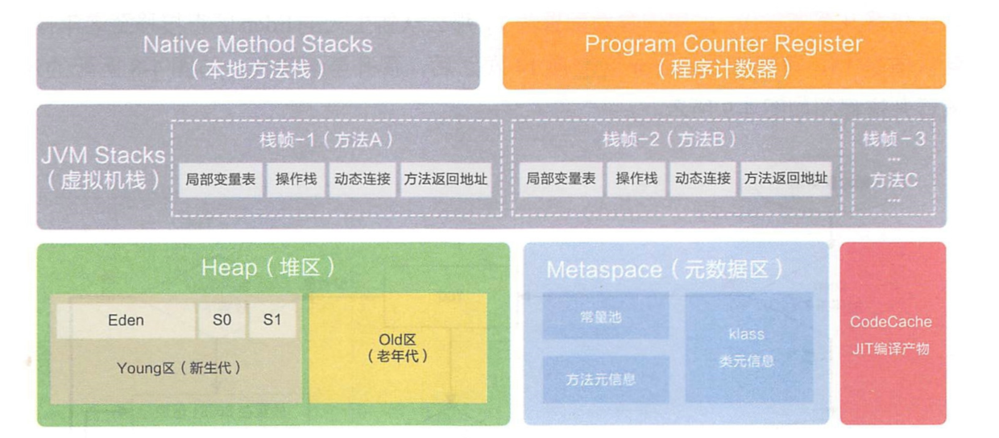

>本文由Scarb发表于[金甲虫的博客](http://47.106.131.90/blog)，转载请注明出处

# JVM Garbage Collector | JVM垃圾回收机制

### 什么是垃圾

没有任何引用指向的一个对象或者多个对象（循环引用）

### 垃圾查找算法

#### Reference Count 引用计数

#### Root Searching 根可达算法

### 垃圾回收算法

#### Mark-Sweep 标记清除

* 算法相对简单
* 存货对象比较多的情况下效率较高
* 两遍扫描(搜索使用中的内存；搜索未使用的内存)，效率偏低
* 容易产生碎片

#### Copying 拷贝

复制对象到内存另一处，然后删除连续对象

* 适用于存活对象较少
* 只扫描一次，效率搞，没有碎片
* 空间浪费
* 移动复制对象，需要修改对象引用

#### Mark-Compact 标记压缩

存活对象全部压缩到一起，然后回收

* 不会产生碎片，方便对象分配
* 不会产生内存减半
* 扫描两次
* 需要移动对象，效率偏低

### JVM内存分代模型

#### 部分垃圾回收器使用的模型

   > 除Epsilon ZGC Shenandoah之外的GC都是使用逻辑分代模型
   >
   > G1是逻辑分代，物理不分代
   >
   > 除此之外不仅逻辑分代，而且物理分代

#### 新生代 + 老年代 + 永久代（1.7）Perm Generation/ 元数据区(1.8) Metaspace

   1. 永久代 元数据 - Class
   2. 永久代必须指定大小限制 ，元数据可以设置，也可以不设置，无上限（受限于物理内存）
   3. 字符串常量 1.7 - 永久代，1.8 - 堆
   4. MethodArea逻辑概念 - 永久代、元数据
   
#### 新生代 = Eden + 2个suvivor区 

   1. YGC回收之后，大多数的对象会被回收，活着的进入s0
   2. 再次YGC，活着的对象eden + s0 -> s1
   3. 再次YGC，eden + s1 -> s0
   4. 年龄足够 -> 老年代 （15 CMS 6）
   5. s区装不下 -> 老年代
   
#### 老年代

   1. 顽固分子
   2. 老年代满了FGC Full GC
   
#### GC Tuning (Generation)

   1. 尽量减少FGC
   2. MinorGC = YGC
   3. MajorGC = FGC
   
#### 对象分配过程图

   

#### 动态年龄：（不重要）

   https://www.jianshu.com/p/989d3b06a49d

#### 分配担保：（不重要）

   YGC期间 survivor区空间不够了 空间担保直接进入老年代
   参考：https://cloud.tencent.com/developer/article/1082730