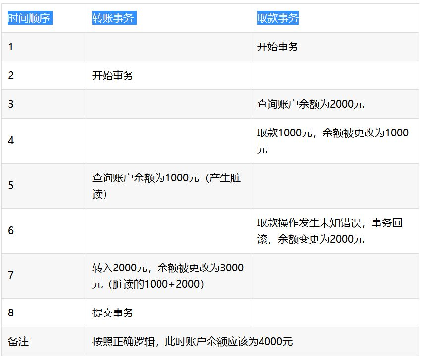

>本文由Scarb发表于[金甲虫的博客](http://47.106.131.90/blog)，转载请注明出处

# MySQL事务隔离级别和锁

[TOC]

## 事务及其特性

数据库事务（简称:事务）是数据库管理系统执行过程中的一个逻辑单位，由一个有限的数据库操作序列构成。事务的使用是数据库管理系统区别文件系统的重要特征之一。

事务拥有四个重要的特性：原子性（Atomicity）、一致性（Consistency）、隔离性（Isolation）、持久性（Durability），人们习惯称之为 ACID 特性。

* 原子性（Atomicity）
  
  事务开始后所有操作，要么全部做完，要么全部不做，不可能停滞在中间环节。事务执行过程中出错，会回滚到事务开始前的状态，所有的操作就像没有发生一样。例如，如果一个事务需要新增 100 条记录，但是在新增了 10 条记录之后就失败了，那么数据库将回滚对这 10 条新增的记录。也就是说事务是一个不可分割的整体，就像化学中学过的原子，是物质构成的基本单。

* 一致性（Consistency）

  指事务将数据库从一种状态转变为另一种一致的的状态。事务开始前和结束后，数据库的完整性约束没有被破坏。例如工号带有唯一属性，如果经过一个修改工号的事务后，工号变的非唯一了，则表明一致性遭到了破坏。

* 隔离性（Isolation）

  要求每个读写事务的对象对其他事务的操作对象能互相分离，即该事务提交前对其他事务不可见。 也可以理解为多个事务并发访问时，事务之间是隔离的，一个事务不应该影响其它事务运行效果。这指的是在并发环境中，当不同的事务同时操纵相同的数据时，每个事务都有各自的完整数据空间。由并发事务所做的修改必须与任何其他并发事务所做的修改隔离。例如一个用户在更新自己的个人信息的同时，是不能看到系统管理员也在更新该用户的个人信息（此时更新事务还未提交）。

  > 注：MySQL通过锁机制来保证事务的隔离性

* 持久性（Durability）

  事务一旦提交，则其结果就是永久性的。即使发生宕机的故障，数据库也能将数据恢复，也就是说事务完成后，事务对数据库的所有更新将被保存到数据库，不能回滚。这只是从事务本身的角度来保证，排除 RDBMS（关系型数据库管理系统，例如 Oracle、MySQL 等）本身发生的故障。

  > 注：MySQL使用`redo log`来保证事务的持久性

## 事务的隔离级别

SQL 标准定义的四种隔离级别被 ANSI（美国国家标准学会）和 ISO/IEC（国际标准）采用，每种级别对事务的处理能力会有不同程度的影响。

我们分别对四种隔离级别从并发程度由高到低进行描述，并用代码进行演示，数据库环境为 MySQL 5.7。

### READ UNCOMMITEED（读未提交）

该隔离级别的事务会读到其它未提交事务的数据，此现象也称之为**脏读**。

1. 准备两个终端，在此命名为`mysql终端1`和`mysql终端2`，再准备一张测试表`test`，写入一条测试数据并调整隔离级别为`READ UNCOMMITTED`，任意一个终端执行即可。

```sql
SET @@session.transaction_isolation = 'READ-UNCOMMITTED';
create database test;
use test;
create table test(id int primary key);
insert into test(id) values(1);
```

2. 登录`mysql`终端1，开启一个事务，将ID为`1`的记录更新为`2`。

```sql
begin;
update test set id = 2 where id = 1;
select * from test; -- 此时看到一条ID为2的记录
```

3. 登录`mysql`终端2，开启一个事务后查看表中的数据。

```sql
use test;
begin;
select * from test; -- 此时看到一条ID为2的记录
```

最后一步读取到了`mysql终端1`中未提交的事务（没有`commit`提交动作），即产生了脏读，大部分业务场景都不允许脏读出现，但是此隔离级别下数据库的并发是最好的。

### READ COMMITED（读提交）

一个事务可以读取另一个已提交的事务，多次读取会造成不一样的结果，此现象称为不可重复读问题，Oracle和SQL Server的默认隔离级别。

1. 准备两个终端，在此命名为`mysql终端1`和`mysql终端2`，再准备一张测试表`test`写入一条测试数据并调整隔离级别为`READ COMMITTED`，任意一个终端执行即可。

```sql
SET @@session.transaction_isolation = 'READ-COMMITTED';
create database test;
use test;
create table test(id int primary key);
insert into test(id) values(1);
```

2. 登录`mysql终端1`，开启一个事务，将ID为`1`的记录更新为`2`，并确认记录数变更过来。

```sql
begin;
update test set id = 2 where id = 1;
select * from test; -- 此时看到一条记录为2
```

3. 登录`mysql终端2`，开启一个事务后，查看表中的数据。

```sql
use test;
begin;
select * from test; -- 此时看到一条ID为1的记录
```

4. 登录`mysql终端1`，提交事务

```sql
commit;
```

5. 切换到`mysql终端2`

```sql
select * from test; -- 此时看到一条ID为2的记录
```

### REPEATABLE READ（可重复读）

该隔离级别是MySQL默认的隔离级别，在同一个事务里，`select`的结果是事务开始时时间点的状态，因此，同样的`select`操作读到的结果会时一直的，但是，会有**幻读**现象。MySQL的InnoDB引擎可以通过`next-key locks`机制来避免幻读。

1. 准备两个终端，在此命名为`mysql终端1`和`mysql终端2`，准备一张测试表`test`并调整隔离级别为`REPEATABLE READ`，任意一个终端执行即可。

```sql
set @@session.transaction_isolation = 'REPEATABLE-READ';
create database test;
use test;
create table test(id int primary key, name varchar(20));
```

2. 登录`mysql终端1`，开启一个事务

```sql
begin;
select * from test; -- 无记录
```

3. 登录`mysql终端2`，开启一个事务

```sql
begin;
select * from test; -- 无记录
```

4. 切换到`mysql终端1`，增加一条记录并提交

```sql
insert into test(id, name) values(1, 'a');
commit;
```

5. 切换到`mysql终端2`

```sql
select * from test; -- 此时查询还是无记录
```

通过这一步可以证明，在该隔离级别下已经读取不到别的以提交的事务，如果想看到`mysql终端1`提交的事务，在`mysql终端2`将当前事务提交后在此查询就可以读取到`mysql终端1`提交的事务。

6. 此时接着在`mysql终端2`插入一条数据

```sql
insert into test(id, name) values(1, 'b'); -- 此时报主键冲突的错误
```

到这里，明明在第5步没有数据，为什么在这里会报错呢？其实这就是该隔离级别下可能产生的问题，MySQL称之为**幻读**。Oracle数据库对于幻读的定义可能有所不同。

### SERIALIZABLE（序列化）

在该隔离级别下事务都是穿行顺序执行的，MySQL数据库的InnoDB引擎会给读操作隐士加一把读共享锁，从而避免了藏独、不可重复读和幻读的问题。

1. 准备两个终端，在此命名为`mysql终端1`和`mysql终端2`，分别登入mysql，准备一张测试表`test`并调整隔离级别为`SERIALIZABLE`，任意一个终端执行即可。

```sql
SET @@session.transaction_isolation = 'SERIALIZABLE';
create database test;
use test;
create table test(id int primary key);
```

2. 登录`mysql终端1`，开启一个事务，并写入一条数据

```sql
begin;
insert into test(id) values(1);
```

3. 登录`mysql终端2`，开启一个事务

```sql
begin;
select * from test; -- 此时会一直卡住
```

4. 立马切换到`mysql终端1`，提交事务

```sql
commit;
```

一旦事务提交，`mysql终端2`会立马返回ID为`1`的记录，否则会一直卡住，知道超市，其中超市参数是由`innodb_lock_wait_timeout`控制。由于每条`select`语句都会枷锁，所以该隔离级别的数据库并发能力最弱，但是有些资料表明该结论也不一定对。

### 各个级别产生的一些问题

| **隔离级别** | **脏读**   | **不可重复读** | **幻读**   |
| :----------- | :--------- | :------------- | :--------- |
| 读未提交     | 可以出现   | 可以出现       | 可以出现   |
| 读提交       | 不允许出现 | 可以出现       | 可以出现   |
| 可重复读     | 不允许出现 | 不允许出现     | 可以出现   |
| 序列化       | 不允许出现 | 不允许出现     | 不允许出现 |

## 脏读、不可重复读、幻读

### 脏读

脏读就是指当一个事务正在访问数据，并且对数据进行了修改，而这种修改还没有提交到数据库中，这时，另外一个事务也访问这个数据，然后使用了这个数据。



### 不可重复读

是指在一个事务内，多次读同一数据。在这个事务还没有结束时，另外一个事务也访问该同一数据。

那么，在第一个事务中的两 次读数据之间，由于第二个事务的修改，那么第一个事务两次读到的的数据可能是不一样的。这样就发生了在一个事务内两次读到的数据是不一样的，因此称为是不 可重复读。

例如，一个编辑人员两次读取同一文档，但在两次读取之间，作者重写了该文档。当编辑人员第二次读取文档时，文档已更改。原始读取不可重复。如果 只有在作者全部完成编写后编辑人员才可以读取文档，则可以避免该问题。


### 幻读

是指当事务不是独立执行时发生的一种现象，例如第一个事务对一个表中的数据进行了修改，这种修改涉及到表中的全部数据行。 同时，第二个事务也修改这个表中的数据，这种修改是向表中插入一行新数据。那么，以后就会发生操作第一个事务的用户发现表中还有没有修改的数据行，就好象 发生了幻觉一样。例如，一个编辑人员更改作者提交的文档，但当生产部门将其更改内容合并到该文档的主复本时，发现作者已将未编辑的新材料添加到该文档中。 如果在编辑人员和生产部门完成对原始文档的处理之前，任何人都不能将新材料添加到文档中，则可以避免该问题。


### 不可重复读和幻读的区别

1. 不可重复读是读取了其他事务更改的数据，针对update操作

    解决：使用行级锁，锁定该行，事务A多次读取操作完成后才释放该锁，这个时候才允许其他事务更改刚才的数据。

2. 幻读是读取了其他事务新增的数据，针对insert和delete操作

    解决：使用表级锁，锁定整张表，事务A多次读取数据总量之后才释放该锁，这个时候才允许其他事务新增数据。

## MySQL中的锁

锁也是数据库管理系统区别文件系统的重要特征之一。锁机制使得在对数据库进行并发访问时，可以保障数据的完整性和一致性。对于锁的实现，各个数据库厂商的实现方法都会有所不同。本文讨论 MySQL 中的 InnoDB 引擎的锁。

### 锁的类型

InnoDB实现了两种类型的行级锁：

* 共享锁（也称为S锁）：允许事务读取一行数据
  * 可以使用SQL语句`select * from tableName where... lock in share mode;` 手动加S锁
* 独占锁（也成为X锁）：允许事务删除或更新一行数据。=
  * 可以使用SQL语句`select * from tableName where... for update;`手动加X锁

S锁和S锁是兼容的，X锁和其他锁都**不兼容**，举个例子，事务T1获取了一个行`r1`的S锁，另外事务T2可以立即获得行`r1`的锁，此时T1和T2共同获得行r1的S锁，此种情况成为**锁兼容**，但是另外一个事务T2此时如果想获得行`r1`的X锁，则必须等待T1对行`r1`锁的释放，此种情况也称为**锁冲突**。

为了实现多粒度的锁机制，InnoDB还有两种内部使用的**意向锁**，由InnoDB自动添加，且都是表级别的锁。

* 意向共享锁（IS）：事务即将给表中的各个行设置共享锁，事务给数据行加S锁前必须获得该表的IS锁。
* 意向排他锁（IX）：事务即将给表中的各个行设置排他锁，事务给数据行加X锁前必须获得该表的IX锁。

意向锁的主要目的是为了使得**行锁**和**表锁**共存。

### 行级锁和表级意向锁的兼容性

| **锁类型** | **X** | **IX** | **S** | **IS** |
| :--------- | :---- | :----- | :---- | :----- |
| **X**      | 冲突  | 冲突   | 冲突  | 冲突   |
| **IX**     | 冲突  | 兼容   | 冲突  | 兼容   |
| **S**      | 冲突  | 冲突   | 兼容  | 兼容   |
| **IS**     | 冲突  | 兼容   | 兼容  | 兼容   |

### 行锁的算法

InnoDB存储引擎使用三种行锁的算法用来满足相关事务隔离级别的要求。

* Record Locks

  该锁为索引记录上的锁，如果表中没有定义索引，InnoDB会默认为该表创建一个隐藏的聚簇索引，并使用该索引锁定记录。

* Gap Locks

  该锁会锁定一个范围，但是不包括记录本身。可以通过修改隔离级别为`READ COMMITTED`或者配置`innodb_locks_unsafe_for_binlog`参数为`ON`。

* Next-key Locks

  该锁就是Record Locks和Gap Locks的组合，即锁定一个范围并且锁定该记录本身。InnoDB使用Next-key Locks解决幻读问题。需要注意的是，如果索引有唯一属性，则InnoDB会自动将Next-key Locks降级为Record Locks。举个例子，如果一个索引有1，3，5三个值，则该索引锁定的区间为(-∞,1], (1,3], (3,5], (5,+ ∞)。

### 死锁

**死锁**是指两个或两个以上的进程在执行过程中，由于竞争资源或者由于彼此通信而造成的一种阻塞的现象，若无外力作用，它们都将无法推进下去。此时称系统处于死锁状态或系统产生了死锁，这些永远在互相等待的进程称为死锁进程。

InnoDB引擎采取的是`wait-for graph`等待图的方法来自动检测死锁，如果发现死锁会自动回滚一个事务。

下面我们通过一个示例来了解死锁。

1. 准备两个终端，在此命名为`mysql终端1`和`mysql终端 2`，分别登入 mysql，再准备一张测试表 `test` 写入两条测试数据，并调整隔离级别为 `SERIALIZABLE` ，任意一个终端执行即可。

```sql
SET @@session.transaction_isolation = 'REPEATABLE-READ';
create database test;
use test;
create table test(id int primary key);
insert into test(id) values(1),(2);
```

2. 登录`mysql终端1`，开启一个事务，手动给ID为`1`的记录加X锁

```sql
begin;
select * from test where id = 1 for update;
```

3. 登录`mysql终端2`，开启一个事务，手动给ID为`2`的记录加X锁

```sql
begin;
select * from test where id = 2 for update;
```

4. 切换到`mysql终端1`，手动给ID为`2`的记录加X锁，此时会一直卡住，因为此时在等待第3步中X锁的释放，直到超市，超市时间由`innodb_lock_wait_timeout`控制

```sql
select * from test where id = 2 for update;
```

5. 在锁超时前立刻切换到 mysql 终端 2，手动给 ID 为 `1` 的记录加 X 锁，此时又会等待第 2 步中 X 所的释放，两个终端都在等待资源的释放，所以 InnoDB 引擎会立马检测到死锁产生，自动回滚一个事务，以防止死锁一直占用资源。

```sql
select * from test where id = 1 for update;
ERROR 1213 (40001): Deadlock found when trying to get lock; try restarting transaction
```

此时，通过 `show engine innodb status\G` 命令可以看到 `LATEST DETECTED DEADLOCK` 相关信息，即表明有死锁发生；或者通过配置 `innodb_print_all_deadlocks` （MySQL 5.6.2 版本开始提供）参数为 `ON` 将死锁相关信息打印到 MySQL 的错误日志。

### 锁的优化建议

锁如果利用不好，会给业务造成大量的卡顿现象，在了解了锁相关的一些知识点后，我们可以有意识的去避免锁带来的一些问题。

1. 合理设计索引，让 InnoDB 在索引键上面加锁的时候尽可能准确，尽可能的缩小锁定范围，避免造成不必要的锁定而影响其他 Query 的执行。
2. 尽可能减少基于范围的数据检索过滤条件，避免因为间隙锁带来的负面影响而锁定了不该锁定的记录。
3. 尽量控制事务的大小，减少锁定的资源量和锁定时间长度。
4. 在业务环境允许的情况下，尽量使用较低级别的事务隔离，以减少 MySQL 因为实现事务隔离级别所带来的附加成本。

## 参考资料

* [MySQL 事务隔离级别和锁](https://developer.ibm.com/zh/technologies/databases/articles/os-mysql-transaction-isolation-levels-and-locks)
* [快速理解脏读、不可重复读、幻读和MVCC](https://blog.csdn.net/mxw2552261/article/details/93263578)