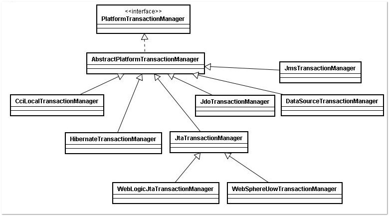

>本文由Scarb发表于[金甲虫的博客](http://47.106.131.90/blog)，转载请注明出处

# Spring 声明式事务 `@Transactional`

Spring 为事务管理提供了丰富的功能支持。Spring 事务管理分为编码式和声明式的两种方式。编程式事务指的是通过编码方式实现事务；声明式事务基于 AOP,将具体业务逻辑与事务处理解耦。声明式事务管理使业务代码逻辑不受污染, 因此在实际使用中声明式事务用的比较多。声明式事务有两种方式，一种是在配置文件（xml）中做相关的事务规则声明，另一种是基于 @Transactional 注解的方式。注释配置是目前流行的使用方式，因此本文将着重介绍基于@Transactional 注解的事务管理。

## 注解管理事务实现步骤

使用`@Transactional`注解管理事务的实现步骤分为两步。
第一步，在 xml 配置文件中添加事务配置信息。
除了用配置文件的方式，`@EnableTransactionManagement`注解也可以启用事务管理功能。
这里以简单的 DataSourceTransactionManager 为例。

### 启用事务管理功能

### 将`@Transactional`添加到合适的方法上

| 属性名           | 说明                                                         |
| :--------------- | :----------------------------------------------------------- |
| name             | 当在配置文件中有多个 TransactionManager , 可以用该属性指定选择哪个事务管理器。 |
| propagation      | 事务的传播行为，默认值为 REQUIRED。                          |
| isolation        | 事务的隔离度，默认值采用 DEFAULT。                           |
| timeout          | 事务的超时时间，默认值为-1。如果超过该时间限制但事务还没有完成，则自动回滚事务。 |
| read-only        | 指定事务是否为只读事务，默认值为 false；为了忽略那些不需要事务的方法，比如读取数据，可以设置 read-only 为 true。 |
| rollback-for     | 用于指定能够触发事务回滚的异常类型，如果有多个异常类型需要指定，各类型之间可以通过逗号分隔。 |
| no-rollback- for | 抛出 no-rollback-for 指定的异常类型，不回滚事务。            |

除此以外，`@Transactional`注解也可以添加到类级别上。当把`@Transactional`注解放在类级别时，表示所有该类的公共方法都配置相同的事务属性信息。见下代码，`EmployeeService`的所有方法都支持事务并且是只读。当类级别配置了`@Transactional`，方法级别也配置了`@Transactional`，应用程序会以方法级别的事务属性信息来管理事务，换言之，方法级别的事务属性信息会覆盖类级别的相关配置信息。

```java
@Transactional(propagation= Propagation.SUPPORTS,readOnly=true)
@Service(value ="employeeService")
public class EmployeeService
```


## Spring的注解方式的事务实现机制

在应用系统调用声明`@Transactional`的目标方法时，Spring Framework 默认使用 AOP 代理，在代码运行时生成一个代理对象，根据`@Transactional`的属性配置信息，这个代理对象决定该声明`@Transactional`的目标方法是否由拦截器`TransactionInterceptor`来使用拦截，在`TransactionInterceptor`拦截时，会在在目标方法开始执行之前创建并加入事务，并执行目标方法的逻辑, 最后根据执行情况是否出现异常，利用抽象事务管理器(图 2 有相关介绍)`AbstractPlatformTransactionManager`操作数据源`DataSource`提交或回滚事务, 如下图所示。


Spring AOP 代理有`CglibAopProxy`和`JdkDynamicAopProxy`两种，图 1 是以`CglibAopProxy`为例，对于`CglibAopProxy`，需要调用其内部类的`DynamicAdvisedInterceptor`的`intercept`方法。对于`JdkDynamicAopProxy`，需要调用其`invoke`方法。

正如上文提到的，事务管理的框架是由抽象事务管理器`AbstractPlatformTransactionManager`来提供的，而具体的底层事务处理实现，由`PlatformTransactionManager`的具体实现类来实现，如事务管理器`DataSourceTransactionManager`。不同的事务管理器管理不同的数据资源`DataSource`，比如 `DataSourceTransactionManager`管理 JDBC 的`Connection`。

`PlatformTransactionManager`，`AbstractPlatformTransactionManager`及具体实现类关系如下图所示。



## Spring事务属性分析

在 Spring 中，事务是通过`TransactionDefinition`接口来定义的。该接口包含与事务属性有关的方法。具体如下所示：

```java
public interface TransactionDefinition {
    int getIsolationLevel();
    int getPropagationBehavior();
    int getTimeout();
    boolean isReadOnly();
}
```

### 事务隔离级别

隔离级别是指若干个并发的事务之间的隔离程度。`TransactionDefinition`接口中定义了五个表示隔离级别的常量：

- TransactionDefinition.ISOLATION_DEFAULT：这是默认值，表示使用底层数据库的默认隔离级别。对大部分数据库而言，通常这值就是TransactionDefinition.ISOLATION_READ_COMMITTED。
- TransactionDefinition.ISOLATION_READ_UNCOMMITTED：该隔离级别表示一个事务可以读取另一个事务修改但还没有提交的数据。该级别不能防止脏读和不可重复读，因此很少使用该隔离级别。
- TransactionDefinition.ISOLATION_READ_COMMITTED：该隔离级别表示一个事务只能读取另一个事务已经提交的数据。该级别可以防止脏读，这也是大多数情况下的推荐值。
- TransactionDefinition.ISOLATION_REPEATABLE_READ：该隔离级别表示一个事务在整个过程中可以多次重复执行某个查询，并且每次返回的记录都相同。即使在多次查询之间有新增的数据满足该查询，这些新增的记录也会被忽略。该级别可以防止脏读和不可重复读。
- TransactionDefinition.ISOLATION_SERIALIZABLE：所有的事务依次逐个执行，这样事务之间就完全不可能产生干扰，也就是说，该级别可以防止脏读、不可重复读以及幻读。但是这将严重影响程序的性能。通常情况下也不会用到该级别。

### 事务传播行为

所谓事务的传播行为是指，如果在开始当前事务之前，一个事务上下文已经存在，此时有若干选项可以指定一个事务性方法的执行行为。在`TransactionDefinition`定义中包括了如下几个表示传播行为的常量：

- TransactionDefinition.PROPAGATION_REQUIRED：如果当前存在事务，则加入该事务；如果当前没有事务，则创建一个新的事务。
- TransactionDefinition.PROPAGATION_REQUIRES_NEW：创建一个新的事务，如果当前存在事务，则把当前事务挂起。
- TransactionDefinition.PROPAGATION_SUPPORTS：如果当前存在事务，则加入该事务；如果当前没有事务，则以非事务的方式继续运行。
- TransactionDefinition.PROPAGATION_NOT_SUPPORTED：以非事务方式运行，如果当前存在事务，则把当前事务挂起。
- TransactionDefinition.PROPAGATION_NEVER：以非事务方式运行，如果当前存在事务，则抛出异常。
- TransactionDefinition.PROPAGATION_MANDATORY：如果当前存在事务，则加入该事务；如果当前没有事务，则抛出异常。
- TransactionDefinition.PROPAGATION_NESTED：如果当前存在事务，则创建一个事务作为当前事务的嵌套事务来运行；如果当前没有事务，则该取值等价于TransactionDefinition.PROPAGATION_REQUIRED。

这里需要指出的是，前面的六种事务传播行为是 Spring 从 EJB 中引入的，他们共享相同的概念。而 PROPAGATION_NESTED是 Spring 所特有的。以 PROPAGATION_NESTED 启动的事务内嵌于外部事务中（如果存在外部事务的话），此时，内嵌事务并不是一个独立的事务，它依赖于外部事务的存在，只有通过外部的事务提交，才能引起内部事务的提交，嵌套的子事务不能单独提交。如果熟悉 JDBC 中的保存点（SavePoint）的概念，那嵌套事务就很容易理解了，其实嵌套的子事务就是保存点的一个应用，一个事务中可以包括多个保存点，每一个嵌套子事务。另外，外部事务的回滚也会导致嵌套子事务的回滚。