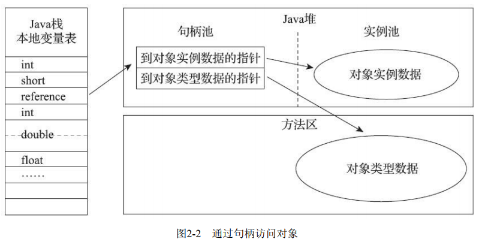
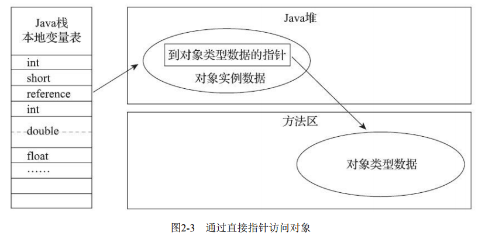

>本文由Scarb发表于[金甲虫的博客](http://47.106.131.90/blog)，转载请注明出处

# JVM 对象创建、布局、访问

本文针对HotSpot虚拟机和Java堆

## 1. 对象的创建

在Java语言层面，创建对象通常是`new`关键字。

### 1.1 类加载检查

在常量池中检查是否有该指令参数的符号引用，并检查这个符号引用代表的类是否已被记载、解析和初始化过。如果没有，执行类加载过程。

### 1.2 分配内存

类加载后可确定新生对象内存大小，接下来虚拟机将为新生对象分配内存。

#### 1.2.1 内存分配方式

垃圾处理器是否带有空间压缩整理(Compact)能力决定了Java堆是否规整，Java堆是否规整决定了内存的分配方式

##### 指针碰撞 Bump The Pointer

设Java堆中内存是绝对规整的，所有被使用过的内存都被放在一边，空闲的内存被放在另一边，中间放着一个指针作为分界点的指示器，那所分配内存就仅仅是把那个指针向空闲空间方向挪动一段与对象大小相等的距离

##### 空闲列表 Free List

如果Java堆中的内存并不是规整的，已被使用的内存和空闲的内存相互交错在一起，那 就没有办法简单地进行指针碰撞了，虚拟机就必须维护一个列表，记录上哪些内存块是可用的，在分 配的时候从列表中找到一块足够大的空间划分给对象实例，并更新列表上的记录

#### 1.2.2 解决内存分配时线程不安全问题

两种可选方案

##### 锁

对分配内存空间的动作进行同步处理——实际上虚拟机是采用CAS配上失败 重试的方式保证更新操作的原子性

##### 本地线程分配缓冲 Thread Local Allocation Buffer，TLAB

把内存分配的动作按照线程划分在不同的空间之中进 行，即每个线程在Java堆中预先分配一小块内存，哪个线程要分配内存，就在哪个线程的本地缓冲区中分配，只有本地缓冲区用完 了，分配新的缓存区时才需要同步锁定

### 1.3 初始化

将分配到的内存空间初始化为零值。

也可以提前至TLAB分配时顺便进行。

### 1.4 设置对象头信息

这个对象是哪个类的实例、如何才能找到 类的元数据信息、对象的哈希码（实际上对象的哈希码会延后到真正调用Object::hashCode()方法时才 计算）、对象的GC分代年龄等信息存放在对象头之中。

### 1.5 构造函数

一般来说，new指令之后会接着执行`<init>()`方法。

（Java编译器会在遇到new关键字的地方同时生成 这两条字节码指令）

## 2. 对象的内存布局

在HotSpot虚拟机里，对象在堆内存中的存储布局可以划分为三个部分：对象头（Header）、实例 数据（Instance Data）和对齐填充（Padding）

### 2.1 对象头 Header

包含两类信息

#### 2.1.1 Mark Word

于存储对象自身的运行时数据，如哈希码（HashCode）、GC分代年龄、锁状态标志、线程持有的锁、偏向线程ID、偏向时间戳等

这部分数据的长度在32位和64位的虚拟机（未开启压缩指针）中分别为32个比特和64个比特

是有着动态定义的数据结构，以便在极小的空间内存储尽量多的数据，根对象的状态复用自己的存储空间。

> 例如在32位的HotSpot虚拟机中，如对象未被同步锁锁定的状态，Mark Word的32个比特存储空间中的25个比特用于存储对象哈希码，4个比特用于存储对象分代年，2个比特用于存储锁标志位，1个比特固定为0
>
> 在其他状态下存储内容
>
> 

#### 2.1.2 类型指针

即对象指向它的类型元数据的指针，Java虚拟机通过这个指针来确定该对象是哪个类的实例

如果对象是一个Java数组，那在对象头中还必须有一块用于记录数组长度的数据

### 2.2 实例数据 Instance Data

对象真正存储的有效信息，即我们在程序代码里面所定义的各种类型的字段内容，无论是从父类继承下来的，还是在子类中定义的字段都必须记录起来。

的存储顺序会受到虚拟机分配策略参数（-XX：FieldsAllocationStyle参数）和字段在Java源码中定义顺序的影响。HotSpot虚拟机默认的分配顺序为longs/doubles、ints、shorts/chars、bytes/booleans、oops（Ordinary Object Pointers，OOPs）

### 2.3 对齐填充 Padding

HotSpot虚拟机的自动内存管理系统要求对象起始地址必须是8字节的整数倍

这里起占位符的作用

## 3. 对象的访问定位

为了后续使用该对象，Java程序会通过栈上的reference（指向对象的引用）来操作堆上的具体对象。

主流的访问方式有两种

### 3.1 句柄

Java堆中将可能会划分出一块内存来作为句柄池，reference中存储的就是对象的句柄地址，而句柄中包含了对象实例数据与类型数据各自具体的地址信息

优点：

reference中存储的是稳定句柄地址，在对象被移动（垃圾收集时移动对象是非常普遍的行为）时只会改变句柄中的实例数据指针，而reference本身不需要被修改。

### 3.2 直接指针

* HotSpot使用

reference中存储的直接就是对象地址，如果只是访问对象本身的话，就不需要多一次间接访问的开销

优点：

速度更快，它节省了一次指针定位的时间开销，由于对象访问在Java中非常频繁，因此这类开销积少成多也是一项极为可观的执行成本

