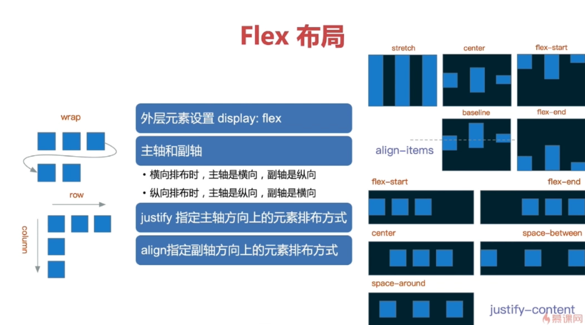
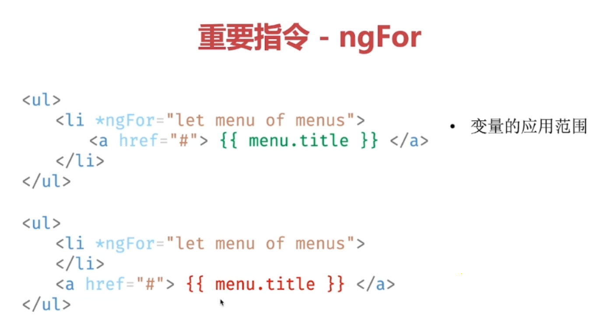
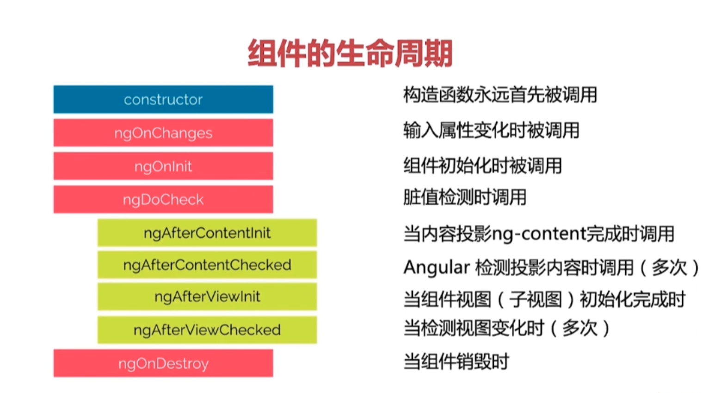
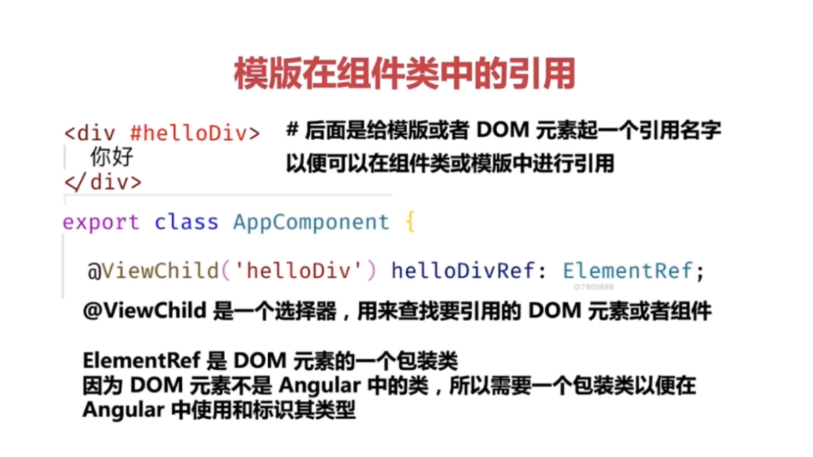
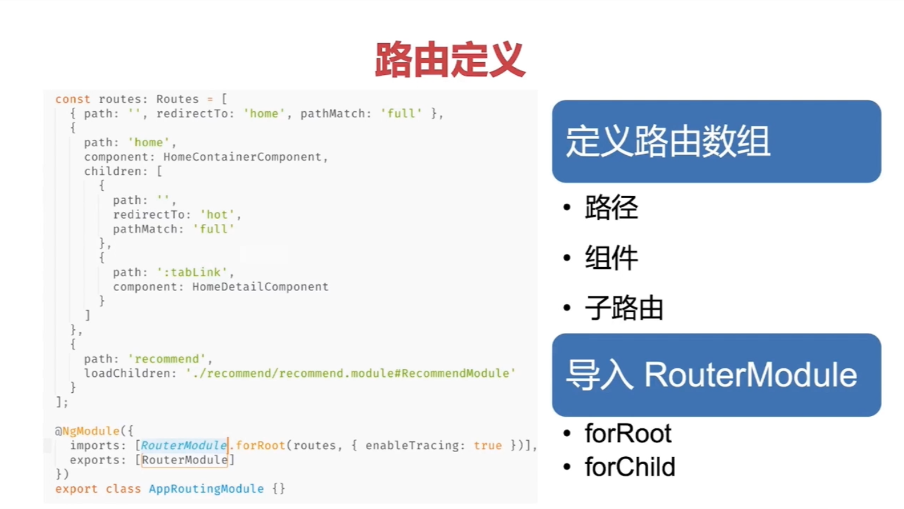

>本文由Scarb发表于[金甲虫的博客](http://47.106.131.90/blog)，转载请注明出处

# Angular 笔记

#### Flex 布局



#### `*ngFor` 

* 变量的应用范围



* 索引的获取

```html
<ul>
  <li *ngFor="let item of topMenus; let i = index">
    <a href="{{item.link}}">{{item.title}}</a>
  </li>
</ul>
```

* 第一个和最后一个

```html
<ul>
  <li *ngFor="let item of topMenus; let first = first; let last = last">
    <a href="{{item.link}}">{{item.title}}</a>
  </li>
</ul>
```

* 奇和偶

```html
<ul>
  <li *ngFor="let item of topMenus; let odd = odd; let even = even">
    <a href="{{item.link}}">{{item.title}}</a>
  </li>
</ul>
```

* trackBy 提升性能

```html
<ul>
  <li *ngFor="let item of topMenus; trackBy: trackElement">
    <a href="{{item.link}}">{{item.title}}</a>
  </li>
</ul>
```

#### 样式绑定的几种方式

* 执行`class`属性，用于单个样式的条件绑定最为合适

```html
<div [class.className]="条件表达式">...</div>
```

* 添加`class`属性，`true`则添加，`false`则不添加

```html
<div [ngClass]="{'one': true, 'two': true, 'three': false}">...</div>
```

* 添加样式

```html
<div [ngStyle]="{'color': someColor, 'font-size': fontSize}">...</div>
```

#### 组件生命周期



#### 在组件类中引用模板资源



#### 双向绑定 `ngModel`

* FormsModule中提供的指令
* 使用`[ngModel] = "变量"` 形式进行双向绑定
* 其实是一个语法糖

```html
<input [ngModel]="username" (ngModelChange)="username = $event"></input>
```

#### 共享模块

将某个模块中，其他多个模块需要用到的组件、指令和管道导入到共享模块中。

其他每个模块都导入共享模块

#### 指令的样式和事件绑定

指令没有模板，要寄宿在一个元素之上 - 宿主（Host）

* `@HostBinding`绑定宿主的属性或者样式
* `@HostListener`绑定宿主的事件

组件的样式中也可使用`:host`这样的一个伪类选择器

#### 投影组件

* `ng-content`：组件的动态内容
* `select`属性可以选择可用的样式类/HTML标签/指令

```html
<ng-content select="样式类/HTML标签/指令"></ng-content>
```

* 适用场景
  * 动态内容
  * 容器组件

### 路由

#### 路由定义



```typescript
const routes: Routes = [							// 按列表顺序匹配，匹配成功则直接返回，忽略后续匹配
  {path: '', component: HomeComponent},				// 匹配空路径，一般使用redirectTo到主页面
  {path: 'path', component: FeatureComponent},		// 匹配路径
  {path: '**', component: PageNotFoundComponent}	// 匹配所有路径
];

@NgModule({
  imports: [RouterModule.forRoot(routes)],			// 根路由用forRoot()，子路由用forChild()
  exports: [RouterModule]
})
export class AppRoutingModule { }

```

#### 子路由写法

```typescript
const routes: Routes = [
    {
        path: 'home',
        component: HomeComponent,
        children: [
            {
                path: ':id',						// 支持变量名
                component: ChildComponent
            }
        ]
    }
]
```

### 管道

### 依赖注入

#### 声明和使用依赖注入

1. 提供服务
   * `@Injectable()`将服务标记为可供注入的服务
2. 模块中声明
   * `providers`或者`import`对应模块
3. 在组件中使用
   * 构造函数中直接声明
   * Angular框架完成自动注入

#### 代码实现

```typescript
@Injectable()
class Product {
  constructor(private name: string, private color: string) {
  }
}

@Injectable()
class PurchaseOrder {
  private amount: number;

  constructor(private product: Product) {
  }
}

const injector = Injector.create({
      providers: [
        {
          provide: Product,
          // useClass: Product,
          // useExisting: product,
          useFactory: () => {
            return new Product('大米手机', '黑色');
          },
          deps: []
        },
        {
          provide: PurchaseOrder,
          useClass: PurchaseOrder,
          deps: [Product]
        }
      ]
    });
    console.log(injector.get(Product));
    console.log(injector.get(PurchaseOrder));
  }
```

