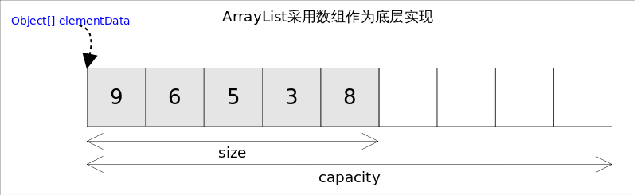

# Java ArrayList剖析

>本文由Scarb发表于[金甲虫的博客](http://47.106.131.90/blog)，转载请注明出处

# ArrayList简介

在 Java 语言中，由于普通数组受到长度限制，初始化时就需要限定数组长度，无法根据元素个数动态扩容，并且 Java 数组供开发者调用方法有限，只有取元素，获取数组长度和添加元素一些简单操作。后台在 Java 1.2 引入了强大丰富的`Collection`框架，其中用`ArrayList`来作为可动态扩容数组的列表实现来代替`Array`在日常开发的使用，`ArrayList`实现所有列表的操作方法，方便开发者操作列表集合。这里我们先列举下`ArrayList`的主要特点：

- 有序存储元素
- 允许元素重复，允许存储 `null` 值
- 支持动态扩容
- 非线程安全



为追求效率，ArrayList 没有实现同步。用户可以手动同步，也可使用 Vector 替代，还可采用 `Collections.synchronizedList()` 包装。

## 继承关系 & 类图


```java
public class ArrayList<E> extends AbstractList<E>
        implements List<E>, RandomAccess, Cloneable, java.io.Serializable {

}
```

- `AbstractList`作为列表的抽象实现，将元素的增删改查都交给了具体的子类去实现，在元素的迭代遍历的操作上提供了默认实现。
- `Cloneable`接口的实现，表示了`ArrayList`支持调用 Object 的`clone` 方法，实现`ArrayList`的拷贝。
- `Serializable`接口实现，说明了`ArrayList`还支持序列化和反序列操作，具有固定的 `serialVersionUID` 属性值。
- `RandomAccess`是一个标志接口，表明实现这个这个接口的`List`集合是支持快速随机访问的。在 `ArrayList`中，我们即可以通过元素的序号快速获取元素对象，这就是快速随机访问。

## 与Vector区别

1. `ArrayList` 是 `List` 的主要实现类，底层使用 `Object[]`存储，适用于频繁的查找工作，线程不安全 ；
2. `Vector` 是 `List` 的古老实现类，底层使用 `Object[]`存储，线程安全的。

## 与LinkedList区别

1. **是否保证线程安全：** `ArrayList` 和 `LinkedList` 都是不同步的，也就是不保证线程安全；
2. **底层数据结构：** `Arraylist` 底层使用的是 **`Object` 数组**；`LinkedList` 底层使用的是 **双向链表** 数据结构（JDK1.6 之前为循环链表，JDK1.7 取消了循环。注意双向链表和双向循环链表的区别，下面有介绍到！）
3. **插入和删除是否受元素位置的影响：** 
   1. **`ArrayList` 采用数组存储，所以插入和删除元素的时间复杂度受元素位置的影响。** 比如：执行`add(E e)`方法的时候， `ArrayList` 会默认在将指定的元素追加到此列表的末尾，这种情况时间复杂度就是`O(1)`。但是如果要在指定位置`i`插入和删除元素的话（`add(int index, E element)`）时间复杂度就为`O(n-i)`。因为在进行上述操作的时候集合中第`i`和第`i`个元素之后的(n-i)个元素都要执行向后位/向前移一位的操作。 
   2. **`LinkedList` 采用链表存储，所以对于`add(E e)`方法的插入，删除元素时间复杂度不受元素位置的影响，近似 O(1)，如果是要在指定位置`i`插入和删除元素的话（`(add(int index, E element)`） 时间复杂度近似为`o(n))`因为需要先移动到指定位置再插入。**
4. **是否支持快速随机访问：** `LinkedList` 不支持高效的随机元素访问，而 `ArrayList` 支持。快速随机访问就是通过元素的序号快速获取元素对象(对应于`get(int index)`方法)。
5. **内存空间占用：** `ArrayList` 的空 间浪费主要体现在在 list 列表的结尾会预留一定的容量空间，而 `LinkedList` 的空间花费则体现在它的每一个元素都需要消耗比 `ArrayList` 更多的空间（因为要存放直接后继和直接前驱以及数据）。

# ArrayList源码解析

## 属性

```java
// 序列化版本UID
private static final long serialVersionUID = 8683452581122892189L;

/**
 * 默认的初始容量
 */
private static final int DEFAULT_CAPACITY = 10;

/**
 * 用于空实例的共享空数组实例
 * new ArrayList(0);
 */
private static final Object[] EMPTY_ELEMENTDATA = {};

/**
 * 用于提供默认大小的实例的共享空数组实例
 * new ArrayList();
 */
private static final Object[] DEFAULTCAPACITY_EMPTY_ELEMENTDATA = {};

/**
 * 存储ArrayList元素的数组缓冲区
 * ArrayList的容量，是数组的长度
 * 
 * non-private to simplify nested class access
 */
transient Object[] elementData; // non-private to simplify nested class access

/**
 * ArrayList中元素的数量
 */
private int size;
```

1. 为什么空实例默认数组有的时候是`EMPTY_ELEMENTDATA`，而又有的时候是`DEFAULTCAPACITY_EMPTY_ELEMENTDATA`
2. 为什么`elementData`要被`transient`修饰
3. 为什么`elementData`没有被`private`修饰？

## 构造方法

（JDK8）ArrayList 有三种方式来初始化

### 带初始容量的构造方法

```java
public ArrayList(int initialCapacity) {
    if (initialCapacity > 0) {
        this.elementData = new Object[initialCapacity];
    } else if (initialCapacity == 0) {
        this.elementData = EMPTY_ELEMENTDATA;
    } else {
        throw new IllegalArgumentException("Illegal Capacity: "+
                                           initialCapacity);
    }
}
```

- 如果`initialCapacity < 0`，就创建一个新的长度是`initialCapacity`的数组
- 如果`initialCapacity == 0`，就使用`EMPTY_ELEMENTDATA`作为`elementData`
- 其他情况，`initialCapacity`不合法，抛出异常

### 无参构造方法

```java
public ArrayList() {
    this.elementData = DEFAULTCAPACITY_EMPTY_ELEMENTDATA;
}
```

- 使用`DEFAULTCAPACITY_EMPTY_ELEMENTDATA`作为`elementData`

### 带一个集合参数的构造方法

```java
public ArrayList(Collection<? extends E> c) {
    Object[] a = c.toArray();
    if ((size = a.length) != 0) {
        if (c.getClass() == ArrayList.class) {
            elementData = a;
        } else {
            elementData = Arrays.copyOf(a, size, Object[].class);
        }
    } else {
        // replace with empty array.
        elementData = EMPTY_ELEMENTDATA;
    }
}
```

- 使用将集合转换为数组的方法
- 如果`c`是`ArrayList`则直接将`c.toArray()`返回的`Object[]`赋值给`elementData`
- 如果数组大小等于`0`，则使用 `EMPTY_ELEMENTDATA`

---

**以无参数构造方法创建 ArrayList 时，实际上初始化赋值的是一个空数组。当真正对数组进行添加元素操作时，才真正分配容量。即向数组中添加第一个元素时，数组容量扩为 10。** 下面在我们分析 ArrayList 扩容时会讲到这一点内容！

> 补充：JDK7 new无参构造的ArrayList对象时，直接创建了长度是10的Object[]数组elementData 。jdk7中的ArrayList的对象的创建类似于单例的饿汉式，而jdk8中的ArrayList的对象的创建类似于单例的懒汉式。JDK8的内存优化也值得我们在平时开发中学习。

## 插入


### 在列表最后添加指定元素

```java
/**
 * Appends the specified element to the end of this list.
 *
 * @param e element to be appended to this list
 * @return <tt>true</tt> (as specified by {@link Collection#add})
 */
public boolean add(E e) {
		//添加元素之前，先调用ensureCapacityInternal方法
    ensureCapacityInternal(size + 1);  // Increments modCount!!
		//这里看到ArrayList添加元素的实质就相当于为数组赋值
    elementData[size++] = e;
    return true;
}
```

1. 扩容校验。
2. 将插入的值放到尾部，并将 size + 1 。

```java
protected transient int modCount = 0;
```

在父类`AbstractList`上，定义了`modCount`属性，用于记录数组修改的次数。

### 在指定位置添加元素

```java
/**
 * Inserts the specified element at the specified position in this
 * list. Shifts the element currently at that position (if any) and
 * any subsequent elements to the right (adds one to their indices).
 *
 * @param index index at which the specified element is to be inserted
 * @param element element to be inserted
 * @throws IndexOutOfBoundsException {@inheritDoc}
 */
public void add(int index, E element) {
    rangeCheckForAdd(index);

		// 添加元素之前，先调用ensureCapacityInternal方法
    ensureCapacityInternal(size + 1);  // Increments modCount!!
		// arraycopy()方法实现数组自己复制自己
    // elementData:源数组;index:源数组中的起始位置;elementData：目标数组；index + 1：目标数组中的起始位置； size - index：要复制的数组元素的数量；
    System.arraycopy(elementData, index, elementData, index + 1,
                     size - index);
    elementData[index] = element;
    size++;
}
```

1. 扩容校验。
2. 复制数据，本次数据插入 index ，后面数据后移。

### 插入方法调用的私有方法

可以看到`add`方法 首先调用了`ensureCapacityInternal(size + 1)`

```java
/**
 * 得到最小扩容量
 */
private static int calculateCapacity(Object[] elementData, int minCapacity) {
    if (elementData == DEFAULTCAPACITY_EMPTY_ELEMENTDATA) {
				// 获取默认的容量和传入参数的较大值
        return Math.max(DEFAULT_CAPACITY, minCapacity);
    }
    return minCapacity;
}
```

当 要`add`进第 1 个元素时，`minCapacity`为 1，在`Math.max()`方法比较后，`minCapacity`为 10。

```java
private void ensureCapacityInternal(int minCapacity) {
    ensureExplicitCapacity(calculateCapacity(elementData, minCapacity));
}
```

如果调用`ensureCapacityInternal()`方法就一定会进入（执行）这个方法，下面我们来研究一下这个方法的源码！

```java
// 判断是否需要扩容
private void ensureExplicitCapacity(int minCapacity) {
    modCount++;

    // overflow-conscious code
    if (minCapacity - elementData.length > 0)
				//调用grow方法进行扩容，调用此方法代表已经开始扩容了
        grow(minCapacity);
}
```

我们来仔细分析一下：

- 当我们要`add`进第 1 个元素到`ArrayList`时，`elementData.length`为`0`（因为还是一个空的 list），因为执行了 `ensureCapacityInternal()` 方法 ，所以`minCapacity`此时为`10`。此时，`minCapacity - elementData.length > 0`成立，所以会进入 `grow(minCapacity)` 方法。
- 当`add`第2个元素时，`minCapacity`为`2`，此时`elementData.length`在添加第一个元素后扩容成`10`了。此时，`minCapacity - elementData.length > 0` 不成立，所以不会进入 （执行）`grow(minCapacity)` 方法。
- 添加第 3、4···到第10个元素时，依然不会执行`grow()`方法，数组容量都为`10`。

直到添加第 11 个元素，`minCapacity`(为 11)比`elementData.length`（为 10）要大。进入`grow`方法进行扩容。

## 扩容


```java
/**
 * The maximum size of array to allocate.
 * 要分配的最大数组大小
 * Some VMs reserve some header words in an array.
 * Attempts to allocate larger arrays may result in
 * OutOfMemoryError: Requested array size exceeds VM limit
 */
private static final int MAX_ARRAY_SIZE = Integer.MAX_VALUE - 8;

/**
 * Increases the capacity to ensure that it can hold at least the
 * number of elements specified by the minimum capacity argument.
 *
 * @param minCapacity the desired minimum capacity
 */
private void grow(int minCapacity) {
    // oldCapacity为旧容量，newCapacity为新容量
    int oldCapacity = elementData.length;
    // 将oldCapacity 右移一位，其效果相当于oldCapacity /2，
    // 我们知道位运算的速度远远快于整除运算，整句运算式的结果就是将新容量更新为旧容量的1.5倍，
    int newCapacity = oldCapacity + (oldCapacity >> 1);
    // 然后检查新容量是否大于最小需要容量，若还是小于最小需要容量，那么就把最小需要容量当作数组的新容量，
    if (newCapacity - minCapacity < 0)
        newCapacity = minCapacity;
   // 如果新容量大于 MAX_ARRAY_SIZE,进入(执行) `hugeCapacity()` 方法来比较 minCapacity 和 MAX_ARRAY_SIZE，
   // 如果minCapacity大于最大容量，则新容量则为`Integer.MAX_VALUE`，否则，新容量大小则为 MAX_ARRAY_SIZE 即为 `Integer.MAX_VALUE - 8`。
    if (newCapacity - MAX_ARRAY_SIZE > 0)
        newCapacity = hugeCapacity(minCapacity);
    // minCapacity is usually close to size, so this is a win:
    elementData = Arrays.copyOf(elementData, newCapacity);
}
```

`int newCapacity = oldCapacity + (oldCapacity >> 1)`,所以 ArrayList 每次扩容之后容量都会变为原来的 1.5 倍左右（oldCapacity 为偶数就是 1.5 倍，否则是 1.5 倍左右）！ 

奇偶不同，比如 ：10+10/2 = 15, 33+33/2=49。如果是奇数的话会丢掉小数。

**我们再来通过例子探究一下`grow()` 方法 ：**

- 当`add`第 1 个元素时，`oldCapacity`为`0`，经比较后第一个`if`判断成立，`newCapacity = minCapacity`(为 10)。但是第二个`if`判断不会成立，即`newCapacity`不比`MAX_ARRAY_SIZE`大，则不会进入`hugeCapacity`方法。数组容量为`10`，`add`方法中`return true`，`size`增为1。
- 当`add`第 11 个元素进入`grow`方法时，`newCapacity`为`15`，比`minCapacity`（为 11）大，第一个 if 判断不成立。新容量没有大于数组最大 size，不会进入 hugeCapacity 方法。数组容量扩为 15，add 方法中 return true,size 增为 11。
- 以此类推······

```java
private static int hugeCapacity(int minCapacity) {
    if (minCapacity < 0) // overflow
        throw new OutOfMemoryError();
		// 对minCapacity和MAX_ARRAY_SIZE进行比较
    // 若minCapacity大，将Integer.MAX_VALUE作为新数组的大小
    // 若MAX_ARRAY_SIZE大，将MAX_ARRAY_SIZE作为新数组的大小
    // MAX_ARRAY_SIZE = Integer.MAX_VALUE - 8;
    return (minCapacity > MAX_ARRAY_SIZE) ?
        Integer.MAX_VALUE :
        MAX_ARRAY_SIZE;
}
```

从上面`grow()`方法源码我们知道： 如果新容量大于`MAX_ARRAY_SIZE`，进入(执行) `hugeCapacity()` 方法来比较`minCapacity`和`MAX_ARRAY_SIZE`，如果`minCapacity`大于最大容量，则新容量则为`Integer.MAX_VALUE`，否则，新容量大小则为`MAX_ARRAY_SIZE`即为`Integer.MAX_VALUE - 8`。

## `System.arraycopy()`和`Arrays.copyOf()`方法

ArrayList 中大量调用了这两个方法

### `System.arraycopy()`方法

将源数组中的元素从指定index1开始拷贝到目标数组的index2开始的位置

```java
/**
 * Copies an array from the specified source array, beginning at the
 * specified position, to the specified position of the destination array.
 * A subsequence of array components are copied from the source
 * array referenced by <code>src</code> to the destination array
 * referenced by <code>dest</code>. 
 * 
 * @param      src      the source array.
 * @param      srcPos   starting position in the source array.
 * @param      dest     the destination array.
 * @param      destPos  starting position in the destination data.
 * @param      length   the number of array elements to be copied.
 */
public static native void arraycopy(Object src,  int  srcPos,
                                    Object dest, int destPos,
                                    int length);
```

```java
/**
 * 在此列表中的指定位置插入指定的元素。
 * 先调用 rangeCheckForAdd 对index进行界限检查；然后调用 ensureCapacityInternal 方法保证capacity足够大；
 * 再将从index开始之后的所有成员后移一个位置；将element插入index位置；最后size加1。
 */
public void add(int index, E element) {
    rangeCheckForAdd(index);

    ensureCapacityInternal(size + 1);  // Increments modCount!!
    // arraycopy()方法实现数组自己复制自己
    // elementData:源数组;index:源数组中的起始位置;elementData：目标数组；index + 1：目标数组中的起始位置； size - index：要复制的数组元素的数量；
    System.arraycopy(elementData, index, elementData, index + 1, size - index);
    elementData[index] = element;
    size++;
}
```

### `Arrays.copyOf()`方法

```java
/**
 * Copies the specified array, truncating or padding with nulls (if necessary)
 * so the copy has the specified length.  For all indices that are
 * valid in both the original array and the copy, the two arrays will
 * contain identical values.  For any indices that are valid in the
 * copy but not the original, the copy will contain <tt>null</tt>.
 * Such indices will exist if and only if the specified length
 * is greater than that of the original array.
 * The resulting array is of the class <tt>newType</tt>.
 *
 * @param <U> the class of the objects in the original array
 * @param <T> the class of the objects in the returned array
 * @param original the array to be copied
 * @param newLength the length of the copy to be returned
 * @param newType the class of the copy to be returned
 * @return a copy of the original array, truncated or padded with nulls
 *     to obtain the specified length
 */
public static <T,U> T[] copyOf(U[] original, int newLength, Class<? extends T[]> newType) {
    @SuppressWarnings("unchecked")
    T[] copy = ((Object)newType == (Object)Object[].class)
        ? (T[]) new Object[newLength]
        : (T[]) Array.newInstance(newType.getComponentType(), newLength);
    System.arraycopy(original, 0, copy, 0,
                     Math.min(original.length, newLength));
    return copy;
}
```

使用`Arrays.copyOf()`方法主要是为了给原有数组扩容，在拷贝元素时，会创建一个新的数组对象。

### 联系和区别

**联系：**

 `Arrays.copyOf()`内部实际调用了 `System.arraycopy()` 方法

**区别：**

- `System.arraycopy()`只拷贝已经存在数组元素。将原数组拷贝到自己定义的数组里或者原数组，而且可以选择拷贝的起点和长度以及放入新数组中的位置
- `Arrays.copyOf()`不仅仅只是拷贝数组中的元素，在拷贝元素时，会创建一个新的数组对象

## 移除

### 移除指定下标元素

```java
/**
 * Removes the element at the specified position in this list.
 * Shifts any subsequent elements to the left (subtracts one from their
 * indices).
 *
 * @param index the index of the element to be removed
 * @return the element that was removed from the list
 * @throws IndexOutOfBoundsException {@inheritDoc}
 */
public E remove(int index) {
    rangeCheck(index);

    modCount++;
    E oldValue = elementData(index);

    int numMoved = size - index - 1;
    if (numMoved > 0)
        System.arraycopy(elementData, index+1, elementData, index,
                         numMoved);
    elementData[--size] = null; // clear to let GC do its work

    return oldValue;
}
```

### 移除指定元素

```java
/**
 * Removes the first occurrence of the specified element from this list,
 * if it is present.  
 */
public boolean remove(Object o) {
    if (o == null) {
        for (int index = 0; index < size; index++)
            if (elementData[index] == null) {
                fastRemove(index);
                return true;
            }
    } else {
        for (int index = 0; index < size; index++)
            if (o.equals(elementData[index])) {
                fastRemove(index);
                return true;
            }
    }
    return false;
}
```

### 私有移除方法

```java
/*
 * Private remove method that skips bounds checking and does not
 * return the value removed.
 */
private void fastRemove(int index) {
    modCount++;
    int numMoved = size - index - 1;
    if (numMoved > 0)
        System.arraycopy(elementData, index+1, elementData, index,
                         numMoved);
    elementData[--size] = null; // clear to let GC do its work
}
```

## 查找

### 查找指定元素所在位置

```java
/**
 * Returns the index of the first occurrence of the specified element
 * in this list, or -1 if this list does not contain the element.
 * More formally, returns the lowest index <tt>i</tt> such that
 * <tt>(o==null&nbsp;?&nbsp;get(i)==null&nbsp;:&nbsp;o.equals(get(i)))</tt>,
 * or -1 if there is no such index.
 */
public int indexOf(Object o) {
    if (o == null) {
        for (int i = 0; i < size; i++)
            if (elementData[i]==null)
                return i;
    } else {
        for (int i = 0; i < size; i++)
            if (o.equals(elementData[i]))
                return i;
    }
    return -1;
}
```

### 查找指定位置元素

```java
public E get(int index) {
    rangeCheck(index);

    return elementData(index);
}
```

## 序列化

### 序列化

```java
/**
 * Save the state of the <tt>ArrayList</tt> instance to a stream (that
 * is, serialize it).
 */
private void writeObject(java.io.ObjectOutputStream s)
    throws java.io.IOException{
    // Write out element count, and any hidden stuff
    int expectedModCount = modCount;
    s.defaultWriteObject();

    // Write out size as capacity for behavioural compatibility with clone()
    s.writeInt(size);

    // Write out all elements in the proper order.
    for (int i=0; i<size; i++) {
        s.writeObject(elementData[i]);
    }

    if (modCount != expectedModCount) {
        throw new ConcurrentModificationException();
    }
}
```

### 反序列化

```java
/**
 * Reconstitute the <tt>ArrayList</tt> instance from a stream (that is,
 * deserialize it).
 */
private void readObject(java.io.ObjectInputStream s)
    throws java.io.IOException, ClassNotFoundException {
    elementData = EMPTY_ELEMENTDATA;

    // Read in size, and any hidden stuff
    s.defaultReadObject();

    // Read in capacity
    s.readInt(); // ignored

    if (size > 0) {
        // be like clone(), allocate array based upon size not capacity
        int capacity = calculateCapacity(elementData, size);
        SharedSecrets.getJavaOISAccess().checkArray(s, Object[].class, capacity);
        ensureCapacityInternal(size);

        Object[] a = elementData;
        // Read in all elements in the proper order.
        for (int i=0; i<size; i++) {
            a[i] = s.readObject();
        }
    }
}
```

`elementData`之所以用`transient`修饰，是因为JDK不想将整个`elementData`都序列化或者反序列化，而只是将`size`和实际存储的元素序列化或反序列化，从而节省空间和时间。

## 子数组

```java
/**
 * Returns a view of the portion of this list between the specified
 * {@code fromIndex}, inclusive, and {@code toIndex}, exclusive.  (If
 * {@code fromIndex} and {@code toIndex} are equal, the returned list is
 * empty.)  The returned list is backed by this list, so non-structural
 * changes in the returned list are reflected in this list, and vice-versa.
 * The returned list supports all of the optional list operations.
 */
public List<E> subList(int fromIndex, int toIndex) {
    subListRangeCheck(fromIndex, toIndex, size);
    return new SubList(this, 0, fromIndex, toIndex);
}
```

```java
private class SubList extends AbstractList<E> implements RandomAccess {
    private final AbstractList<E> parent;
    private final int parentOffset;
    private final int offset;
    int size;

    SubList(AbstractList<E> parent,
            int offset, int fromIndex, int toIndex) {
        this.parent = parent;
        this.parentOffset = fromIndex;
        this.offset = offset + fromIndex;
        this.size = toIndex - fromIndex;
        this.modCount = ArrayList.this.modCount;
    }

    public E set(int index, E e) {
        rangeCheck(index);
        checkForComodification();
        E oldValue = ArrayList.this.elementData(offset + index);
        ArrayList.this.elementData[offset + index] = e;
        return oldValue;
    }

    // 省略代码...
}
```

- `SubList`的`set()`方法，**是直接修改ArrayList**中`elementData`数组的，使用中应该注意
- `SubList`是没有实现`Serializable`接口的，**是不能序列化的**

## 迭代器

```java
public Iterator<E> iterator() {
    return new Itr();
}
```

---

```java
private class Itr implements Iterator<E> {
    int cursor;       // 下一个要返回的元素的下标
    int lastRet = -1; // 最后一个要返回元素的下标 没有元素返回 -1
    int expectedModCount = modCount;

    Itr() {}

    public boolean hasNext() {
        return cursor != size;
    }

    public E next() {
				// 会校验modCount是否等于expectedModCount，不等于就会抛出ConcurrentModificationException
        checkForComodification();
        int i = cursor;
        if (i >= size)
            throw new NoSuchElementException();
        Object[] elementData = ArrayList.this.elementData;
        if (i >= elementData.length)
            throw new ConcurrentModificationException();
        cursor = i + 1;
        return (E) elementData[lastRet = i];
    }

    public void remove() {
        if (lastRet < 0)
            throw new IllegalStateException();
        checkForComodification();

        try {
            ArrayList.this.remove(lastRet);
            cursor = lastRet;
            lastRet = -1;
						// 移除之后将modCount重新赋值给expectedModCount。
            expectedModCount = modCount;
        } catch (IndexOutOfBoundsException ex) {
            throw new ConcurrentModificationException();
        }
    }

    @Override
    public void forEachRemaining(Consumer<? super E> consumer) {
        Objects.requireNonNull(consumer);
        final int size = ArrayList.this.size;
        int i = cursor;
        if (i >= size) {
            return;
        }
        final Object[] elementData = ArrayList.this.elementData;
        if (i >= elementData.length) {
            throw new ConcurrentModificationException();
        }
        while (i != size && modCount == expectedModCount) {
            consumer.accept((E) elementData[i++]);
        }
        // update once at end of iteration to reduce heap write traffic
        cursor = i;
        lastRet = i - 1;
        checkForComodification();
    }

    final void checkForComodification() {
        if (modCount != expectedModCount)
            throw new ConcurrentModificationException();
    }
}
```

## 其他

### `ensureCapacity(int minCapacity)`

```java
/**
 * 如有必要，增加此 ArrayList 实例的容量，以确保它至少可以容纳由minCapacity参数指定的元素数
 */
public void ensureCapacity(int minCapacity) {
    int minExpand = (elementData != DEFAULTCAPACITY_EMPTY_ELEMENTDATA)
        // any size if not default element table
        ? 0
        // larger than default for default empty table. It's already
        // supposed to be at default size.
        : DEFAULT_CAPACITY;

    if (minCapacity > minExpand) {
        ensureExplicitCapacity(minCapacity);
    }
}
```

最好在 add 大量元素之前用`ensureCapacity`方法，以减少增量重新分配的次数

# 面试题

## ArrayList（int initialCapacity）会不会初始化数组大小？

**不会**

构造方法只初始化了`elementData`，不会改变`size`当进行插入（add()）之后`size`才会增加

## ArrayList如何扩容？

其实实现方式比较简单，他就是通过数组扩容的方式去实现的。

就比如我们现在有一个长度为10的数组，现在我们要新增一个元素，发现已经满了，那ArrayList会怎么做呢？

[https://mmbiz.qpic.cn/mmbiz_jpg/uChmeeX1FpzW9kGwS65sOQzl9X9ZBsK5sj4NCXfMoNg7f9MCDm5xSI3UkuPR7T0ZuRUcAlKkcoL50N4iaia1c5WA/640?wx_fmt=jpeg&tp=webp&wxfrom=5&wx_lazy=1&wx_co=1](https://mmbiz.qpic.cn/mmbiz_jpg/uChmeeX1FpzW9kGwS65sOQzl9X9ZBsK5sj4NCXfMoNg7f9MCDm5xSI3UkuPR7T0ZuRUcAlKkcoL50N4iaia1c5WA/640?wx_fmt=jpeg&tp=webp&wxfrom=5&wx_lazy=1&wx_co=1)

第一步他会重新定义一个长度为10+10/2的数组也就是新增一个长度为15的数组。

[https://mmbiz.qpic.cn/mmbiz_jpg/uChmeeX1FpzW9kGwS65sOQzl9X9ZBsK5DfuPIhKfRS2CRnZqEickGCroVWlMWO7OkzgicopH7TukJr89Uib5ywCwA/640?wx_fmt=jpeg&tp=webp&wxfrom=5&wx_lazy=1&wx_co=1](https://mmbiz.qpic.cn/mmbiz_jpg/uChmeeX1FpzW9kGwS65sOQzl9X9ZBsK5DfuPIhKfRS2CRnZqEickGCroVWlMWO7OkzgicopH7TukJr89Uib5ywCwA/640?wx_fmt=jpeg&tp=webp&wxfrom=5&wx_lazy=1&wx_co=1)

然后把原数组的数据，原封不动的复制到新数组中，这个时候再把指向原数的地址换到新数组，ArrayList就这样完成了一次改头换面。

[https://mmbiz.qpic.cn/mmbiz_jpg/uChmeeX1FpzW9kGwS65sOQzl9X9ZBsK5mjud93Fa2oL8OKvLiajrVjCqANon92BbUBDcvIPYoMA9iaZqOSnarPQA/640?wx_fmt=jpeg&tp=webp&wxfrom=5&wx_lazy=1&wx_co=1](https://mmbiz.qpic.cn/mmbiz_jpg/uChmeeX1FpzW9kGwS65sOQzl9X9ZBsK5mjud93Fa2oL8OKvLiajrVjCqANon92BbUBDcvIPYoMA9iaZqOSnarPQA/640?wx_fmt=jpeg&tp=webp&wxfrom=5&wx_lazy=1&wx_co=1)

## ArrayList在增删的时候是怎么做的？

他有指定index新增，也有直接新增的，在这之前他会有一步校验长度的判断**ensureCapacityInternal**，就是说如果长度不够，是需要扩容的。

[https://mmbiz.qpic.cn/mmbiz_jpg/uChmeeX1FpzW9kGwS65sOQzl9X9ZBsK5jMqpH6x1Wx87QcIyaL5OjuXCibDK35ia4xAf5aR8Afic8Yuu2WXJW4dLA/640?wx_fmt=jpeg&tp=webp&wxfrom=5&wx_lazy=1&wx_co=1](https://mmbiz.qpic.cn/mmbiz_jpg/uChmeeX1FpzW9kGwS65sOQzl9X9ZBsK5jMqpH6x1Wx87QcIyaL5OjuXCibDK35ia4xAf5aR8Afic8Yuu2WXJW4dLA/640?wx_fmt=jpeg&tp=webp&wxfrom=5&wx_lazy=1&wx_co=1)

在扩容的时候，老版本的jdk和8以后的版本是有区别的，8之后的效率更高了，采用了位运算，**右移**一位，其实就是除以2这个操作。

[https://mmbiz.qpic.cn/mmbiz_jpg/uChmeeX1FpzW9kGwS65sOQzl9X9ZBsK5LwLjYV9ApvByAvrwyibHM9QH2oEOJhnGYibkgIYLyQuFauTUFK2H8ENw/640?wx_fmt=jpeg&tp=webp&wxfrom=5&wx_lazy=1&wx_co=1](https://mmbiz.qpic.cn/mmbiz_jpg/uChmeeX1FpzW9kGwS65sOQzl9X9ZBsK5LwLjYV9ApvByAvrwyibHM9QH2oEOJhnGYibkgIYLyQuFauTUFK2H8ENw/640?wx_fmt=jpeg&tp=webp&wxfrom=5&wx_lazy=1&wx_co=1)

指定位置新增的时候，在校验之后的操作很简单，就是数组的copy，大家可以看下代码。

[https://mmbiz.qpic.cn/mmbiz_jpg/uChmeeX1FpzW9kGwS65sOQzl9X9ZBsK5SkrUxI7wMZJzbgVK8xbpufLSiaKaOHCEbOmTAZBf9MBH8ATMnk6MLEQ/640?wx_fmt=jpeg&tp=webp&wxfrom=5&wx_lazy=1&wx_co=1](https://mmbiz.qpic.cn/mmbiz_jpg/uChmeeX1FpzW9kGwS65sOQzl9X9ZBsK5SkrUxI7wMZJzbgVK8xbpufLSiaKaOHCEbOmTAZBf9MBH8ATMnk6MLEQ/640?wx_fmt=jpeg&tp=webp&wxfrom=5&wx_lazy=1&wx_co=1)

不知道大家看懂**arraycopy**的代码没有，我画个图解释下，你可能就明白一点：

比如有下面这样一个数组我需要在index 5的位置去新增一个元素A

[https://mmbiz.qpic.cn/mmbiz_jpg/uChmeeX1FpzW9kGwS65sOQzl9X9ZBsK5ZSuaic23wv1eSiamttx3zIs0Tu4QQJJoVhdwWfCh34Ppg6nFSS0CBicJQ/640?wx_fmt=jpeg&tp=webp&wxfrom=5&wx_lazy=1&wx_co=1](https://mmbiz.qpic.cn/mmbiz_jpg/uChmeeX1FpzW9kGwS65sOQzl9X9ZBsK5ZSuaic23wv1eSiamttx3zIs0Tu4QQJJoVhdwWfCh34Ppg6nFSS0CBicJQ/640?wx_fmt=jpeg&tp=webp&wxfrom=5&wx_lazy=1&wx_co=1)

那从代码里面我们可以看到，他复制了一个数组，是从index 5的位置开始的，然后把它放在了index 5+1的位置

[https://mmbiz.qpic.cn/mmbiz_jpg/uChmeeX1FpzW9kGwS65sOQzl9X9ZBsK5b2RZbr12SLN6dXFibAx3u6aZdk34jH6WKWMm83yT6PotUdDW4mEZRWA/640?wx_fmt=jpeg&tp=webp&wxfrom=5&wx_lazy=1&wx_co=1](https://mmbiz.qpic.cn/mmbiz_jpg/uChmeeX1FpzW9kGwS65sOQzl9X9ZBsK5b2RZbr12SLN6dXFibAx3u6aZdk34jH6WKWMm83yT6PotUdDW4mEZRWA/640?wx_fmt=jpeg&tp=webp&wxfrom=5&wx_lazy=1&wx_co=1)

给我们要新增的元素腾出了位置，然后在index的位置放入元素A就完成了新增的操作了

[https://mmbiz.qpic.cn/mmbiz_jpg/uChmeeX1FpzW9kGwS65sOQzl9X9ZBsK57rRg4F3JEcpM310I1owAnRGtMRv5yvWYxvCicVNPNWicPBzCvSxbZYibA/640?wx_fmt=jpeg&tp=webp&wxfrom=5&wx_lazy=1&wx_co=1](https://mmbiz.qpic.cn/mmbiz_jpg/uChmeeX1FpzW9kGwS65sOQzl9X9ZBsK57rRg4F3JEcpM310I1owAnRGtMRv5yvWYxvCicVNPNWicPBzCvSxbZYibA/640?wx_fmt=jpeg&tp=webp&wxfrom=5&wx_lazy=1&wx_co=1)

至于为啥说他效率低，我想我不说你也应该知道了，我这只是在一个这么小的List里面操作，要是我去一个几百几千几万大小的List新增一个元素，那就需要后面所有的元素都复制，然后如果再涉及到扩容啥的就更慢了不是嘛。

# Vector

`Vector` 实现与 `ArrayList` 类似, 但所有方法都被 `synchronized` 修饰 ，开销较大。

# 参考资料

[ArrayList源码解析，老哥，来一起复习一哈？](https://mp.weixin.qq.com/s/3PNWmtS-bEZgZjd9wyMiDA)

[原创 |《吊打面试官》系列-ArrayList](https://mp.weixin.qq.com/s/WoGclm7SsbURGigI3Mwr3w)

[搞懂 Java ArrayList 源码](https://juejin.cn/post/6844903582194466824)

[重识 ArrayList](https://juejin.cn/post/6844903934251778062)

[ArrayList源码+扩容机制分析](https://snailclimb.gitee.io/javaguide/#/docs/java/collection/ArrayList%E6%BA%90%E7%A0%81+%E6%89%A9%E5%AE%B9%E6%9C%BA%E5%88%B6%E5%88%86%E6%9E%90)

[吴俊：ArrayList、Vector](https://wujun234.github.io/05%20Java/00%20Java%20%E5%9F%BA%E7%A1%80/06%20%E9%9B%86%E5%90%88/2.1%20ArrayList%E3%80%81Vector/)