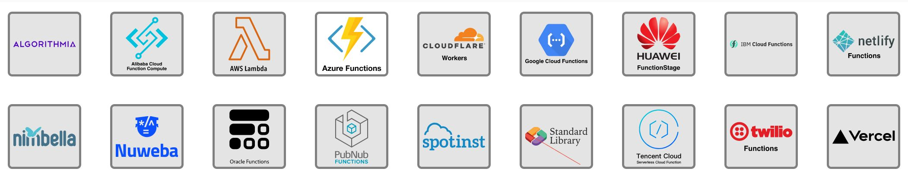

# Serverless详解

>本文由Scarb发表于[金甲虫的博客](http://47.106.131.90/blog)，转载请注明出处

[Structure](https://www.notion.so/Structure-e8a8b2f6d60d48da9c1ea465b3604d5b) 

# Serverless起源

Serverless 概念的诞生由来已久，但至今仍然没有清楚的定义。这个词首次出现大概是在 2012 年，云基础设施服务提供商 Iron.io 的副总裁 Ken Fromm 在一篇文章中阐述了为什么他认为 [Serverless 是软件的未来](http://readwrite.com/2012/10/15/why-the-future-of-software-and-apps-is-serverless/)（事实上，Iron.io 自 2012 年以来就支持这种概念和框架）。紧接着，在 2014 年，亚马逊发布 AWS Lambda，在这之后，Serverless 开始变得流行起来，国内外各大云厂商都争相跟进。

2016 年 8 月， martinfowler.com 上的一篇文章对 Serverless 做了详细阐述。简单来说，Serverless 主要用来描述两个互相有重叠的概念：

- Serverless 最早用于描述那些**大部分或者完全依赖于第三方（云端）应用或服务来管理服务器端逻辑和状态的应用**，这些应用通常是**富客户端应用**（单页应用或者移动端 App），他们建立在云端服务生态之上，包括数据库（Parse、Firebase）、账号系统（Auth0、AWS Cognito）等。这些服务最早被称为 “(Mobile) Backend as a Service”，下文将对此简称为 “BaaS”。
- Serverless 还可以指代这种情况：应用的一部分服务端逻辑依然由开发者完成，但是不像传统架构那样运行在一个无状态的计算容器中，而是**由事件驱动、短时执行（甚至只有一次调用）、完全由第三方管理**。对此有一个叫法是 Functions as a service（FaaS）。AWS Lambda 是目前的热门 FaaS 实现之一。

# Serverless是什么

顾名思义， Serverless 就是指应用的开发不再需要考虑服务器这样的硬件基础设施，基于 Serverless 架构的应用主要依赖于第三提供的后端服务（BaaS, Backend as a Service) 和应用逻辑运行容器（FaaS Container，Function as a Service)。

传统的应用部署在服务器上运行。而在Serverless云计算模式中，应用程序的运行不需要使用服务器。应用程序一般细化为一个或多个Function，上传至云计算平台。由平台负责在无状态的计算容器中可靠执行代码。对于平台，最终的计算资源自然不可能是无源之水，还要通过服务器落地。但是对用户确实屏蔽了服务器，用户只需要上传代码。因此所谓的 Serverless 是针对用户的Serverless。

## Serverless主要解决的问题

1. 降低硬件基础设施的部署和维护成本。

2. 降低应用扩展（scaling）成本。目前的 Serverless 运行平台如 Amazon AWS，都可以支持动态的自动扩张。

## Serverless和微服务之间的关系

微服务和 Serverless 架构都实现了细粒度的部署，维护和伸缩（scaling）。 目前的 Serverless 实现通常会依赖 FaaS，那么粒度就由 Service 变成了更细粒度的 Function。

# Serverless技术——FaaS和BaaS

Serverless 有时会与 FAAS (function-as-a-service) 和 BAAS (backend-as-a-service) 的概念混用，但它们不是一回事。

## FaaS（Function as a Service，函数即服务）

Serverless 有一部分是 FaaS（Function asa Service，也即函数即服务）。FaaS 是Compute as a Service（计算即服务）的一种形式。事实上，有些人（特别是AWS）说FaaS就是Serverless计算。当然，不可否认，AWS的Lambda是如今被采用得最广泛的FaaS实现。

FaaS是一种构建和部署服务端软件的新方式，面向部署单个的函数或者操作。关于Serverless许多时髦的词儿都来自FaaS。很多人认为Serverless就是FaaS，其实他们是只知其一不知其二。

我们部署服务端软件的传统方式都是这样开始的：先要有一个主机实例，一般是一个虚拟机（VM）或者容器（见图1），然后把应用部署在主机上。如果主机是VM或者容器，那么我们的应用就是一个操作系统进程。通常我们的应用里包含各种相关操作的代码——比如一个Web服务可能要收回和更新资源。

图1 传统服务端软件的部署

FaaS改变了这种部署模式（见图2）。我们去掉主机实例和应用进程，仅关注表达应用逻辑的那些操作或者函数。我们把这些函数上传至由云厂商提供的FaaS平台。

图2 FaaS软件部署

但是在一个服务器进程中，函数不是一直处于运行状态的，它们只会在需要的时候才运行，其他时间都是空闲状态（见图3）。我们可以对FaaS平台进行配置，让它为每一个操作监听特定事件。一旦该事件发生，平台就会实例化Lambda函数，然后再用这个触发事件来调用该函数。

图3 FaaS函数生命周期

一旦这个函数执行完毕，FaaS平台就可以随意销毁它。或者，平台将其保留一会儿，直到有另一个事件需要处理。

FaaS本质上是事件驱动的途径。除了提供一个平台保存和执行代码，FaaS供应商还会将各种同步和异步事件源集成起来。比如 HTTP API Gateway 就是一个同步源；而托管的消息总线、对象存储，或者协调的事件就是异步源。

2014年秋 Amazon 发布了 AWS Lambda，经过3年时间，该产品已经逐渐成熟，开始被一些企业采纳。有些Lambda函数的使用量非常少，一天就几次，而也有些公司使用Lambda每天处理数十亿事件。截至本文写作之时，Lambda已经集成了15种以上的不同事件源，可以满足各种不同应用的需求。

除了大家所熟识的 AWS Lambda 之外，微软、IBM及Google等大公司，以及一些更小的厂商比如Auth0，也提供商业FaaS。正如各种Computer-as-a-Service平台（IaaS、PaaS、Container-as-a-Service）一样，现在也有一些开源FaaS项目，你可以在自己的硬件或者公有云平台上运行。目前这类私有FaaS还处于混战时代，并没有明显的冒尖者。Galactic Fog、IronFunctions及Fission（使用的是Kubernetes），以及IBM公司自己的OpenWhisk均属于开源系的FaaS。

## BaaS（Backend as a Service，后端即服务）

BaaS（Backend as a Service，后端即服务）是指我们不再编写和/或管理所有服务端组件。与虚拟实例和容器相比，在概念上它更接近SaaS（软件即服务）。SaaS主要是业务流程的外包——HR、销售工具，或者从技术端来讲，像Github这样的产品，而BaaS则是要把应用拆分为更小的颗粒，其中一部分完全使用外部产品实现。

BaaS 服务都是领域通用的远程组件（而不是进程内的库），可以以 API 的形式使用，深受移动 App 或者单页Web app开发团队的欢迎。因为这些团队通常会使用大量的第三方服务，否则他们就要自己花很多精力做这些事情。我们来看一些例子。

Google Firebase是完全由云厂商（Google）管理的数据库，可以直接在移动或者Web应用中使用，而无须经过我们自己的中间层应用服务器。这解释了BaaS的一个方面：用服务替我们管理数据组件。

BaaS服务还允许我们倚赖其他人已经实现的应用逻辑。对于这点，认证就是一个很好的例子。很多应用都要自己编写实现注册、登录、密码管理等逻辑的代码，而其实对于不同的应用这些代码往往大同小异。完全可以把这些重复性的工作提取出来，再做成外部服务，而这正是Auth0和Amazon Cognito等产品的目标。它们能实现全面的认证和用户管理，开发团队再也不用自己编写或者管理实现这些功能的代码。

BaaS这个词是随着移动应用开发火起来的。事实上，它有时指的是MBaaS（Mobile Backend as a Service）。然而，使用完全托管在外部的产品来开发应用，这个理念并不是移动开发，或者更一般地说，前端开发，所独有的。比如，我们可以不再管理EC2机器上的MySQL数据库服务器，转而使用Amazon的RDS服务，或者我们可以用Kinesis取代我们自己的Kafka消息总线。其他数据基础设施服务还有：文件系统/对象存储（如Amazon S3）、数据仓库（如Amazon Redshift），而更面向逻辑的服务，比如语音分析（如Amazon Lex）以及前面提到的认证，也可以直接在服务端组件中使用。这其中有很多服务都可以认为是Serverless，但并非全部都是。

## PaaS与FaaS的区别

FaaS 和 PaaS 关键的区别在于 Scaling，PaaS 无法像 FaaS 那样在很短的时间内启动或停止一个实例，所以无法实现 FaaS 的按请求动态伸缩，用户必须提前考虑 PaaS 基础设施对于访问量变化的影响。我认为 FaaS 不是 PaaS 的升级，目前看各有特点适用于不同的场合。

# Serverless如何工作

与使用虚拟机或一些底层的技术来部署和管理应用程序相比，无服务器计算提供了一种更高级别的抽象。因为它们有不同的抽象和“触发器”的集合。

拿计算来讲，这种抽象有一个特定函数和抽象的触发器，它通常是一个事件。以数据库为例，这种抽象也许是一个表，而触发器相当于表的查询或搜索，或者通过在表中做一些事情而生成的事件。

比如一款手机游戏，允许用户在不同的平台上为全球顶级玩家使用高分数表。当请求此信息时，请求从应用程序到API接口。API接口或许会触发AWS的Lambda函数，或者无服务器函数，这些函数再从数据库表中获取到数据流，返回包含前五名分数的一定格式的数据。

一旦构建完成，应用程序的功能就可以在基于移动和基于 Web 的游戏版本中重用。

这跟设置服务器不同，不是必须要有Amazon EC2实例或服务器，然后等待请求。环境由事件触发，而响应事件所需的逻辑只在响应时执行。这意味着，运行函数的资源只有在函数运行时被创建，产生一种非常高效的方法来构建应用程序。

# Serverless适用场景

## UI 驱动

UI 驱动表示应用的执行主要由前端UI的输入触发。常见的这类应用包括 Web 和 APP。UI 事件触发 API 网关，网关调用后端业务逻辑。结合 BAAS 提供基础服务，通过这种模式可以快速搭建具备高可用性和扩展性的 Web 或 APP 应用。

## 消息驱动

异步消息处理是 Serverless 技术非常流行的应用场景。

在改场景下，生产者发布消息到消息队列，应用程序异步处理队列中的消息。从抽象架构上看，基于 Serverless 的异步处理可能没有什么变化。关键是通过 FAAS 函数替换了之前的消息处理程序。传统的消息处理程序部署在服务器上，函数代码部署在云端，通过实例化多个副本并行执行。Serverless 提供了更好的弹性。

一般云平台供应商同时提供了消息触发和 FaaS 环境，可以一站式集成开发。例如 AWS 平台的 Lambda 函数内置提供了基于 DynamoDB、S3、SNS、Kinesese 等的更新驱动。

## 定时任务

现在流行的介绍文章基本都推荐了前两个场景。在具体实践中，个人觉得定时任务也可以通过 Serverless 实现。例如 AWS 环境下，可以通过 CloudWatch 设置定时触发 Lambda 函数。比较常用的是批处理任务，可以通过 CloudWatch + Step Function + Lambda 的方式定期执行。

## 应用负载有显著的波峰波谷

Serverless 应用成功与否的评判标准并不是公司规模的大小，而是其业务背后的具体技术问题，比如业务波峰波谷明显，如何实现削峰填谷。一个公司的业务负载具有波峰波谷时，机器资源要按照峰值需求预估；而在波谷时期机器利用率则明显下降，因为不能进行资源复用而导致浪费。

业界普遍共识是，当自有机器的利用率小于 30%，使用 Serverless 后会有显著的效率提升。对于云服务厂商，在具备了足够多的用户之后，各种波峰波谷叠加后平稳化，聚合之后资源复用性更高。比如，外卖企业负载高峰是在用餐时期，安防行业的负载高峰则是夜间，这是受各个企业业务定位所限的；而对于一个成熟的云服务厂商，如果其平台足够大，用户足够多，是不应该有明显的波峰波谷现象的。

# Serverless的问题

## 冷启动

Serverless 平台收到请求后，在初始化函数的实例需要一些时间准备运行环境，启动资源。这个启动延迟可能在几毫秒到几秒的范围内，这就是冷启动问题。针对频繁调用的函数，平台会复用已创建的环境资源来优化，即热启动。而脉冲式或零星调用的函数就容易遇到冷启动性能问题。

冷启动的时间延迟与很多因素有关，包括编程语言、类库数量、代码大小等。例如 NodeJS 相对启动迅速，而 Java 程序则存在臭名昭著的冷启动问题。

为了解决性能问题，云计算厂商会针对语言进行优化，例如提高 JVM 启动加载效率。用户也可以定时触发函数进行预热，缓解冷启动问题。

## 执行时间

Serverless 函数每次调用运行时间通常受到限制。例如 AWS Lambda 函数运行的超时最多为5分钟，然后被强制终止。因此长期任务不适合采用 Serverles 架构。

推荐的解决方案是创建多个函数，确保每个函数的执行时间不超过限制，各个函数协调执行来完成长期任务。例如在 AWS 中创建 StepFunction 协调多个 Lambda 函数的执行。

## 性能调优

Serverless 代码的性能或资源问题相比传统代码更难定位。虽然平台提供了函数运行的计时，但很难通过Profiling工具、调试器或APM工具来深入了解更多细节。而云端运行 Serverless 代码的环境通常不是开源的，因此不能在本地环境中精确复制性能特征。

## 工具支持

首先，虽然存在 Serverless 的 Web IDE，但是目前最主要的开发方式还是在本地进行开发。现在还不方便直接开发、调试云端函数。

其次，代码运行于无状态的计算容器内，实时日志通过云平台输出。首先没有细粒度的日志分级，其次还没有工具支持方便地查看查找日志信息。

最后，缺乏完善的工具支持持续集成、系统发布。

## 厂商锁定

因为现在还没有统一的 Serverless 标准，不同云计算平台提供了个性化的 Serverless 服务。这就导致了厂商锁定的问题：为一个平台开发的代码，不能平滑迁移到其他平台。同时维护多个平台代码耗时费力，专一钟情于一家厂商可能存在风险。这里不只是说云计算厂商倒闭的风险（其实这个应该是最低的风险），还可能有其他意想不到的风险。例如字节跳动之前签了谷歌的大单，现在可能又不得不用甲骨文的云平台。

目前比较通用的解决方案是借助 Serverless 框架。业界流行的 Serverless 框架有 Serverless Framework、Apex 等。这些框架的可以屏蔽不同 Serverless 服务中的差异，基于框架开发的的函数可以方便的发布到各个云计算平台。

# Serverless产品

# 参考资料

[看懂 Serverless，这一篇就够了](https://blog.csdn.net/cc18868876837/article/details/90672971)

[Serverless Framework](https://github.com/serverless/serverless)

[Serverless computing - Wikipedia](https://en.wikipedia.org/wiki/Serverless_computing)

[Serverless 简介](https://xie.infoq.cn/article/3174ec655f87478ba3bd6107e)

[如何理解 Serverless](https://www.infoq.cn/article/2017/10/how-to-understand-serverless)？