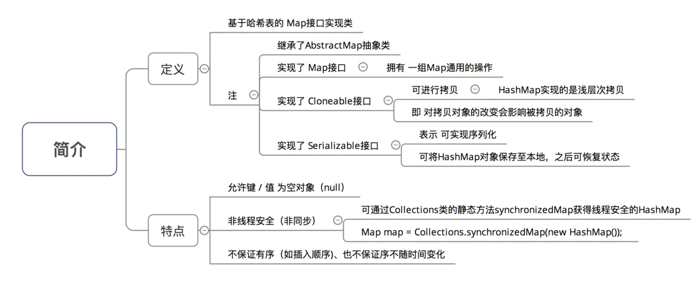
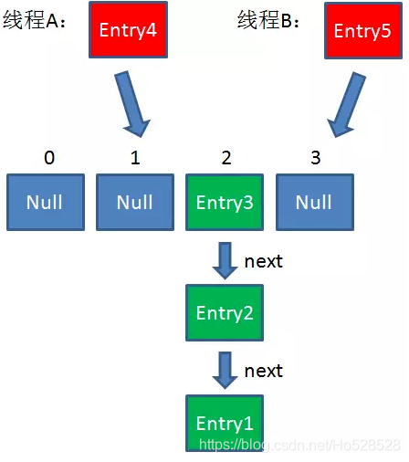
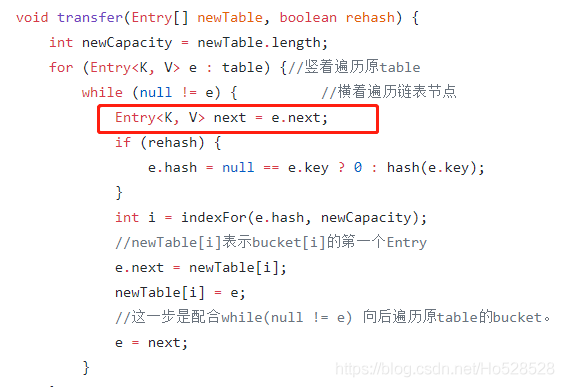
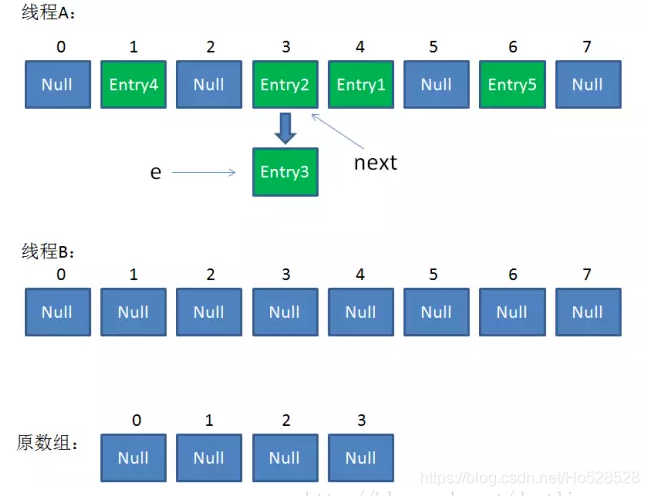
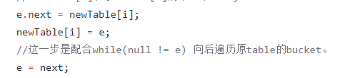
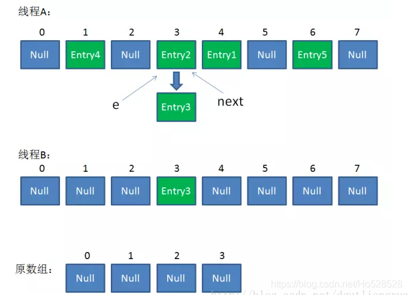
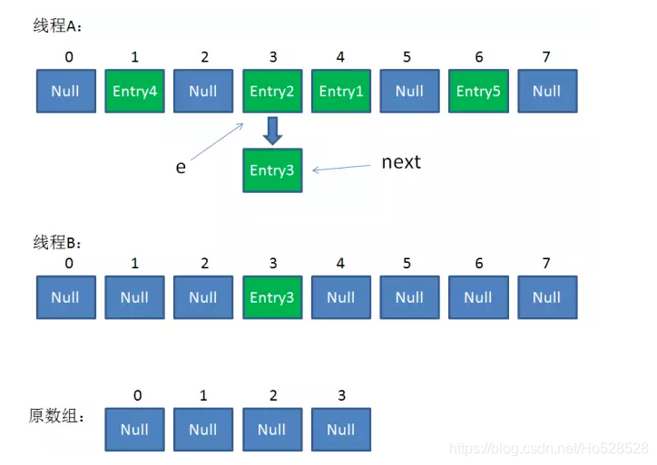
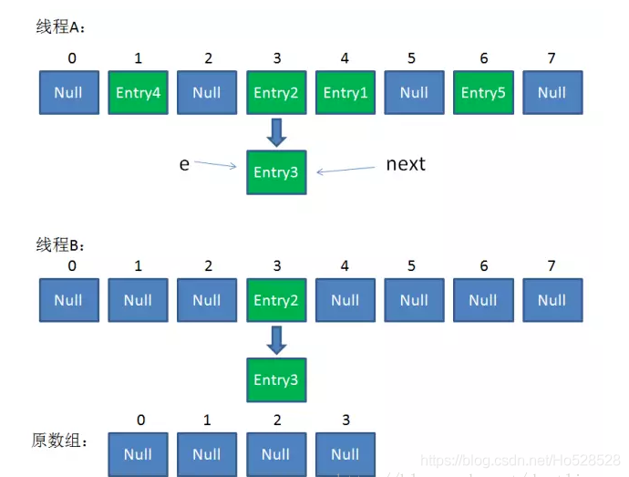
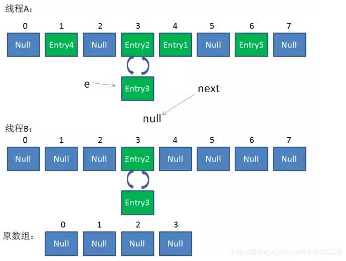

# Java HashMap 剖析

>本文由Scarb发表于[金甲虫的博客](http://47.106.131.90/blog)，转载请注明出处

# HashMap简介

基于哈希表，实现了Map接口。允许null值null键，非同步，无序。

哈希表有两种实现方式，开放地址方式和冲突链表方式。

HashMap采用的是冲突链表方式（数组和链表）。

- JDK1.8 之前 `HashMap` 由**数组+链表**组成的，**数组**是 `HashMap` 的主体，**链表**则是主要为了解决哈希冲突而存在的（“拉链法”解决冲突）。
- JDK1.8 以后在解决哈希冲突时有了较大的变化，当链表长度大于阈值（默认为 8）（将链表转换成红黑树前会判断，如果当前数组的长度小于 64，那么会选择先进行数组扩容，而不是转换为红黑树）时，将链表转化为**红黑树**，以减少搜索时间



## 继承关系&类图


```java
public class HashMap<K,V> extends AbstractMap<K,V>
    implements Map<K,V>, Cloneable, Serializable {
		// ...
}
```

从中我们可以了解到：

- HashMap<K,V>：HashMap是以key-value形式存储数据的。
- extends AbstractMap<K,V>：继承了AbstractMap，大大减少了实现Map接口时需要的工作量。
- implements Map<K,V>：实现了Map，提供了所有可选的Map操作。
- implements Cloneable：表明其可以调用clone()方法来返回实例的field-for-field拷贝。
- implements Serializable：表明该类是可以序列化的。

## 底层数据结构


HashMap的实现采用了（数组 + 链表 + 红黑树）的复杂结构，数组的一个元素又称作桶。

在添加元素时，会根据hash值算出元素在数组中的位置，如果该位置没有元素，则直接把元素放置在此处，如果该位置有元素了，则把元素以链表的形式放置在链表的尾部。

当一个链表的元素个数达到一定的数量（且数组的长度达到一定的长度）后，则把链表转化为红黑树，从而提高效率。

数组的查询效率为O(1)，链表的查询效率是O(k)，红黑树的查询效率是O(log k)，k为桶中的元素个数，所以当元素数量非常多的时候，转化为红黑树能极大地提高效率。


# 源码分析

## 静态全局变量

```java
/**
 * 默认初始化容量，值为16
 * 必须是2的n次幂.
 */
static final int DEFAULT_INITIAL_CAPACITY = 1 << 4; // aka 16

/**
 * 最大容量, 容量不能超出这个值。如果一个更大的初始化容量在构造函数中被指定，将被MAXIMUM_CAPACITY替换.
 * 必须是2的倍数。最大容量为1<<30，即2的30次方。
 */
static final int MAXIMUM_CAPACITY = 1 << 30;

/**
 * 默认的加载因子。
 */
static final float DEFAULT_LOAD_FACTOR = 0.75f;

/**
 * 将链表转化为红黑树的临界值。
 * 当添加一个元素被添加到有至少TREEIFY_THRESHOLD个节点的桶中，桶中链表将被转化为树形结构。
 * 临界值最小为8
 */
static final int TREEIFY_THRESHOLD = 8;

/**
 * 恢复成链式结构的桶大小临界值
 * 小于TREEIFY_THRESHOLD，临界值最大为6
 */
static final int UNTREEIFY_THRESHOLD = 6;

/**
 * 桶可能被转化为树形结构的最小容量。当哈希表的大小超过这个阈值，才会把链式结构转化成树型结构，否则仅采取扩容来尝试减少冲突。
 * 应该至少4*TREEIFY_THRESHOLD来避免扩容和树形结构化之间的冲突。
 */
static final int MIN_TREEIFY_CAPACITY = 64;
```

## 静态内部类Node

```java
/**
 * HashMap的节点类型。既是HashMap底层数组的组成元素，又是每个单向链表的组成元素
 */
static class Node<K,V> implements Map.Entry<K,V> {
    //key的哈希值
    final int hash;
    final K key;
    V value;
    // 指向下个节点的引用（链表结构）
    Node<K,V> next;
    //构造函数
    Node(int hash, K key, V value, Node<K,V> next) {
        this.hash = hash;
        this.key = key;
        this.value = value;
        this.next = next;
    }

    public final K getKey()        { return key; }
    public final V getValue()      { return value; }
    public final String toString() { return key + "=" + value; }
		// 重写hashCode()方法
    public final int hashCode() {
        return Objects.hashCode(key) ^ Objects.hashCode(value);
    }

    public final V setValue(V newValue) {
        V oldValue = value;
        value = newValue;
        return oldValue;
    }
		// 重写 equals() 方法
    public final boolean equals(Object o) {
        if (o == this)
            return true;
        if (o instanceof Map.Entry) {
            Map.Entry<?,?> e = (Map.Entry<?,?>)o;
            if (Objects.equals(key, e.getKey()) &&
                Objects.equals(value, e.getValue()))
                return true;
        }
        return false;
    }
}
```

## 域

```java
/**
 * 存储键值对的数组，一般是2的幂
 */
transient Node<K,V>[] table;

/**
 * 键值对缓存，它们的映射关系集合保存在entrySet中。即使Key在外部修改导致hashCode变化，缓存中还可以找到映射关系
 */
transient Set<Map.Entry<K,V>> entrySet;

/**
 * 键值对的实际个数
 */
transient int size;

/**
 * 记录HashMap被修改结构的次数。
 * 修改包括改变键值对的个数或者修改内部结构，比如rehash
 * 这个域被用作HashMap的迭代器的fail-fast机制中（参考ConcurrentModificationException）
 */
transient int modCount;

/**
 * 扩容的临界值，通过capacity * load factor可以计算出来。超过这个值HashMap将进行扩容
 * @serial
 */

int threshold;

/**
 * 加载因子
 *
 * @serial
 */
final float loadFactor;
```

## 构造方法

HashMap 中有四个构造方法

```java
// 默认构造函数。
public HashMap() {
    this.loadFactor = DEFAULT_LOAD_FACTOR; // all   other fields defaulted
}

// 包含另一个“Map”的构造函数
public HashMap(Map<? extends K, ? extends V> m) {
    this.loadFactor = DEFAULT_LOAD_FACTOR;
    putMapEntries(m, false);  // 下面会分析到这个方法
}

// 指定“容量大小”的构造函数
public HashMap(int initialCapacity) {
    this(initialCapacity, DEFAULT_LOAD_FACTOR);
}

// 指定“容量大小”和“加载因子”的构造函数
public HashMap(int initialCapacity, float loadFactor) {
		// 判断初始大小是否合理
    if (initialCapacity < 0)
        throw new IllegalArgumentException("Illegal initial capacity: " + initialCapacity);
		// 如果初始大小超过最大值，赋值为最大值
    if (initialCapacity > MAXIMUM_CAPACITY)
        initialCapacity = MAXIMUM_CAPACITY;
		// 判断初始大小是否合理
    if (loadFactor <= 0 || Float.isNaN(loadFactor))
        throw new IllegalArgumentException("Illegal load factor: " + loadFactor);
		// 初始化装填因子
    this.loadFactor = loadFactor;
    this.threshold = tableSizeFor(initialCapacity);
}
```

### `tableSizeFor()`

在上面的构造方法最后一行，我们会发现调用了`tableSizeFor()`

```java
/**
 * 返回一个大于输入参数且最接近2的整数次幂的数
 */
static final int tableSizeFor(int cap) {
    int n = cap - 1;
    n |= n >>> 1;
    n |= n >>> 2;
    n |= n >>> 4;
    n |= n >>> 8;
    n |= n >>> 16;
    return (n < 0) ? 1 : (n >= MAXIMUM_CAPACITY) ? MAXIMUM_CAPACITY : n + 1;
}
```

详解如下：

先来分析有关n位操作部分：先来假设n的二进制为01xxx...xxx。接着

对n右移1位：001xx...xxx，再位或：011xx...xxx

对n右移2为：00011...xxx，再位或：01111...xxx

此时前面已经有四个1了，再右移4位且位或可得8个1

同理，有8个1，右移8位肯定会让后八位也为1。

综上可得，该算法让最高位的1后面的位全变为1。

最后再让结果n+1，即得到了2的整数次幂的值了。

现在回来看看第一条语句：

`int n = cap - 1;`

让cap-1再赋值给n的目的是另找到的目标值大于或**等于**原值。例如二进制1000，十进制数值为8。如果不对它减1而直接操作，将得到答案10000，即16。显然不是结果。减1后二进制为111，再进行操作则会得到原来的数值1000，即8。

这种方法的效率非常高，可见Java8对容器优化了很多。

### 为何将`tableSizeFor(initialCapacity)`的值赋给threshold？

- threshold这个成员变量是阈值，决定了是否要将散列表再散列。它的值应该是：`capacity * load factor`才对。
- 其实这里仅仅是一个初始化，当初始化哈希表的时候，它会重新赋值

### `putMapEntries(Map<? extends K, ? extends V> m, boolean evict)`

```java
/**
 * Map.putAll and Map constructor的实现需要的方法。
 * 将m的键值对插入本map中
 * 
 * @param m the map
 * @param evict 初始化map时使用false，否则使用true
 */
final void putMapEntries(Map<? extends K, ? extends V> m, boolean evict) {
    int s = m.size();
    // 如果参数map不为空
    if (s > 0) {
        // 如果table没有初始化
        if (table == null) { // pre-size
            // 前面讲到，initial capacity * load factor就是当前hashMap允许的最大元素数目。那么不难理解，s/loadFactor+1即为应该初始化的容量。
            float ft = ((float)s / loadFactor) + 1.0F;
            // 如果ft小于最大容量MAXIMUM_CAPACITY，则容量为ft，否则容量为最大容量MAXIMUM_CAPACITY
            int t = ((ft < (float)MAXIMUM_CAPACITY) ?
                     (int)ft : MAXIMUM_CAPACITY);
            // 如果容量大于临界值
            if (t > threshold)
                // 根据容量初始化临界值
                threshold = tableSizeFor(t);
        }
        // table已经初始化，并且map的大小大于临界值
        else if (s > threshold)
            //扩容处理
            resize();
        // 将map中所有键值对添加到hashMap中
        for (Map.Entry<? extends K, ? extends V> e : m.entrySet()) {
            K key = e.getKey();
            V value = e.getValue();
            // putVal方法的实现在下面
            putVal(hash(key), key, value, false, evict);
        }
    }
}
```

## hash

HashMap计算位置的方法如下，在get、put、contains等主要方法中都有用到

```java
(n - 1) & hash
```

其中的`n`为数组的长度，`hash`为`hash(key)`计算得到的值。

然后我们来看一下hash方法

```java
static final int hash(Object key) {
    int h;
    return (key == null) ? 0 : (h = key.hashCode()) ^ (h >>> 16);
}
```


---


---

1. 为什么不直接采用经过`hashCode（）`处理的哈希码 作为 存储数组`table`的下标位置？
2. 为什么采用 哈希码 **与运算(&)** （数组长度-1） 计算数组下标？
3. 为什么在计算数组下标前，需对哈希码进行二次处理：扰动处理？

在回答这3个问题前，请大家记住一个核心思想：

> **所有处理的根本目的，都是为了提高 存储`key-value`的数组下标位置 的随机性 & 分布均匀性，尽量避免出现hash值冲突。**即：对于不同`key`，存储的数组下标位置要尽可能不一样

### 问题1：为什么不直接采用经过hashCode()处理的哈希码 作为 存储数组table的下标位置？

- 结论：容易出现 哈希码 与 数组大小范围不匹配的情况，即 计算出来的哈希码可能 不在数组大小范围内，从而导致无法匹配存储位置
- 原因描述

[https://user-gold-cdn.xitu.io/2018/3/12/16217d70dc71fde5?imageView2/0/w/1280/h/960/format/webp/ignore-error/1](https://user-gold-cdn.xitu.io/2018/3/12/16217d70dc71fde5?imageView2/0/w/1280/h/960/format/webp/ignore-error/1)

- 为了解决 “哈希码与数组大小范围不匹配” 的问题，`HashMap`给出了解决方案：**哈希码 与运算（&） （数组长度-1）**，即问题3

### 问题2：为什么采用 哈希码 与运算(&) （数组长度-1） 计算数组下标？

- 结论：根据HashMap的容量大小（数组长度），按需取 哈希码一定数量的低位 作为存储的数组下标位置，从而 解决 “哈希码与数组大小范围不匹配” 的问题
- 具体解决方案描述

[https://user-gold-cdn.xitu.io/2018/3/12/16217d70e157b3d6?imageView2/0/w/1280/h/960/format/webp/ignore-error/1](https://user-gold-cdn.xitu.io/2018/3/12/16217d70e157b3d6?imageView2/0/w/1280/h/960/format/webp/ignore-error/1)

### 问题3：为什么在计算数组下标前，需对哈希码进行二次处理：扰动处理？

- 结论：加大哈希码低位的随机性，使得分布更均匀，从而提高对应数组存储下标位置的随机性 & 均匀性，最终减少Hash冲突
- 具体描述

[https://user-gold-cdn.xitu.io/2018/3/12/16217d70eb322042?imageView2/0/w/1280/h/960/format/webp/ignore-error/1](https://user-gold-cdn.xitu.io/2018/3/12/16217d70eb322042?imageView2/0/w/1280/h/960/format/webp/ignore-error/1)

## get


```java
public V get(Object key) {
    Node<K,V> e;
    return (e = getNode(hash(key), key)) == null ? null : e.value;
}
```

从源码中可以看到，get(E e)可以分为三个步骤：

1. 通过hash(Object key)方法计算key的哈希值hash。
2. 通过getNode(int hash, Object key)方法获取node。
3. 如果node为null，返回null，否则返回node.value。

```java
/**
 * 根据key的哈希值和key获取对应的节点
 * 
 * @param hash 指定参数key的哈希值
 * @param key 指定参数key
 * @return 返回node，如果没有则返回null
 */
final Node<K,V> getNode(int hash, Object key) {
    Node<K,V>[] tab; Node<K,V> first, e; int n; K k;
    // 如果哈希表不为空，而且key对应的桶上不为空
    if ((tab = table) != null && (n = tab.length) > 0 &&
        (first = tab[(n - 1) & hash]) != null) {
        // 如果桶中的第一个节点就和指定参数hash和key匹配上了
        if (first.hash == hash && // always check first node
            ((k = first.key) == key || (key != null && key.equals(k))))
            // 返回桶中的第一个节点
            return first;
        // 如果桶中的第一个节点没有匹配上，而且有后续节点
        if ((e = first.next) != null) {
            // 如果当前的桶采用红黑树，则调用红黑树的get方法去获取节点
            if (first instanceof TreeNode)
                return ((TreeNode<K,V>)first).getTreeNode(hash, key);
            // 如果当前的桶不采用红黑树，即桶中节点结构为链式结构
            do {
                // 遍历链表，直到key匹配
                if (e.hash == hash &&
                    ((k = e.key) == key || (key != null && key.equals(k))))
                    return e;
            } while ((e = e.next) != null);
        }
    }
    // 如果哈希表为空，或者没有找到节点，返回null
    return null;
}
```

总结：

- get(E e)可以分为三个步骤：
    1. 通过hash(Object key)方法计算key的哈希值hash。
    2. 通过getNode( int hash, Object key)方法获取node。
    3. 如果node为null，返回null，否则返回node.value。
- hash方法又可分为三步：
    1. 取key的hashCode第二步
    2. key的hashCode高16位异或低16位
    3. 将第一步和第二部得到的结果进行取模运算。
- getNode方法又可分为以下几个步骤：
    1. 如果哈希表为空，或key对应的桶为空，返回null
    2. 如果桶中的第一个节点就和指定参数hash和key匹配上了，返回这个节点。
    3. 如果桶中的第一个节点没有匹配上，而且有后续节点
        1. 如果当前的桶采用红黑树，则调用红黑树的get方法去获取节点
        2. 如果当前的桶不采用红黑树，即桶中节点结构为链式结构，遍历链表，直到key匹配
    4. 找到节点返回null，否则返回null。

## put

HashMap只提供了`put`用于添加元素，`putVal`方法只是给`put`方法调用的一个方法，并没有提供给用户使用。

```java
public V put(K key, V value) {
    return putVal(hash(key), key, value, false, true);
}
```

从源码中可以看到，put(K key, V value)可以分为三个步骤：

1. 通过hash(Object key)方法计算key的哈希值。
2. 通过putVal(hash(key), key, value, false, true)方法实现功能。
3. 返回putVal方法返回的结果。

### `final V putVal(int hash, K key, V value, boolean onlyIfAbsent, boolean evict)`

1. 如果定位到的数组位置没有元素 就直接插入。
2. 如果定位到的数组位置有元素就和要插入的key比较，如果key相同就直接覆盖，如果key不相同，就判断p是否是一个树节点，如果是就调用`e = ((TreeNode<K,V>)p).putTreeVal(this, tab, hash, key, value)`将元素添加进入。如果不是就遍历链表插入(插入的是链表尾部)。


```java
/**
 * Map.put和其他相关方法的实现需要的方法
 * 
 * @param hash 指定参数key的哈希值
 * @param key 指定参数key
 * @param value 指定参数value
 * @param onlyIfAbsent 如果为true，即使指定参数key在map中已经存在，也不会替换value
 * @param evict 如果为false，数组table在创建模式中
 * @return 如果value被替换，则返回旧的value，否则返回null。当然，可能key对应的value就是null。
 */
final V putVal(int hash, K key, V value, boolean onlyIfAbsent,boolean evict) {
    Node<K,V>[] tab; Node<K,V> p; int n, i;
    //如果哈希表为空，调用resize()创建一个哈希表，并用变量n记录哈希表长度
    if ((tab = table) == null || (n = tab.length) == 0)
        n = (tab = resize()).length;
    //如果指定参数hash在表中没有对应的桶，即为没有碰撞
    if ((p = tab[i = (n - 1) & hash]) == null)
        //直接将键值对插入到map中即可
        tab[i] = newNode(hash, key, value, null);
    else {
        Node<K,V> e; K k;
        //如果碰撞了，且桶中的第一个节点就匹配了
        if (p.hash == hash &&
            ((k = p.key) == key || (key != null && key.equals(k))))
            //将桶中的第一个节点记录起来
            e = p;
        //如果桶中的第一个节点没有匹配上，且桶内为红黑树结构，则调用红黑树对应的方法插入键值对
        else if (p instanceof TreeNode)
            e = ((TreeNode<K,V>)p).putTreeVal(this, tab, hash, key, value);
        //不是红黑树结构，那么就肯定是链式结构
        else {
            //遍历链式结构
            for (int binCount = 0; ; ++binCount) {
                //如果到了链表尾部
                if ((e = p.next) == null) {
                    //在链表尾部插入键值对
                    p.next = newNode(hash, key, value, null);
                    //如果链的长度大于TREEIFY_THRESHOLD这个临界值，则把链变为红黑树
                    if (binCount >= TREEIFY_THRESHOLD - 1) // -1 for 1st
                        treeifyBin(tab, hash);
                    //跳出循环
                    break;
                }
                //如果找到了重复的key，判断链表中结点的key值与插入的元素的key值是否相等，如果相等，跳出循环
                if (e.hash == hash &&
                    ((k = e.key) == key || (key != null && key.equals(k))))
                    break;
                //用于遍历桶中的链表，与前面的e = p.next组合，可以遍历链表
                p = e;
            }
        }
        //如果key映射的节点不为null
        if (e != null) { // existing mapping for key
            //记录节点的vlaue
            V oldValue = e.value;
            //如果onlyIfAbsent为false，或者oldValue为null
            if (!onlyIfAbsent || oldValue == null)
                //替换value
                e.value = value;
            //访问后回调
            afterNodeAccess(e);
            //返回节点的旧值
            return oldValue;
        }
    }
    //结构型修改次数+1
    ++modCount;
    //判断是否需要扩容
    if (++size > threshold)
        resize();
    //插入后回调
    afterNodeInsertion(evict);
    return null;
}
```

### put 总结


## resize 扩容

向hashMap对象里不停的添加元素，而HashMap对象内部的数组无法装载更多的元素时，hashMap就需要扩大数组的长度，以便能装入更多的元素。当然数组是无法自动扩容的，扩容方法使用一个新的数组代替已有的容量小的数组。

resize方法非常巧妙，因为每次扩容都是翻倍，与原来计算（n-1）& hash的结果相比，节点要么就在原来的位置，要么就被分配到“原位置+旧容量”这个位置。


```java
/**
 * 对table进行初始化或者扩容。
 * 如果table为null，则对table进行初始化
 * 如果对table扩容，因为每次扩容都是翻倍，与原来计算（n-1）&hash的结果相比，节点要么就在原来的位置，要么就被分配到“原位置+旧容量”这个位置。
 */
final Node<K,V>[] resize() {
    //新建oldTab数组保存扩容前的数组table
    Node<K,V>[] oldTab = table;
    //使用变量oldCap扩容前table的容量
    int oldCap = (oldTab == null) ? 0 : oldTab.length;
    //保存扩容前的临界值
    int oldThr = threshold;
    int newCap, newThr = 0;
    //如果扩容前的容量 > 0
    if (oldCap > 0) {
        //如果当前容量>=MAXIMUM_CAPACITY
        if (oldCap >= MAXIMUM_CAPACITY) {
            //扩容临界值提高到正无穷
            threshold = Integer.MAX_VALUE;
            //无法进行扩容，返回原来的数组
            return oldTab;
        }
        //如果现在容量的两倍小于MAXIMUM_CAPACITY且现在的容量大于DEFAULT_INITIAL_CAPACITY
        else if ((newCap = oldCap << 1) < MAXIMUM_CAPACITY &&oldCap >= DEFAULT_INITIAL_CAPACITY)
            //临界值变为原来的2倍
            newThr = oldThr << 1; 
    }//如果旧容量 <= 0，而且旧临界值 > 0
    else if (oldThr > 0) 
        //数组的新容量设置为老数组扩容的临界值
        newCap = oldThr;
    else {//如果旧容量 <= 0，且旧临界值 <= 0，新容量扩充为默认初始化容量，新临界值为DEFAULT_LOAD_FACTOR * DEFAULT_INITIAL_CAPACITY
        newCap = DEFAULT_INITIAL_CAPACITY;
        newThr = (int)(DEFAULT_LOAD_FACTOR * DEFAULT_INITIAL_CAPACITY);
    }
    if (newThr == 0) {//在当上面的条件判断中，只有oldThr > 0成立时，newThr == 0
        //ft为临时临界值，下面会确定这个临界值是否合法，如果合法，那就是真正的临界值
        float ft = (float)newCap * loadFactor;
        //当新容量< MAXIMUM_CAPACITY且ft < (float)MAXIMUM_CAPACITY，新的临界值为ft，否则为Integer.MAX_VALUE
        newThr = (newCap < MAXIMUM_CAPACITY && ft < (float)MAXIMUM_CAPACITY ?
                  (int)ft : Integer.MAX_VALUE);
    }
    //将扩容后hashMap的临界值设置为newThr
    threshold = newThr;
    //创建新的table，初始化容量为newCap
    @SuppressWarnings({"rawtypes","unchecked"})
        Node<K,V>[] newTab = (Node<K,V>[])new Node[newCap];
    //修改hashMap的table为新建的newTab
    table = newTab;
    //如果旧table不为空，将旧table中的元素复制到新的table中
    if (oldTab != null) {
        //遍历旧哈希表的每个桶，将旧哈希表中的桶复制到新的哈希表中
        for (int j = 0; j < oldCap; ++j) {
            Node<K,V> e;
            //如果旧桶不为null，使用e记录旧桶
            if ((e = oldTab[j]) != null) {
                //将旧桶置为null
                oldTab[j] = null;
                //如果旧桶中只有一个node
                if (e.next == null)
                    //将e也就是oldTab[j]放入newTab中e.hash & (newCap - 1)的位置
                    newTab[e.hash & (newCap - 1)] = e;
                //如果旧桶中的结构为红黑树
                else if (e instanceof TreeNode)
                    //将树中的node分离
                    ((TreeNode<K,V>)e).split(this, newTab, j, oldCap);
                else { // 链表优化重hash的代码块
                    Node<K,V> loHead = null, loTail = null;
                    Node<K,V> hiHead = null, hiTail = null;
                    Node<K,V> next;
                    //遍历整个链表中的节点
                    do {
                        next = e.next;
                        // hash值新增参与运算的位 = 0，那么&yu
                        if ((e.hash & oldCap) == 0) {
                            if (loTail == null)
                                loHead = e;
                            else
                                loTail.next = e;
                            loTail = e;
                        }
                        else {
                            if (hiTail == null)
                                hiHead = e;
                            else
                                hiTail.next = e;
                            hiTail = e;
                        }
                    } while ((e = next) != null);
                    if (loTail != null) {
                        loTail.next = null;
                        newTab[j] = loHead;
                    }
                    if (hiTail != null) {
                        hiTail.next = null;
                        newTab[j + oldCap] = hiHead;
                    }
                }
            }
        }
    }
    return newTab;
}
```

从代码中可以看到，扩容很耗性能。所以在使用HashMap的时候，先估算map的大小，初始化的时候给一个大致的数值，避免map进行频繁的扩容。

看完代码后，可以将resize的步骤总结为

1. 计算扩容后的容量，临界值。
2. 将hashMap的临界值修改为扩容后的临界值
3. 根据扩容后的容量新建数组，然后将hashMap的table的引用指向新数组。
4. 将旧数组的元素复制到table中。

### 扩容结论


### 结果示意图


## remove

```java
/**
 * 删除hashMap中key映射的node
 *
 * @param  key 参数key
 * @return 如果没有映射到node，返回null，否则返回对应的value。
 */
public V remove(Object key) {
    Node<K,V> e;
    //根据key来删除node。removeNode方法的具体实现在下面
    return (e = removeNode(hash(key), key, null, false, true)) == null ?
        null : e.value;
}
```

从源码中可以看到，remove方法的实现可以分为三个步骤：

1. 通过hash(Object key)方法计算key的哈希值。
2. 通过removeNode方法实现功能。
3. 返回被删除的node的value。

### `removeNode(int hash, Object key, Object value, boolean matchValue, boolean movable)`

```java
/**
 * Map.remove和相关方法的实现需要的方法
 * 删除node
 * 
 * @param hash key的哈希值
 * @param key 参数key
 * @param value 如果matchValue为true，则value也作为确定被删除的node的条件之一，否则忽略
 * @param matchValue 如果为true，则value也作为确定被删除的node的条件之一
 * @param movable 如果为false，删除node时不会删除其他node
 * @return 返回被删除的node，如果没有node被删除，则返回null（针对红黑树的删除方法）
 */
final Node<K,V> removeNode(int hash, Object key, Object value,boolean matchValue, boolean movable) {
    Node<K,V>[] tab; Node<K,V> p; int n, index;
    //如果数组table不为空且key映射到的桶不为空
    if ((tab = table) != null && (n = tab.length) > 0 &&
        (p = tab[index = (n - 1) & hash]) != null) {
        //
        Node<K,V> node = null, e; K k; V v;
        //如果桶上第一个node的就是要删除的node
        if (p.hash == hash &&
            ((k = p.key) == key || (key != null && key.equals(k))))
            //记录桶上第一个node
            node = p;
        else if ((e = p.next) != null) {//如果桶内不止一个node
            if (p instanceof TreeNode)//如果桶内的结构为红黑树
                //记录key映射到的node
                node = ((TreeNode<K,V>)p).getTreeNode(hash, key);
            else {//如果桶内的结构为链表
                do {//遍历链表，找到key映射到的node
                    if (e.hash == hash &&
                        ((k = e.key) == key ||
                         (key != null && key.equals(k)))) {
                        //记录key映射到的node
                        node = e;
                        break;
                    }
                    p = e;
                } while ((e = e.next) != null);
            }
        }
        //如果得到的node不为null且(matchValue为false||node.value和参数value匹配)
        if (node != null && (!matchValue || (v = node.value) == value || (value != null && value.equals(v)))) {
            //如果桶内的结构为红黑树
            if (node instanceof TreeNode)
                //使用红黑树的删除方法删除node
                ((TreeNode<K,V>)node).removeTreeNode(this, tab, movable);
            else if (node == p)//如果桶的第一个node的就是要删除的node
                //删除node
                tab[index] = node.next;
            else//如果桶内的结构为链表，使用链表删除元素的方式删除node
                p.next = node.next;
            //结构性修改次数+1
            ++modCount;
            //哈希表大小-1
            --size;
            afterNodeRemoval(node);
            //返回被删除的node
            return node;
        }
    }
    //如果数组table为空或key映射到的桶为空，返回null。
    return null;
}
```

看完代码后，可以将removeNode方法的步骤总结为

1. 如果数组table为空或key映射到的桶为空，返回null。
2. 如果key映射到的桶上第一个node的就是要删除的node，记录下来。
3. 如果桶内不止一个node，且桶内的结构为红黑树，记录key映射到的node。
4. 桶内的结构不为红黑树，那么桶内的结构就肯定为链表，遍历链表，找到key映射到的node，记录下来。
5. 如果被记录下来的node不为null，删除node，size-1被删除。
6. 返回被删除的node。

# 源码总结

## 数据结构 & 主要参数


## 添加 & 查询数据流程


## 扩容机制


# 面试题

## 哈希表如何解决Hash冲突？


## 为什么 HashMap 中 String、Integer 这样的包装类适合作为 key 键？


## 新的Entry节点在插入链表的时候，是怎么插入的？

**java8之前是头插法**，就是说新来的值会取代原有的值，原有的值就顺推到链表中去，就像上面的例子一样，因为写这个代码的作者认为后来的值被查找的可能性更大一点，提升查找的效率。

但是，**在java8之后，都是所用尾部插入了。**

---

## java8为什么改为尾插入？

- 使用头插会改变链表的上的顺序，但是如果使用尾插，在扩容时会保持链表元素原本的顺序，就不会出现链表成环的问题了。
- Java7多线程下容易出现`resize()`死循环

    本质：并发 执行`put()`操作导致触发 扩容行为，从而导致环形链表，使得在获取数据遍历链表时形成死循环，即Infinite Loop

- Java8在同样的前提下并不会引起死循环，原因是扩容转移后前后链表顺序不变，保持之前节点的引用关系。

先来分析一下jdk1.7中`resize()`代码，着重分析`transfer()`方法：

```java
/**
 * 源码分析：resize(2 * table.length)
 * 作用：当容量不足时（容量 > 阈值），则扩容（扩到2倍）
 */ 
 void resize(int newCapacity) {  
    
    // 1. 保存旧数组（old table） 
    Entry[] oldTable = table;  

    // 2. 保存旧容量（old capacity ），即数组长度
    int oldCapacity = oldTable.length; 

    // 3. 若旧容量已经是系统默认最大容量了，那么将阈值设置成整型的最大值，退出    
    if (oldCapacity == MAXIMUM_CAPACITY) {  
        threshold = Integer.MAX_VALUE;  
        return;  
    }  
  
    // 4. 根据新容量（2倍容量）新建1个数组，即新table  
    Entry[] newTable = new Entry[newCapacity];  

    // 5. （重点分析）将旧数组上的数据（键值对）转移到新table中，从而完成扩容 ->>分析1.1 
    transfer(newTable); 

    // 6. 新数组table引用到HashMap的table属性上
    table = newTable;  

    // 7. 重新设置阈值  
    threshold = (int)(newCapacity * loadFactor); 
} 

/**
 * 分析1.1：transfer(newTable); 
 * 作用：将旧数组上的数据（键值对）转移到新table中，从而完成扩容
 * 过程：按旧链表的正序遍历链表、在新链表的头部依次插入
 */ 
void transfer(Entry[] newTable) {
    // 1. src引用了旧数组
    Entry[] src = table; 

    // 2. 获取新数组的大小 = 获取新容量大小                 
    int newCapacity = newTable.length;

    // 3. 通过遍历 旧数组，将旧数组上的数据（键值对）转移到新数组中
    for (int j = 0; j < src.length; j++) { 
        // 3.1 取得旧数组的每个元素  
        Entry<K,V> e = src[j];           
        if (e != null) {
            // 3.2 释放旧数组的对象引用（for循环后，旧数组不再引用任何对象）
            src[j] = null; 

            do { 
                // 3.3 遍历 以该数组元素为首 的链表
                // 注：转移链表时，因是单链表，故要保存下1个结点，否则转移后链表会断开
                Entry<K,V> next = e.next; 
               // 3.3 重新计算每个元素的存储位置
               int i = indexFor(e.hash, newCapacity); 
               // 3.4 将元素放在数组上：采用单链表的头插入方式 = 在链表头上存放数据 = 将数组位置的原有数据放在后1个指针、将需放入的数据放到数组位置中
               // 即 扩容后，可能出现逆序：按旧链表的正序遍历链表、在新链表的头部依次插入
               e.next = newTable[i]; 
               newTable[i] = e;  
               // 访问下1个Entry链上的元素，如此不断循环，直到遍历完该链表上的所有节点
               e = next;             
           } while (e != null);
           // 如此不断循环，直到遍历完数组上的所有数据元素
       }
   }
}
```

### 假设一个长度为4的HashMap，现在已经存在3个元素了，当再插入一个元素时，Map将会扩容。

此时有两个线程同时进行put操作：



假设线程B刚遍历到Entry3的时候，运行到这句话时线程被挂起。



对于线程B来说：
此时的 **e为Entry3，next为Entry2**
而假设线程A畅通无阻的完成了rehash，完成后，结果如下图： （图中e和next代表线程B的两个引用）



之后线程B重新拿到时间片开始运行，继续往下运行。

计算出Entry3的下标 i 同样为3，因为线程A计算结果就为3。



根据线程A已经计算后的结果，线程B运行这三句代码后：**e为Entry2，next也为Entry2**



开始一轮新的循环后，运行至此：

Entry2的next为Entry3，故此时：**e为Entry2，next为Entry3**



接着执行下面三行，将Entry2使用头插法插入头结点：


则此时：e为Entry3，next也为Entry3



第三次循环，运行至此：

Entry3的next为null，故此时：**e为Entry3，next为null**
 最后一步运行三句代码时：


注意：
 第一行的结果为：**Entry3.next=Entry2；**
 第二行的结果为：**Entry插入到头结点，即线程A的Entry2的位置**
 第三行的结果为：**e置为null，本次while循环结束**
 线程A、B完整运行后：
 A—>：头结点为Entry2，Entry2.next = Entry3
 B—>：头结点为Entry3，Entry3.next = Entry2
 形成了**环形链表**！



此时问题并为发生，但当调用get方法，参数为一个不存在的key，而这个key的hash值恰好为3时，由于位置3存在环形链表，则会进入死循环！

### 总结

链表头插法的会颠倒原来一个散列桶里面链表的顺序。在并发的时候原来的顺序被另外一个线程a颠倒了，而被挂起线程b恢复后拿扩容前的节点和顺序继续完成第一次循环后，又遵循a线程扩容后的链表顺序重新排列链表中的顺序，最终形成了环。

# 参考资料

[JavaGuide: HashMap(JDK1.8)源码+底层数据结构分析](https://snailclimb.gitee.io/javaguide/#/docs/java/collection/HashMap(JDK1.8)%E6%BA%90%E7%A0%81+%E5%BA%95%E5%B1%82%E6%95%B0%E6%8D%AE%E7%BB%93%E6%9E%84%E5%88%86%E6%9E%90)

[java3y: HashMap就是这么简单【源码剖析】](https://mp.weixin.qq.com/s?__biz=MzI4Njg5MDA5NA==&mid=2247484139&idx=1&sn=bb73ac07081edabeaa199d973c3cc2b0&chksm=ebd743eadca0cafc532f298b6ab98b08205e87e37af6a6a2d33f5f2acaae245057fa01bd93f4&scene=178&cur_album_id=1337042038407397378#rd)

[敖丙: 《吊打面试官》系列-HashMap](https://mp.weixin.qq.com/s/0Gf2DzuzgEx0i3mHVvhKNQ)

[敖丙：面试官：HashMap 为什么线程不安全？](https://mp.weixin.qq.com/s/VtIpj-uuxFj5Bf6TmTJMTw)

[原创 | 万万没想到，HashMap默认容量的选择，竟然背后有这么多思考！？](https://mp.weixin.qq.com/s/ktre8-C-cP_2HZxVW5fomQ)

[Java8源码-HashMap](https://blog.csdn.net/panweiwei1994/article/details/77244920)

[图解HashMap](https://juejin.cn/post/6844903518474600455)

[HashMap源码注解 之 静态工具方法hash()、tableSizeFor()（四）](https://blog.csdn.net/fan2012huan/article/details/51097331)

[Java源码分析：HashMap 1.8 相对于1.7 到底更新了什么？](https://juejin.cn/post/6844903574552461320)

[吴俊：HashMap、HashSet、Hashtable](https://wujun234.github.io/05%20Java/00%20Java%20%E5%9F%BA%E7%A1%80/06%20%E9%9B%86%E5%90%88/2.5%20HashMap%E3%80%81HashSet%E3%80%81Hashtable/)

[HashMap在1.8之前插入元素采用头插法的危害性](https://blog.csdn.net/Ho528528/article/details/103903998)